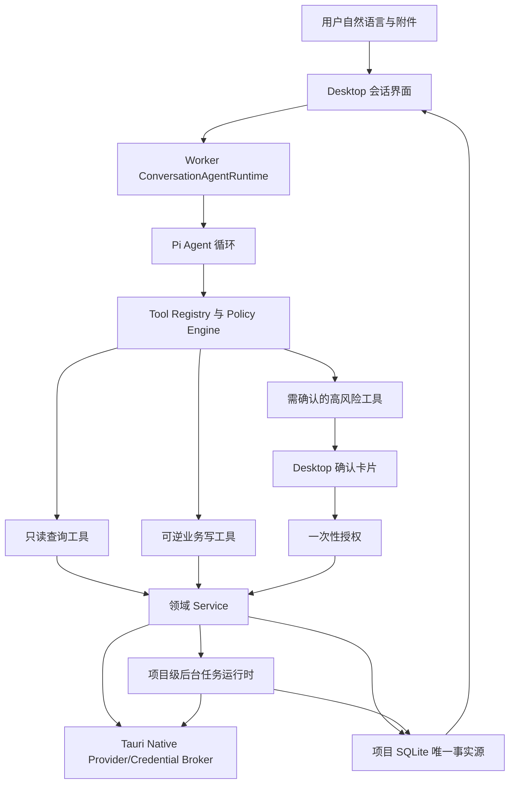

# 全系统 Agent 编排优化方案

版本：1.0  
日期：2026-09-02  
最近同步：2026-09-03  
状态：实施中（P0、P1 已完成；媒体模型选择核心已完成；下一阶段为 P2 通用工具注册表与策略引擎）  
适用范围：Desktop、Tauri Native、Worker、Contracts、Domain、Persistence、Context、LLM、Generation Adapters

> **方案结论** 会话是面向整个应用的统一人工智能助手，不再按“普通聊天、通用模式、专用模式”划分运行方式。用户在会话中选择一个支持工具调用的推理模型，之后由 Pi Agent 理解自然语言、规划步骤、选择受控业务工具并连续执行；Worker 始终负责权限、确认、状态机、幂等、事务和审计，Tauri Native 始终负责凭据与 Provider 网络边界。图片、视频、小说、文档、素材和项目操作均逐步接入同一个 Agent 工具面。

## 1. 文档目的

本文冻结统一会话 Agent 的产品定位、目标架构、权限边界和分阶段实施顺序，解决当前会话路由、媒体生成、后台任务和工具覆盖相互割裂的问题。

本文是上层优化方案，与以下实施文档共同使用：

- [统一 Agent 体验实施计划](./UNIFIED-AGENT-IMPLEMENTATION-PLAN.md)
- [Pi 会话 Agent Runtime 二开与集成方案](./PI-CONVERSATION-RUNTIME-INTEGRATION-PLAN.md)
- [会话功能企业级优化实施计划](./SESSION-ENTERPRISE-OPTIMIZATION-PLAN.md)
- [素材库优化方案](./ASSET-LIBRARY-OPTIMIZATION-PLAN.md)
- [素材库优化方案实施文档](./ASSET-LIBRARY-IMPLEMENTATION-PLAN.md)

发生冲突时，本文确认的产品定位和安全边界优先；已有数据不做破坏性迁移，既有已完成能力通过兼容层继续工作。实施阶段完成后，必须同步更新对应实施文档的清单和验证记录。

## 2. 已确认的产品决策

| 主题 | 确认结论 |
|---|---|
| 会话定位 | 会话是高度适配整个系统的统一人工智能助手，不是普通聊天组件。 |
| 运行方式 | 不区分通用模式和专用模式；所有会话请求进入同一个 Agent Runtime。 |
| Agent 模型 | 用户在会话中选择一次支持 Tool Call 的推理模型，不因任务类型重复选择 Agent 模型；媒体生成模型是独立的用户选择。 |
| Agent 模型职责 | Agent LLM 负责理解自然语言、制定计划、选择工具和解释结果；LLM 的工具调用只是建议，不能绕过 Worker 校验和授权。 |
| 能力范围 | Agent 最终应能通过受控工具完成系统全部业务操作，包括设置、模型适配、生图、生视频、小说、文档、素材和项目操作。 |
| 工具循环 | Pi Agent 负责理解目标、制定计划、选择工具、接收 Tool Result 并继续执行或追问。 |
| 媒体生成模型 | 生图、生视频使用的 Provider/模型由用户在任务需要时明确选择；Worker 负责列出兼容候选、校验选择并冻结快照，不得静默替换。 |
| 费用确认 | Agent 可以查询和准备任务；每次正式提交有费用的 Provider 操作前必须展示确认，不使用历史确认代替本次授权。 |
| 后台任务 | 应用和项目打开期间，视频等长任务由项目级后台运行时持续处理，不依赖具体 React 页面是否挂载。 |
| 应用退出 | 应用完全退出后不继续本地轮询；下次打开项目时从持久化任务恢复。 |
| Provider | UniCompAPI、Vidu 国际站和 Vidu 中国站纳入统一 Provider Adapter 协议。 |
| 提交不确定 | Provider 不支持幂等对账且提交结果不确定时，进入明确的 `submission_unknown` 状态，不自动重复扣费。 |
| 多个付费动作 | 一条消息包含多个图片/视频等付费动作时，先展示完整计划和影响范围；每个实际 Provider 提交仍分别确认。 |
| 系统设置 | 非敏感设置、模型能力和 Schema 可通过受控工具提议或修改； API Key、Token、Base URL、认证方式和区域路由只能通过受保护设置界面或强确认流程处理。 |
| 模糊指代 | “它”“刚才那个”等只允许匹配当前会话中最近且唯一的对象；存在多个候选时必须展示候选并要求用户明确选择。 |
| 项目范围 | Agent 默认且强制只操作当前打开项目，禁止跨项目查询、引用、写入、删除和任务提交。 |
| Agent 模型不支持工具 | 不静默切换模型；明确提示用户当前模型不支持 Agent 工具调用，并要求切换到支持 Tool Call 的会话模型。 |
| 自动重试 | 只读工具和明确临时网络错误可有限重试；提交结果不确定或可能产生费用的操作禁止自动重复提交。 |
| 兼容策略 | 当前仍在开发阶段，允许增量迁移；保留历史会话、任务、素材和项目数据兼容。 |
| 文档格式 | 本方案及后续新增计划只维护 Markdown。既有素材库 Markdown/DOCX 的同步规则只在其确认需求发生变化时继续适用。 |

## 3. 当前代码基线与已确认缺陷

### 3.1 当前基线

| 能力 | 当前实现 | 可复用部分 |
|---|---|---|
| 会话入口 | `App.tsx` 调用 `agent.run`，Desktop 先推断 capability | 会话、消息、附件、模型选择和持久化基础 |
| 能力分类 | Desktop 与 Worker 各有一份正则分类器 | 可降级为提示和兜底，不再作为唯一决策者 |
| Agent 工具循环 | `AgentProviderLoopService` 支持文档、研究和 Adapter Schema 工具 | 授权句柄、调用配额、确认、审计和 Tool Result 回灌 |
| Pi Runtime | Worker 内已有低层 Pi `Agent` 循环和 Native Provider Bridge | Worker ownership、连续 Tool Call、取消和事件基础 |
| Pi 启用范围 | `PiConversationRuntime` 当前只接受 `short-drama` | 需要扩展为所有项目会话 |
| 媒体生成 | `agent.run` 在进入 Agent 循环前直接返回 image/video prepared | 图片/视频 Service、Adapter Schema、任务快照和 Provider 桥 |
| 视频轮询 | `VideoPollingScheduler` 由 `ProductionPanel` 持有 | 退避、并发、超时、观察和刷新算法 |
| 素材入库 | Worker 在媒体结果成功落盘后事务化登记素材 | 保持本地优先和“成功落盘才入库”规则 |
| 任务审计 | 已有 generation job events、Agent task/tool call 记录 | 扩展统一关联 ID 和跨阶段事件即可 |

### 3.2 本次问题暴露的缺陷

1. `inferAgentCapability` 与 `inferUnifiedAgentCapability` 要求“生成”和“视频”近邻，无法识别“帮我生成龙在天空翱翔的视频”，请求被送入文本模型。
2. 媒体请求在 `agent.run` 内先于 Agent tool loop 分流，LLM 没有机会通过工具选择纠正错误路由。
3. Agent 工具注册表没有图片或视频生成工具，模型即使理解意图也只能返回文字说明。
4. Pi Runtime 当前只为短剧任务启用，普通项目会话仍使用旧的 `native-agent` 路径。
5. 聊天视频任务未按 Provider Profile 冻结真实区域，UniCompAPI 任务可能错误记录为 `global`。
6. 视频轮询器依赖 `ProductionPanel` 生命周期；停留在素材库或文档页面时，新任务不会立即开始轮询。
7. 聊天视频提交异常未统一收口，可能留下没有 Provider task ID 的 `pending` 任务。
8. Desktop、Worker、Native 分别承担部分媒体编排，造成重复判断、参数漂移和错误恢复语义不一致。

### 3.3 已完成实现基线（2026-09-03）

- Agent 会话模型与图片/视频媒体模型已分离；媒体请求不会使用 Agent LLM 或持久化偏好静默选模。
- `agent.run` 在图片/视频缺少明确 Provider/model 时返回 `needs_model_selection`；Desktop 展示兼容候选，用户选择后才继续。
- Worker 对 Provider profile、模型、Adapter、能力、区域和 Schema 做二次校验，并将规范化选择写入任务快照。
- 图片/视频任务已具备参数校验、失败终止、素材落盘、视频轮询恢复、生命周期事件和本地优先素材库处理。
- Pi Runtime 已完成 Worker 侧核心工具编排与基础 Desktop owner/订阅接线，但仍受短剧 feature flag 限制，尚未成为所有会话的默认 Runtime。
- 最新验证基线：Worker 294 项测试、Desktop 174 项测试、全仓 TypeScript typecheck、Prettier 和 `git diff --check` 通过。

## 4. 目标架构



### 4.1 职责边界

| 层 | 负责 | 不负责 |
|---|---|---|
| Pi Agent | 理解自然语言、拆解目标、选择工具、组织参数、依据结果继续执行或追问 | 直接访问数据库、文件、凭据或 Provider；决定最终权限；持有长任务生命周期 |
| Tool Registry / Policy | 根据当前项目、用户目标和风险级别动态暴露工具；签发有界授权 | 保存业务事实；读取 secret |
| Worker Service | 参数校验、项目隔离、权限、状态机、幂等、事务、任务恢复和审计 | 在模型提示词中隐式实现业务规则 |
| Tauri Native | 系统凭据、Provider HTTP/SSE、受控下载、网络安全、临时文件桥 | 业务意图判断；项目数据持久化 |
| Project Runtime | 异步任务调度、轮询、退避、取消、恢复和通知 | UI 布局；凭据管理 |
| Desktop | 会话交互、附件、确认卡片、状态订阅和结果入口 | 成为后台任务 owner；自行判定权限或 Provider 路由 |

### 4.2 单一会话运行语义

所有会话消息统一进入 `ConversationAgentRuntime`：

```text
用户消息
  -> 冻结会话、项目 session、所选 Agent 模型和附件引用
  -> 启动或继续 Pi Agent turn
  -> 模型可直接回答，也可调用一个或多个受控工具
  -> Worker 校验工具授权和参数
  -> 低风险工具执行并回灌结果
  -> 高风险工具暂停并请求用户确认
  -> 确认后继续同一个 Agent task
  -> 完成、等待用户、失败或进入后台任务
```

内部仍可使用 `text`、`image`、`video`、`document`、`asset` 等 capability 作为目录过滤、策略和观测标签，但它们不再代表用户可见模式，也不能在 Pi 运行前永久截断任务。

### 4.3 模型选择语义

必须区分两类用户可见的模型：

- **Agent 模型**：用户在会话中已经选择的 LLM，负责推理与 Tool Call。会话期间不因执行生图、生视频或写小说而要求重新选择 Agent 模型。
- **媒体生成模型**：图片、视频等具体生产所使用的 Provider/模型，由用户在任务需要时从兼容候选中明确选择。它与 Agent 模型是两项不同选择，不能把二者混为一谈。

简单说，用户可能先选择 `gpt-5.6-sol` 作为会话 Agent 模型；当 Agent 理解到需要生成视频时，系统再展示可用的 UniCompAPI/Kling 或 Vidu 视频模型，由用户选择具体使用哪一个。Agent 负责理解和调用 `media.video.prepare`，Worker 负责过滤、校验并冻结用户选择，不能静默改成另一个媒体模型。

媒体模型选择按以下规则处理：

1. Worker 根据能力、附件、Adapter Schema、Provider 状态和项目权限列出兼容候选；
2. UI 或 Agent 以结构化选择请求展示候选，包含 Provider、模型、区域、Schema 状态和费用提示；
3. 用户明确选择后，Worker 校验该选择并冻结到媒体草稿和任务快照；
4. 用户在当前指令中明确要求更换模型时，重新展示候选并更新本次任务选择；
5. 已保存的会话媒体偏好只能由 Desktop 作为下一次请求的明确参数发送，不能由 Worker 直接读取并替代用户选择，也不能在模型失效时静默替换；
6. 没有可用候选时，Agent 解释原因并引导用户配置或选择其他 Provider。

Agent 模型必须在会话开始时通过 `tools=true` 能力校验。历史配置中的非工具模型可以查看旧消息，但不能静默切换模型或启动工具任务；界面应一次性提示用户更换会话模型。

Agent 的自然语言理解和工具选择由所选 LLM 完成，不再由 Desktop/Worker 的正则分类器作为付费业务入口。规则分类器只保留为 UI 提示、输入安全拦截、离线降级和 Worker 最终状态校验。LLM 返回的工具名称和参数必须经过 Worker 的工具注册表、项目边界、风险策略、Schema、幂等和事务校验。对于生图、生视频工具，LLM 可以推荐或请求某个媒体模型，但只有用户明确选择且 Worker 校验通过后才能提交。

## 5. Agent 工具体系

### 5.1 设计原则

1. 工具按业务能力定义，不向模型暴露任意 Shell、SQL、文件系统或网络访问。
2. 每个工具使用严格 JSON Schema，拒绝未知字段、越界长度、非法枚举和未经授权的实体 ID。
3. 模型参数不是权限。项目、会话、用户确认、目标实体和可调用次数由 Worker 注入的授权句柄绑定。
4. 只读工具可并行；会改变状态、产生费用或依赖顺序的工具必须串行。
5. 工具返回有界业务摘要和稳定错误码，不把原始 Provider 响应、绝对路径、secret 或大二进制交给模型。
6. 所有业务能力最终都可以通过工具覆盖，但危险能力通过确认、审核或安全 UI 完成，而不是完全禁止自然语言发起。

### 5.2 目标工具域

| 工具域 | 首批工具示例 | 说明 |
|---|---|---|
| 项目 | `project.get_context`、`project.update_settings`、`project.integrity.check`、`project.backup.prepare` | 项目打开/关闭和路径选择仍需 Desktop/Native 协作 |
| 会话 | `conversation.search`、`conversation.rename`、`conversation.archive` | Agent 不得跨项目访问会话 |
| 文档 | 复用 `document.*`、`novel.*`、change set 与审核工具 | 已发布内容继续受审核边界保护 |
| 素材 | `asset.search`、`asset.get`、`asset.update_alias`、`asset.update_tags`、`asset.move_to_trash`、`asset.restore` | 彻底删除必须单独确认；不改变已确认的素材库合同 |
| 模型与 Schema | 复用 `model.catalog.*`、`adapter.schema.*` | 允许自然语言适配模型，连接安全字段走受保护设置流程 |
| 图片 | `media.image.prepare`、`media.generation.submit`、`media.task.get`、`media.task.cancel` | prepare 不扣费，submit 必须有本次确认授权 |
| 视频 | `media.video.prepare`、`media.generation.submit`、`media.task.get`、`media.task.cancel` | 提交后由后台运行时接管，不让 Pi 持续占用轮次轮询 |
| 设置 | `settings.get`、`settings.propose_update`、`settings.apply_update` | 非 secret 设置可变更；凭据只能打开安全输入界面或验证引用 |
| 维护 | `maintenance.status`、`maintenance.prepare_cleanup`、`maintenance.execute_cleanup` | 清理、恢复、迁移等操作必须确认并记录审计 |

### 5.3 媒体工具合同

媒体工具不能直接复用当前由 Desktop 拼接的 `prepare -> native submit -> complete/attach` 流程，应由 Worker 提供统一应用服务：

```ts
type MediaGenerationDraft = {
  draftId: string;
  kind: 'image' | 'video';
  prompt: string;
  inputAssetIds: string[];
  mediaModelSelection: {
    providerProfileId: string;
    providerType: 'unicompapi' | 'vidu';
    remoteModelId: string;
    adapterKey: string;
    providerRegion: 'unicompapi' | 'global' | 'cn';
  };
  normalizedParameters: Record<string, unknown>;
  missingParameters: string[];
  costNotice: { required: true; summary: string };
};
```

- `media.image.prepare` / `media.video.prepare`：解析目标、素材引用和默认参数，返回兼容的 Provider/媒体模型候选；用户选择后形成媒体草稿，不调用 Provider。
- `media.generation.submit`：校验草稿版本、一次性授权、幂等键和 Provider 快照，然后创建并提交任务。
- `media.task.get`：返回规范化任务状态和素材结果引用。
- `media.task.cancel`：请求取消；Provider 不支持取消时返回明确结果，不伪造成功。

对于缺失参数，Agent 优先从用户指令、项目上下文、素材元数据和已确认默认值补齐；仍无法确定时才追问。参数补齐不应重新要求用户选择 Agent 模型。

## 6. 风险分级、确认与授权

### 6.1 风险等级

| 等级 | 类型 | 默认行为 | 示例 |
|---|---|---|---|
| R0 | 只读、无外部副作用 | 自动执行 | 查询项目、搜索素材、读取模型 Schema、查看任务状态 |
| R1 | 本地可逆写入 | 用户指令明确时自动执行并可撤销 | 创建草稿、设置别名、添加标签、保存生成参数草稿 |
| R2 | 产生费用、外部调用、重要状态变更 | 每次展示差异/参数/费用并确认 | 提交图片/视频、发布文档、应用 Provider 模型配置 |
| R3 | 不可逆、破坏性或安全敏感 | 强确认；必要时要求在受保护 UI 完成 | 彻底删除素材、恢复覆盖、修改连接地址、录入凭据 |

### 6.2 确认协议

1. Worker 根据工具与参数生成不可变 `confirmation_request`，包含操作摘要、影响对象、费用提示、草稿版本和过期时间。
2. Desktop 只渲染 Worker 返回的结构化确认，不根据模型文本自行判断是否需要确认。
3. 用户确认后，Worker 签发绑定 `taskId + toolCallId + operation + argumentsHash + projectSessionId` 的一次性授权。
4. 授权短时有效、只可使用一次；参数发生变化必须重新确认。
5. 确认、拒绝、过期、执行结果和重试全部进入审计事件。
6. “继续”“好的”等回复只有在当前会话恰好存在一个有效确认请求时才能解析为确认；存在多个请求时必须让用户明确选择。

### 6.3 凭据和系统设置

“完成系统所有操作”不表示模型可以读取 secret：

- Agent 可以查询连接是否配置、模型是否可用和最近一次验证结果；
- Agent 可以提出 Provider 配置变更并打开对应设置位置；
- API key/token 由用户在 Native 受保护输入中填写，Pi、Desktop 状态、Worker、SQLite 和日志均不得得到明文；
- Agent 可以引用 `providerProfileId` 发起受控验证，但不能读取凭据内容；
- Base URL、认证协议和区域修改属于 R3，必须由 Worker 白名单校验并经过确认。

## 7. 统一任务与后台运行时

### 7.1 任务状态机

媒体等外部任务统一使用明确状态：

```text
draft
  -> awaiting_confirmation
  -> submitting
  -> polling | submission_unknown | failed
  -> downloading | failed | timed_out | cancelled
  -> validating
  -> committing
  -> succeeded | failed
```

核心不变量：

1. `submitting` 前必须持久化任务快照和幂等键。
2. Provider task ID 与 `polling` 状态在同一 Worker 事务中绑定。
3. 网络中断且无法判断是否提交成功时进入 `submission_unknown`，不能自动重新扣费。
4. 终态单调且幂等；重复 Provider 回调不得重复下载、入库或计费。
5. 已创建任务永久使用冻结的 Provider Profile、区域、远程模型、Adapter Schema 版本和参数快照。
6. 任务成功必须意味着结果已经通过本地校验、落盘并完成数据库事务。

### 7.2 项目级后台运行时

将 `VideoPollingScheduler` 从 `ProductionPanel` 提升为 Worker/项目会话拥有的 `ProjectTaskRuntime`：

- 项目以可写模式打开时扫描并恢复 `polling`、`downloading`、`validating`、`committing` 任务；
- Agent、制作面板和其他入口提交的任务进入同一队列；
- UI 页面切换、会话关闭、浮动窗口和面板卸载不影响任务；
- 轮询遵守全局并发、Provider 速率限制、指数退避、抖动和 `Retry-After`；
- 应用退出时持久化可恢复状态并停止本地执行，下次打开项目继续；
- Desktop 通过任务订阅或有界刷新读取状态，不拥有计时器和业务转换；
- Pi 在拿到 `accepted + taskId` 后结束当前执行步骤，不用 Tool Call 忙等视频完成。

### 7.3 Provider 规范化

每个 Provider Adapter 将原始响应转成统一结果：

```ts
type NormalizedMediaTaskState =
  | { state: 'queued' | 'running'; progress?: number; retryAfterMs?: number }
  | { state: 'succeeded'; output: MediaOutput }
  | { state: 'failed'; code?: string; message: string; retryable: boolean }
  | { state: 'cancelled' };

type MediaOutput =
  | { type: 'remote_url'; url: string }
  | { type: 'authenticated_content'; providerTaskId: string }
  | { type: 'native_temporary_file'; handle: string };
```

业务层不得再根据错误的 `providerRegion` 猜测是否需要鉴权下载。UniCompAPI 的 `/content`、Vidu 的受控 HTTPS URL 和 Native 临时文件都由 Adapter 显式声明输出类型。

## 8. 结果落盘与素材库边界

本文不改变已经确认的素材库规则：

1. 只有成功生成、完整下载并完成本地落盘的图片或视频才进入素材库。
2. 一次生成多个结果时，每个结果都是独立素材。
3. 下载先写项目内受控临时文件，校验大小、MIME、文件签名和哈希后再原子移动。
4. 文件移动、素材记录、生成结果和任务成功状态必须具备事务与补偿语义。
5. 任一结果失败时按既有原子性合同回滚，不能把半成品或失败任务写入素材库。
6. Agent 获得的是素材 ID、别名和有界元数据，不获得任意本地绝对路径。
7. GitHub 只管理源码与评审，不参与运行时素材或项目数据同步。

## 9. 计划、上下文和连续对话

### 9.1 何时需要结构化计划

并非每条消息都强制先调用 `task.plan.submit`：

- 单步查询或明确动作可以直接调用一个工具；
- 跨领域、多步骤、多交付物或存在依赖的任务必须先生成结构化计划；
- Worker 根据任务复杂度和工具影响判断是否要求计划，不能完全由模型自行决定；
- 计划只描述业务步骤和交付物，不向模型暴露内部路径、SQL 或凭据。

例如“根据前三章生成分集方案，再生成角色图和预告视频”必须形成依赖图；“把这个素材加上龙标签”可以直接执行 R1 工具。

### 9.2 上下文治理

- Worker 冻结项目 ID、project session ID、conversation ID、用户选择、附件和素材引用；
- 长对话使用现有上下文快照、RAG 和有界摘要，不把完整项目无差别送给模型；
- Tool Result 只返回继续推理所需字段，并限制数量和字符数；
- 外部研究内容视为不可信数据，不能改变工具授权或系统规则；
- 用户中途追加要求时使用 Pi steering/follow-up 语义，但新的高风险参数仍需重新确认；
- 每个任务设置 turn、tool call、token、时间和外部费用上限。

## 10. 代码结构调整建议

### 10.1 Worker

建议新增或重构为以下边界：

```text
apps/worker/src/agent-runtime/
  conversation-agent-runtime.ts
  agent-tool-registry.ts
  agent-policy-engine.ts
  agent-confirmation-service.ts
  agent-tool-result.ts

apps/worker/src/media/
  media-orchestration-service.ts
  execution-model-resolver.ts
  media-task-state-machine.ts
  media-provider-adapter.ts
  project-task-runtime.ts
```

- `handler.ts` 只做 IPC 解析和服务调用，不继续堆叠意图、模型、工具和媒体分支。
- `AgentProviderLoopService` 中现有授权、工具调用和审计能力逐步抽到通用 registry/policy，不复制第二套逻辑。
- `PiConversationRuntime` 移除 `short-drama` 限制，接收统一任务类型与动态工具授权。
- `ImageGenerationService`、`VideoGenerationService` 保留领域落盘能力，由 `MediaOrchestrationService` 统一调用。

### 10.2 Desktop

```text
apps/desktop/src/agent/
  use-conversation-agent.ts
  AgentConfirmationCard.tsx
  AgentTaskProgress.tsx
  AgentResultLinks.tsx

apps/desktop/src/runtime/
  use-project-task-subscription.ts
```

- `App.tsx` 不再直接调用 Native media submit，也不维护媒体状态机。
- `ProductionPanel` 继续作为高级可视化参数编辑入口，但与会话共享同一 Worker 应用服务。
- 原 `inferAgentCapability` 只保留为 UI 提示或离线降级，不作为付费业务路由权威。
- 所有确认卡片从 Worker 合同渲染，避免 UI 与策略漂移。

### 10.3 Contracts 与 Persistence

- 新增统一 Agent task、tool grant、confirmation、media draft、normalized provider state 和后台订阅合同；
- 为所有合同增加运行时解析，不能只依赖 TypeScript 静态类型；
- 复用现有 `agent_tasks`、`agent_tool_calls`、`generation_jobs` 和 event 表，优先增量迁移而不是建立重复事实源；
- 建立 `correlationId`，贯通 user message、Agent task、tool call、confirmation、generation job、Provider task 和 asset；
- 任务快照只保存脱敏参数和素材引用，不保存图片 Base64、视频正文、secret 或临时绝对路径。

## 11. 分阶段实施计划

必须按顺序实施。每阶段完成时更新本文清单、对应实施文档和验证证据。

### P0：合同冻结与回归基线

- [x] 将本文决策同步到 `UNIFIED-AGENT-IMPLEMENTATION-PLAN.md` 和 `PI-CONVERSATION-RUNTIME-INTEGRATION-PLAN.md`，明确“仅 short-drama”只是当前灰度限制，不是最终产品边界。
- [x] 建立当前截图语句、媒体区域、页面外轮询和提交异常的失败回归测试。
- [x] 冻结工具风险矩阵、确认协议、统一状态机和 Provider 规范化合同。
- [x] 记录现有全仓测试、启动时间、sidecar 大小和安装包基线。

完成门禁：测试能够稳定复现已知缺陷；架构评审确认没有第二事实源、凭据泄漏或素材库规则变化。

P0 证据：[Agent 编排 P0 合同与回归基线](./code-traces/2026-09-03-agent-orchestration-p0-baseline.md)。页面卸载测试当前用于稳定刻画 `ProductionPanel` 持有调度器的已知缺陷；调度器迁移与页面外持续运行仍按顺序在 P5 完成，P0 不提前引入第二个后台 Runtime。

### P1：统一会话 Pi Runtime

- [x] 所有项目会话由 `ConversationAgentRuntime` 启动 Pi，不再根据 capability 在运行前分叉为媒体或文本流程。
- [x] 移除 `PiConversationRuntime` 的 `short-drama` 限制，保留现有短剧完整性门禁。
- [x] 会话创建/选择时验证 Agent 模型 `tools=true`；不支持时给出一次性明确提示。
- [x] 保留旧 `native-agent` 作为开发期回退开关，不再扩展其业务能力。
- [x] 将 Desktop/Worker 重复分类器收敛为共享的非权威提示器，并加入一致性语料测试。

完成门禁：普通问答、文档、研究、小说和短剧均可通过同一 Pi Runtime 完成；明确媒体请求不会在进入 Pi 前被错误截断。

P1 证据：[Agent 编排 P1 统一会话 Pi Runtime](./code-traces/2026-09-03-agent-orchestration-p1-unified-runtime.md)。媒体 capability 仅作为非权威提示；`agent.run` 始终使用用户已选的会话 Agent LLM，图片/视频 Provider 与媒体模型仍必须在后续媒体工具流程中由用户明确选择。

### P2：通用工具注册表与策略引擎

- [ ] 将文档、研究、Schema、计划工具纳入统一 `AgentToolRegistry`。
- [ ] 实现 R0-R3 风险元数据、动态授权、串并行策略和统一错误合同。
- [ ] 实现一次性确认授权，绑定项目 session、工具调用和参数哈希。
- [ ] 建立 Tool Result 大小、敏感字段和错误信息红线。
- [ ] 增加项目、会话、素材和设置的首批查询/可逆写工具。

完成门禁：未知工具、越权实体、跨项目 ID、重复授权、篡改参数和过期确认均被 Worker 拒绝并留有审计记录。

### P3：媒体准备与用户选择模型适配

- [ ] 实现媒体候选解析服务，按输入能力、附件、Adapter Schema、Provider 状态和项目权限列出可用图片/视频模型。
- [ ] 增加 `media.image.prepare`、`media.video.prepare` 和 `media.task.get`。
- [x] 用户明确选择 Provider/媒体模型后，由 Worker 校验 provider type、region、base URL 类别和 remote model，并冻结到草稿/任务快照；不得静默替换。
- [x] 通过 Agent 追问缺失参数，不重复要求用户选择会话 Agent 模型。
- [x] 支持素材 ID 输入和附件转受控临时引用，不把 Base64 放入任务快照或 Tool Result。

当前实现通过 `agent.run` 与既有 `image.generate.prepare`/`video.generate.prepare` 兼容入口完成媒体选择核心；独立 `media.*` IPC 和统一媒体编排服务仍属于后续 P3/P4 收口工作。

完成门禁：“帮我生成龙在天空翱翔的视频”可由已选会话模型调用视频 prepare 工具，展示兼容的媒体 Provider/模型供用户选择，并返回费用确认草稿；未选择媒体模型时不得提交 Provider。

### P4：付费提交与统一状态机

- [ ] 实现 `media.generation.submit` 和 `media.task.cancel`，提交必须验证 R2 一次性授权。
- [ ] 将 Desktop 中的 Native submit 调用迁移到 Worker `MediaOrchestrationService`。
- [ ] 引入 `submitting` 与 `submission_unknown`，所有提交使用本地幂等键。
- [ ] Provider task ID 与任务状态原子绑定；明确失败立即进入终态。
- [ ] 兼容现有 image/video job 数据和历史任务快照。

完成门禁：确认前不产生 Provider 请求；重复确认、重复 IPC 和应用重入不会重复提交或重复扣费；不再产生无 task ID 的长期 `pending` 任务。

### P5：项目级后台任务运行时

- [ ] 将视频轮询从 `ProductionPanel` 迁移到 `ProjectTaskRuntime`。
- [ ] 接入 Provider 规范化状态和输出类型，统一 UniCompAPI/Vidu 提交、轮询、下载和取消。
- [ ] 支持项目打开恢复、应用退出中止、页面无关运行、退避、限流和 `Retry-After`。
- [ ] 建立任务状态订阅，聊天、制作面板、任务日志和素材库共享一致状态。
- [ ] 完成下载、校验、原子落盘、事务入库和失败补偿。

完成门禁：用户停留在素材库时视频仍能完成并自动入库；重启应用后继续已有 Provider task，且不会重复生成素材。

### P6：全系统工具覆盖

- [ ] 按风险矩阵逐步补齐项目、会话、文档、小说、短剧、素材、标签、素材组、模型 Schema、设置和维护工具。
- [ ] 生产按钮与 Agent 工具调用共享同一个 Worker Service，不维护两套业务实现。
- [ ] 为多步骤任务接入结构化计划、依赖图、完整性门禁和有界自动修复。
- [ ] Provider 设置变更使用提议/确认流程；secret 录入始终跳转 Native 安全 UI。
- [ ] 删除、发布、恢复覆盖和清理等 R2/R3 操作全部具有预览、确认和审计。

完成门禁：系统公开业务能力都有明确工具合同或明确说明只能由受保护 UI 完成；不存在模型可以绕过的隐藏写入口。

### P7：收口、迁移和发布门禁

- [ ] 删除 Desktop/Worker 中不再使用的重复路由与媒体编排代码。
- [ ] 迁移历史会话模型偏好和媒体任务，验证旧项目可无损打开。
- [ ] 完成错误中文化、技术详情、任务通知和结果深链。
- [ ] 运行安全、故障注入、性能、长时间任务、真实 Provider 和 Windows 安装包验收。
- [ ] 更新用户帮助、质量门禁、发布清单和所有相关实施记录。

完成门禁：P0-P7 全部通过且回退开关经过验证后，统一 Agent 才可成为唯一默认会话 Runtime。

## 11.1 已确认的交互默认值

以下规则已根据产品确认冻结，实施中不得由单个页面自行改变：

- Agent 模型在会话中选择一次；生图/生视频的 Provider 和媒体模型由用户明确选择，Worker 只负责候选筛选、校验和快照冻结。
- 一条消息的多个付费动作分别确认，拒绝其中一个不能隐式授权其他动作。
- 当前会话中没有唯一对象时，Agent 不猜测引用对象；先列出候选并等待选择。
- 跨项目操作一律拒绝，不提供通过自然语言绕过项目边界的特殊参数。
- 不支持 Tool Call 的 Agent 模型不自动替换；用户必须明确切换会话模型。
- 查询和临时错误允许有限自动重试；可能重复扣费的提交不自动重试。

## 12. 测试策略

### 12.1 关键功能回归

- “帮我生成龙在天空翱翔的视频”调用视频工具，不返回“只能提供提示词”。
- “分析这个视频”“写一个视频提示词”“视频接口怎么使用”不产生付费任务。
- “生成一张龙的图片，再把它生成视频”形成顺序依赖并使用前一步素材 ID。
- 用户在会话已选 `gpt-5.6-sol` 后，执行不同任务不重复选择 Agent 模型。
- 生图/生视频的 Provider 和媒体模型由用户明确选择；Worker 只负责展示兼容候选、校验选择并冻结快照。
- 用户停留在任意页面时视频持续轮询、下载并在成功落盘后入库。
- UniCompAPI 成功任务通过鉴权内容端点下载；Vidu 使用规范化远程输出。
- Provider 提交抛错、超时或连接中断不会留下悬挂 `pending`。

### 12.2 状态、幂等与恢复

- 相同 idempotency key 的重复提交只产生一个 Provider task。
- Provider 已接收但本地响应丢失时进入 `submission_unknown`，不自动再次扣费。
- 重复轮询成功、重复下载完成和重复数据库回调只生成一个素材。
- Worker 重启、应用重启、项目切换、会话关闭和页面卸载不会跨项目写入。
- 旧 project session 的迟到结果不能覆盖新 session 状态。
- 所有终态不可回退，取消与完成竞态有确定结果。

### 12.3 权限与安全

- Tool Call 伪造项目 ID、素材 ID、确认 ID、授权句柄或参数哈希全部被拒绝。
- R2/R3 工具没有本次授权时不能执行。
- Prompt injection 不能增加工具权限、改变目标项目或读取凭据。
- Worker、Pi context、SQLite、日志、诊断包和 Tool Result 不包含 secret。
- Native 下载拒绝私网 URL、非法重定向、超限内容、错误 MIME 和不匹配文件签名。
- Agent 不可通过设置工具写入任意 Base URL、任意路径或未知协议。

### 12.4 性能与稳定性

- 工具 Schema 数量增长后，首轮上下文大小和延迟保持在预算内；按任务动态暴露工具，而非每轮发送全部工具。
- 多个视频任务遵守全局并发和 Provider 限流，不因 UI 多开创建多个调度器。
- 24 小时轮询/恢复稳定性测试无计时器泄漏、重复请求或内存持续增长。
- 大附件、大图片、多结果和长视频不进入 JSONL/IPC 大正文。
- Agent turn、tool call、token、执行时间和费用预算达到上限时安全终止并保留可恢复状态。

### 12.5 最终质量门禁

```powershell
pnpm.cmd test
pnpm.cmd typecheck
pnpm.cmd lint
pnpm.cmd format:check
pnpm.cmd build
cargo fmt --manifest-path apps/desktop/src-tauri/Cargo.toml --check
cargo test --manifest-path apps/desktop/src-tauri/Cargo.toml
pnpm.cmd worker:sidecar
pnpm.cmd tauri:build
git diff --check
```

还必须完成真实 UniCompAPI、Vidu 国际站、Vidu 中国站的受控冒烟测试，并记录未执行的人工边界。

## 13. 可观测性和审计

每次 Agent 任务至少关联以下标识：

```text
projectSessionId
conversationId
userMessageId
agentTaskId
agentTurnId
toolCallId
confirmationId（如有）
generationJobId（如有）
providerTaskId（脱敏/受控展示）
assetId（成功后）
correlationId
```

需要采集但默认不包含用户正文的指标：

- Agent 首次响应和首次工具调用延迟；
- 每任务 turn/tool call/token 数；
- 工具成功、参数纠正、拒绝、确认和超时率；
- 媒体提交、轮询、下载、校验、入库各阶段耗时与失败码；
- `submission_unknown` 数量和人工处置结果；
- 自动执行模型选择命中来源及无法选择原因；
- 后台任务恢复、重复事件去重和补偿执行次数。

## 14. 兼容、迁移与回滚

1. 当前项目 SQLite 继续作为唯一运行时事实源，不采用 Pi session backend。
2. 新 Schema 只做前向增量迁移；迁移前执行 checkpoint/备份，失败时原项目保持可恢复。
3. 历史 `native-agent` 会话可继续读取；新 turn 可按功能开关进入统一 Pi Runtime。
4. 历史媒体任务缺少新快照字段时，通过 Provider Profile 和 Adapter 进行有界兼容解析；无法可靠确定时标记需人工处理，不猜测路由。
5. 回滚只影响新任务采用的 Runtime；已创建草稿、任务、素材和审计记录不删除。
6. 回滚时先停止新 Tool Call，再让后台媒体任务按持久化状态继续或安全暂停。
7. 开发期允许保留制作面板旧入口，但它必须逐步复用新 Worker Service，不能长期形成第二套提交链路。

## 15. 明确非目标

- 不让 Pi 直接操作 Shell、SQL、任意文件或任意网络。
- 不把 API key、token 或认证头发送给 LLM、Worker、Desktop 状态或项目数据库。
- 不用 LLM 文字输出替代权限、状态机、参数 Schema、事务或业务完成判定。
- 不让 Agent 在未确认时自动执行有费用、不可逆或安全敏感操作。
- 不要求应用完全退出后继续作为 Windows 后台服务运行。
- 不使用 GitHub、Pi Server 或外部云数据库同步运行时项目和素材。
- 不因统一 Agent 重写已经稳定的领域 Service；优先通过工具适配复用。

## 16. 风险与缓解

| 风险 | 影响 | 缓解措施 |
|---|---|---|
| 把“智能”误解为放弃确定性边界 | 越权、重复扣费、数据损坏 | Pi 只编排，Worker 持有状态机、授权、事务和完成判定 |
| 工具数量过多 | 上下文膨胀、选错工具 | 按任务和计划动态授权工具域；使用稳定命名和有界描述 |
| Agent 模型 Tool Call 兼容性不一致 | 循环中断或参数质量差 | 会话选择时能力校验；Provider fixture；不静默换模型 |
| 媒体模型选择不一致 | 成本或质量偏离用户期望 | Worker 只展示兼容候选；用户明确选择后冻结 Provider、区域、远程模型和 Adapter 快照，禁止静默替换 |
| 确认疲劳 | 用户频繁点击 | R0/R1 自动执行；仅 R2/R3 确认；同一动作不重复确认未变化参数 |
| Agent 长循环失控 | 延迟和成本增加 | turn/tool/token/time/费用上限；结构化计划和完整性门禁 |
| 后台任务与 Agent 生命周期耦合 | 页面切换后任务停止 | `ProjectTaskRuntime` 独立持有长任务，Pi 只接收 task ID |
| 多入口状态漂移 | 会话和制作面板行为不一致 | 所有入口复用同一 Worker Service 和 Provider Adapter |
| Provider 响应差异 | 错误下载或无法入库 | Adapter 规范化状态和输出类型，不在 UI/Service 中猜字段 |
| 大媒体跨 IPC | Sidecar 超限和内存峰值 | 受控文件句柄、素材 ID、流式下载和严格大小上限 |

## 17. 完成定义

只有满足以下条件，方案才可标记为完成：

- [ ] 所有项目会话默认进入统一 Pi Agent Runtime，不存在用户可见的通用/专用模式分裂。
- [ ] 用户只选择一次 Agent 模型，并可用自然语言调用系统业务能力。
- [ ] 图片、视频、小说、文档、素材、项目、模型 Schema、设置和维护均有受控工具覆盖或明确的安全 UI 接管合同。
- [ ] 付费、外部、不可逆和安全敏感操作全部经过 Worker 生成的确认与一次性授权。
- [ ] 媒体任务不依赖页面生命周期，提交、轮询、下载、校验、落盘和入库形成可恢复状态机。
- [ ] UniCompAPI、Vidu 国际站和 Vidu 中国站通过真实端到端冒烟。
- [ ] 旧项目、历史任务、历史会话和已有素材无损兼容。
- [ ] 当前项目 SQLite 仍是唯一事实源，凭据和本地优先边界未退化。
- [ ] P0-P7 的自动化、故障注入、性能、安全、Windows 打包和人工验收证据完整记录。

## 18. 下一步

当前处于 **P0、P1 已完成，P3 媒体选择核心已完成，Pi 集成计划已到 P5 核心/P6 基础接线** 的状态。下一步按以下顺序推进：

1. 进入 P2，将 P0 冻结的 Tool Registry、风险授权、一次性确认和 Tool Result 红线接入统一生产路径；
2. 按顺序完成 P3/P4 的独立媒体工具与付费提交状态机，包括 `submission_unknown`；
3. 将视频轮询和媒体提交收口到项目级后台运行时，再进行 P6/P7 的全系统工具覆盖与发布验收。

> **冻结原则** Agent 可以用自然语言发起整个系统的操作，但模型永远不是权限、状态和数据事实源；付费与高风险动作必须确认，Provider 凭据永不进入 Agent 边界，成功媒体必须先完成本地落盘再进入素材库。

## 19. 状态同步记录

| 日期 | 状态 | 证据 | 未完成边界 |
|---|---|---|---|
| 2026-09-03 | 计划状态与实现同步 | 提交 `c80f619` 已同步 `main`；媒体模型显式选择、Worker 二次校验、任务快照和 Base64 防护已完成；Worker 294、Desktop 174 测试及 typecheck/format check 通过 | Pi 尚未覆盖所有会话；媒体提交/轮询尚未完全迁移到项目级后台运行时；真实 Provider、Windows 断网/重启/性能和发布门禁未完成 |
| 2026-09-03 | P0 完成 | 冻结 `AgentToolRegistryV1`、R0-R3、一次性确认授权、64 KiB Tool Result 红线、媒体草稿/状态机和 Provider 规范化合同；补齐精确视频语句、Provider 区域快照、页面卸载和提交异常回归；JS/TS 534 项、Rust 71 项、typecheck/lint/format、sidecar smoke 与 NSIS build 通过；详见 P0 基线证据 | P1 尚未统一所有会话；P2/P4 尚未接入通用策略与 `submission_unknown` 实现；P5 尚未迁移页面调度器；真实 Provider 与 Windows 安装/升级/卸载仍待 P7 |
| 2026-09-03 | P1 完成 | 所有普通问答、文档、研究、小说和短剧会话默认进入 Worker-owned Pi Runtime；新增 Pi→Worker 工具网关、动态授权刷新和确认回传；Agent 模型强制 `text+streaming+tools` 且不静默替换；共享 capability 提示器不再主导业务路由；JS/TS 554 项、Rust 71 项、typecheck/lint/format、Pi spike、sidecar smoke 与 NSIS build 通过；详见 P1 证据 | P2 通用 Registry/策略接线、P3/P4 独立媒体工具与付费提交、P5 项目级后台轮询、真实 Provider 和 Windows 安装/升级/卸载仍未完成 |
