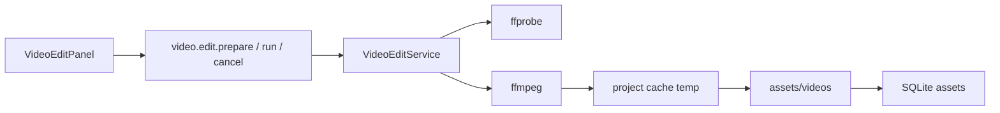

# 本地文件级基础剪辑计划

版本：1.1  
日期：2026-08-04  
状态：计划已定稿；排在 `docs/CREDIT-PRICING-AND-REFERENCE-VIDEO-PLAN.md` 全部验收之后实施，不与其 A/B 节并行交付

## 1. 文档目的

本文档定义「本地文件级基础剪辑」里程碑的产品边界、架构、不变量、实施阶段与验收门禁。

覆盖：

- 素材库内简易视频预览与打点选段（解决盲填秒数无法对准画面的问题）。
- 裁剪、静音、顺序拼接三类文件级操作。
- Worker 通过捆绑的 `ffmpeg.exe` / `ffprobe.exe` 执行处理，结果另存为新素材。
- 打包、许可证、项目隔离与质量门禁要求。

本文档是实施和验收依据。依据：`docs/QUALITY-GATES.md`。

**排期约束（硬）：** 必须在积分定价与参考生扩模型计划（CREDIT）的 A 节硬门禁与 B 节验收完成后再开工本里程碑；不得与 CREDIT 混在同一交付轮次。

## 2. 背景与现状

### 2.1 已有能力

- 生成视频下载后落盘到项目 `assets/videos/`，SQLite `assets` 表登记相对路径、hash、大小与 kind（`generated-video` / `shot-video`）。
- 素材库可列出、重命名、删除、在资源管理器中显示；视频通过 `asset.open` 用系统默认播放器打开。
- 图片可用 `asset.preview` 在应用内预览；视频无应用内播放与剪辑。
- 项目目录含 `cache/`、`exports/`；媒体写入受磁盘余量与 512 MiB 视频上限约束。

### 2.2 缺口

- 无 FFmpeg / ffprobe，无 trim / mute / concat IPC。
- Tauri CSP 仅有 `img-src`，无 `media-src`，WebView 内 `<video>` 无法安全加载项目媒体。
- `PROJECT-STARTUP.md` MVP 非目标写明不做「复杂剪辑」；需在文档中区分「复杂剪辑」与本里程碑的文件级基础剪辑。

### 2.3 产品问题：如何保证裁剪时间点正确

仅手填「从 3.0 秒到 12.5 秒」无法保证对准用户想要的画面。本里程碑以**应用内播放器打点 + 试看选段**为权威选点方式；秒数输入仅用于微调。

## 3. 已锁定的产品与架构决策

1. **形态**：文件级处理，输出新素材；不做多轨时间线、转场、字幕、调色、口型、配音工作站。
2. **v1 能力**：裁剪（主功能）、静音、顺序拼接（2～N 条，无转场）。
3. **选点 UX**：素材库内简易播放器 + 当前时间显示 +「设为起点」/「设为终点」+「试看选段」；可保留秒数框微调。
4. **唯一剪辑引擎：FFmpeg（已确认）**  
   - 安装包必须捆绑 `ffmpeg.exe` 与 `ffprobe.exe`。  
   - Worker 仅通过子进程 `spawn` 调用上述捆绑二进制完成 probe / trim / mute / concat。  
   - **禁止**替代引擎：Node 原生 FFmpeg 绑定、WASM/纯 JS 转码器、云端剪辑 API、系统 PATH 上未捆绑的 ffmpeg（发布模式）。  
   - 开发可用环境变量 `AI_VIDEO_FFMPEG_PATH` / `AI_VIDEO_FFPROBE_PATH` 指向本地构建，不得写入发布配置。
5. **结果策略**：写入 `assets/videos/{uuid}.mp4|.webm`，SQLite 新行；**永不覆盖**源素材文件。
6. **任务模型**：与视频生成类似的异步任务终态机；受项目会话令牌隔离。
7. **许可证**：分发 LGPL（或更宽松）构建的 FFmpeg，安装包/关于页附许可证与源码获取说明；不捆绑仅 GPL 的受限组件若与产品许可证冲突。
8. **预览协议**：扩展 CSP `media-src`，使用 Tauri `asset:` / `http://asset.localhost` 播放当前项目内已登记视频；路径必须经 Worker/原生校验，禁止任意文件系统 URL。预览只负责选点，**不承担转码**；所有导出处理走 FFmpeg。

## 4. 目标用户流程

### 4.1 裁剪

```text
素材库选择一条视频
→ 应用内播放 / 拖动进度条（显示当前时间）
→ 「设为起点」→ 「设为终点」
→ （可选）微调秒数
→ 「试看选段」（仅播放 [start, end)）
→ 「生成新素材」
→ Worker 创建任务 → ffmpeg 输出到 cache → 原子登记 assets
→ 素材库出现新条目；原片不变
```

### 4.2 静音

```text
选中视频 → 「生成无声副本」→ ffmpeg 去音轨 → 新素材
```

可与裁剪在同一表单组合：先定起止，再勾选「同时去除音频」，一次任务完成。

### 4.3 拼接

```text
素材库多选 2～N 条视频（或在剪辑面板按序添加）
→ 调整顺序
→ 「合并为新素材」
→ ffmpeg concat（优先尝试 demuxer；失败则统一重编码）
→ 新素材
```

## 5. 目标系统架构

```text
Desktop UI
├─ AssetsLibrary（既有）
└─ VideoEditPanel（新建）
   ├─ 预览 <video> + 进度与时间
   ├─ 设为起点 / 终点 / 试看选段
   ├─ 静音开关
   └─ 拼接列表与顺序

Worker
├─ VideoEditService（新建）
│  ├─ probe（ffprobe 时长与流信息）
│  ├─ trim / mute / concat
│  └─ 登记 Asset + 可选 edit_jobs 元数据
└─ FfmpegRuntime
   └─ 解析捆绑二进制路径并 spawn

Persistence
└─ project.sqlite
   ├─ assets（新行）
   └─ video_edit_jobs（建议新表，或复用 generation_jobs 扩展 kind）

Tauri
├─ CSP media-src
├─ asset 协议范围限制在当前项目
└─ externalBin / resources：ffmpeg、ffprobe
```



## 6. 数据与 IPC 设计

### 6.1 任务状态机

```text
pending → running → complete
                 → failed
                 → cancelling → cancelled
```

进程退出或项目关闭时：取消运行中的 ffmpeg；清理临时文件；非终态任务恢复为 `failed` 或 `cancelled`（与现有视频任务恢复策略一致，不得永久 `running`）。

### 6.2 建议表 `video_edit_jobs`（项目库迁移）

```text
id
project_id
operation          -- trim | mute | concat | trim_mute
status
source_asset_ids_json
params_json        -- startSec, endSec, mute, order
result_asset_id
error_code
error_message
created_at
started_at
completed_at
```

若不做独立表，可将操作快照写入现有任务表的扩展 metadata，但必须能按项目列出与恢复；本计划默认独立表，Schema 版本随实施时下一档迁移号递增。

### 6.3 IPC（合约草案）

| 方法 | 作用 |
|---|---|
| `video.edit.probe` | 返回时长、是否有音轨、容器提示 |
| `video.edit.prepare` | 校验参数与源素材归属，创建 pending 任务 |
| `video.edit.run` | 启动 ffmpeg（可与 prepare 合并为一步，但取消点需清晰） |
| `video.edit.cancel` | 终止进程并终态化 |
| `video.edit.get` / `list` | 查询任务 |
| `asset.mediaUrl` 或等价 | 返回可供 `<video>` 使用的受控预览引用（仅当前项目、仅已登记视频） |

参数约束：

- `startSec` / `endSec`：有限数字，`0 <= start < end`，`end` 不超过 ffprobe 时长（允许末尾极小 epsilon）。
- concat：`2 <= N <= 20`（硬上限，防止异常列表）。
- 源 `assetId` 必须属于当前可写项目且扩展名为 `.mp4` / `.webm`。

### 6.4 资产 kind

新素材默认 `generated-video`；若所有源均为 `shot-video` 且 UI 选择关联镜头，允许登记为 `shot-video` 并带 `shotId`（若现有资产模型支持；否则 v1 一律 `generated-video`，在结果 metadata 中记录源资产 ID）。

## 7. FFmpeg 运行时

### 7.1 二进制定位

解析顺序：

1. 环境变量覆盖（仅开发）：`AI_VIDEO_FFMPEG_PATH` / `AI_VIDEO_FFPROBE_PATH`
2. 与 sidecar / 应用资源目录相邻的捆绑路径（发布）
3. 找不到则任务失败，错误信息可操作（提示重装或联系支持），不得静默跳过

### 7.2 命令策略

| 操作 | 策略 |
|---|---|
| trim | 优先 `-ss` / `-to` 重封装（`-c copy`）；若容器/关键帧导致失败或结果时长偏差过大，回退重编码（H.264/AAC 或源为 WebM 时用 VP9/Opus 保守配置） |
| mute | `-an` 或去掉音频流；优先 copy 视频流 |
| concat | 同编码参数时尝试 concat demuxer + copy；否则统一重编码后拼接 |

超时：按源时长与体积设总时限（例如 `max(120s, durationSec * 3)`，并设绝对上限如 30 分钟）。超时杀进程并 `failed`。

### 7.3 工作目录与清理

- 输入仅项目内已登记相对路径，经 `resolveProjectRelativePath` 解析。
- 输出先写 `cache/video-edit/{jobId}/`，成功后原子移动/复制到 `assets/videos/`，再写库；失败删除临时目录。
- 取消、关闭项目、Worker 重启：尽最大努力删除对应临时目录。

## 8. UI 设计

### 8.1 入口

- 素材库选中视频时，详情区由「播放视频」（系统播放器）扩展为：
  - 应用内预览（主）
  - 保留「用系统播放器打开」作为次要操作
  - 「基础剪辑」展开 `VideoEditPanel`

### 8.2 VideoEditPanel

必需控件：

- `<video>` 预览、播放/暂停、进度条、当前时间 / 总时长
- 「设为起点」「设为终点」
- 起点、终点秒数输入（与打点双向同步）
- 「试看选段」：将 `currentTime` 设为起点并在到达终点时暂停
- 「去除音频」开关
- 「生成新素材」主按钮；busy / 进度 / 错误区
- 拼接：有序列表、上移下移、添加/移除；单独「合并」按钮

布局：保持现有素材库结构，不引入新样式框架；窄屏下预览在参数上方。

### 8.3 组件拆分

建议从 `App.tsx` 抽出：

```text
apps/desktop/src/
├─ VideoEditPanel.tsx
└─ video-edit-client.ts
```

## 9. 不变量与故障矩阵

### 9.1 领域不变量

1. 剪辑输出不得覆盖任何已有 `assets` 相对路径。
2. 源与目标路径必须落在当前项目根内；拒绝 `..` 与绝对路径穿越。
3. 仅 `.mp4` / `.webm` 可作为源与默认输出。
4. 每个任务进入 `complete` / `failed` / `cancelled` 终态；重启不得永久保留 `running`。
5. 项目关闭或切换时，旧项目 ffmpeg 回调不得写入新项目。
6. 预览 URL 不得暴露任意磁盘路径；不得把凭据写入预览查询串。
7. 磁盘余量与 512 MiB（或与现网一致的上限）在写最终文件前检查；失败清理临时文件。
8. 诊断日志不得包含完整用户媒体路径以外的敏感数据；错误消息长度受限且可操作。
9. 捆绑 ffmpeg 缺失时明确失败，不回退到调用系统 PATH 上的未知 ffmpeg（避免行为不一致与供应链风险）。开发环境变量覆盖除外且不得打进发布配置。

### 9.2 故障矩阵

| 场景 | 必须满足的结果 |
|---|---|
| 起点 >= 终点 | prepare 拒绝，不建任务 |
| 终点 > 时长 | 拒绝或钳制到时长（选定：**拒绝**，提示重新打点） |
| 源素材已删除 | 失败，不写半成品 |
| ffmpeg 被用户取消 | `cancelled`，清理 temp |
| 关闭项目时任务 running | 先取消再关库 |
| concat 编码不一致且重编码失败 | `failed`，保留源 |
| 磁盘不足 | 拒绝，清理 temp |
| 只读项目 | 拒绝 prepare |
| CSP/预览失败 | 剪辑面板显示错误；仍可提示系统播放器，但不允许盲填作为唯一路径（v1 必须预览可用才允许生成，或预览失败时禁用生成并说明原因） |
| 打包缺失 ffmpeg | 安装后探测失败有明确文案 |

### 9.3 需求追踪

| 不变量 | 负责模块 | 必需测试 |
|---|---|---|
| 不覆盖源素材 | VideoEditService | trim-writes-new-asset |
| 路径隔离 | VideoEditService / ProjectService | path-escape-rejected |
| 任务终态与取消 | VideoEditService | cancel-during-ffmpeg |
| 项目切换隔离 | VideoEditService / Desktop | stale-edit-callback |
| 磁盘与体积上限 | VideoEditService | low-space-reject |
| 预览仅限项目资产 | Tauri / Desktop | media-src-asset-scope |
| ffmpeg 路径解析 | FfmpegRuntime | bundled-binary-resolution |
| 打点与试看 | VideoEditPanel 测试 | mark-in-out-preview-range |

## 10. 实施阶段

### 阶段 E0：前置条件

- CREDIT 计划 A/B 全部验收通过（含 sidecar 硬门禁）。
- 记录当前安装包体积基线，作为 FFmpeg 捆绑后的对比基准。

### 阶段 E1：预览通道

- 扩展 [`apps/desktop/src-tauri/tauri.conf.json`](apps/desktop/src-tauri/tauri.conf.json) CSP：`media-src 'self' asset: http://asset.localhost`（按 Tauri 2 实际 asset 主机名校准）。
- 实现受控视频预览引用；素材库视频详情使用 `<video>`。
- 门禁：桌面测试覆盖视频预览加载；非法 assetId 拒绝。

### 阶段 E2：FFmpeg 运行时与打包

- 将 `ffmpeg.exe` / `ffprobe.exe` 纳入发布资源（`externalBin` 或 `resources`）。
- 实现 `FfmpegRuntime` 路径解析、版本探测、spawn 封装、超时与取消。
- 添加许可证文件与关于/文档说明。
- 门禁：开发与打包路径均可探测；缺失二进制时错误稳定。

### 阶段 E3：Worker 剪辑服务

- 新增 `video-edit-service.ts` 与合约方法。
- 实现 probe / trim / mute / concat、临时目录、资产登记、任务表迁移。
- 门禁：Worker 单测使用夹具短视频（仓库内小型固定夹具）；覆盖成功、取消、非法区间、路径穿越。

### 阶段 E4：剪辑 UI

- 实现 `VideoEditPanel`：打点、试看、静音、拼接顺序、任务状态。
- 从 `App.tsx` 接入素材库详情。
- 门禁：组件测试覆盖打点同步、试看区间、无预览禁用生成。

### 阶段 E5：文档与发布验证

- 更新 `docs/PROJECT-STARTUP.md`：澄清「复杂剪辑」非目标 vs 本文件级能力。
- 更新 `docs/M4`/`M1` 或素材相关文档中的能力表；`QUALITY-GATES.md` 追加追踪行。
- 运行 typecheck、lint、test、Rust test、sidecar（若本轮改动触及）、以及含 ffmpeg 资源的打包冒烟（至少能 probe）。
- 记录 NSIS 体积增量。

## 11. 明确不做

- 多轨时间线、磁吸、转场、字幕、调色、音频混音、变速、倒放。
- 逐帧精修与波纹编辑。
- 云端剪辑 API。
- WASM / 纯 JS 转码器，或任何非捆绑 FFmpeg 的导出路径。
- Node 原生 FFmpeg 绑定（`ffmpeg-static` 原生模块、`fluent-ffmpeg` 依赖系统二进制等均不符合本计划的捆绑 spawn 模型）。
- 自动字幕 / 口型 / 数字人。
- 调用系统 PATH 上未捆绑的 ffmpeg（发布模式）。
- 与 CREDIT A/B 同一轮混交或抢占其门禁机器时间。

## 12. 验证命令（实施阶段）

```powershell
pnpm --filter @ai-video/contracts build
pnpm --filter @ai-video/worker test
pnpm --filter @ai-video/desktop test
cargo test --manifest-path apps/desktop/src-tauri/Cargo.toml
pnpm typecheck
pnpm lint
pnpm format:check
pnpm test
```

打包冒烟：安装或解包后确认 `ffmpeg.exe` / `ffprobe.exe` 存在，Worker `video.edit.probe` 对夹具成功。

## 13. 风险与缓解

| 风险 | 影响 | 缓解 |
|---|---|---|
| 安装包体积显著增加 | 分发与 CI 变慢 | 使用精简 LGPL 构建；记录体积门禁 |
| `-c copy` 裁剪关键帧不准 | 用户认为打点无效 | 偏差检测后重编码回退；UI 说明「导出可能重编码」 |
| concat 编码不一致 | 合并失败 | 自动重编码回退；失败可操作文案 |
| CSP / asset 协议踩坑 | 预览不可用 | E1 单独验收；预览失败禁用生成 |
| ffmpeg 许可证不合规 | 发布阻断 | 法务友好构建 + 许可证副本 |
| 长任务阻塞 Worker | 其它 IPC 卡顿 | 子进程异步；取消；必要时限制并发为 1 |

## 14. 实施清单

| 序号 | 项 | 状态 |
|---|---|---|
| 0 | CREDIT 计划验收完成（前置） | 阻塞中 |
| 1 | 本计划文档定稿 | 已完成 |
| 2 | E1 预览 CSP + 素材库内播放 | 待做（CREDIT 后） |
| 3 | E2 捆绑 ffmpeg/ffprobe + Runtime | 待做 |
| 4 | E3 VideoEditService + IPC + 迁移 | 待做 |
| 5 | E4 VideoEditPanel 打点/试看/静音/拼接 | 待做 |
| 6 | E5 文档、QUALITY-GATES、打包冒烟 | 待做 |

## 15. 与其它文档的关系

| 文档 | 关系 |
|---|---|
| `docs/CREDIT-PRICING-AND-REFERENCE-VIDEO-PLAN.md` | **前置**里程碑；本计划不得并行抢交付 |
| `docs/PROJECT-STARTUP.md` | 实施时澄清非目标措辞：禁止复杂 NLE，允许本文件级能力 |
| `docs/QUALITY-GATES.md` | 实施时追加 §9.3 追踪行与故障场景 |
| `docs/M1-DATA-LAYER.md` | 实施时补充 `video_edit_jobs` 与编辑产物说明 |

## 16. 修订记录

| 版本 | 日期 | 说明 |
|---|---|---|
| 1.0 | 2026-08-04 | 初稿：锁定文件级剪辑 + 打点试看 UX + 捆绑 FFmpeg；排在 CREDIT 之后 |
| 1.1 | 2026-08-04 | 产品确认：FFmpeg 为唯一剪辑引擎；明确排除 WASM/云端/原生绑定/系统 PATH 回退 |
