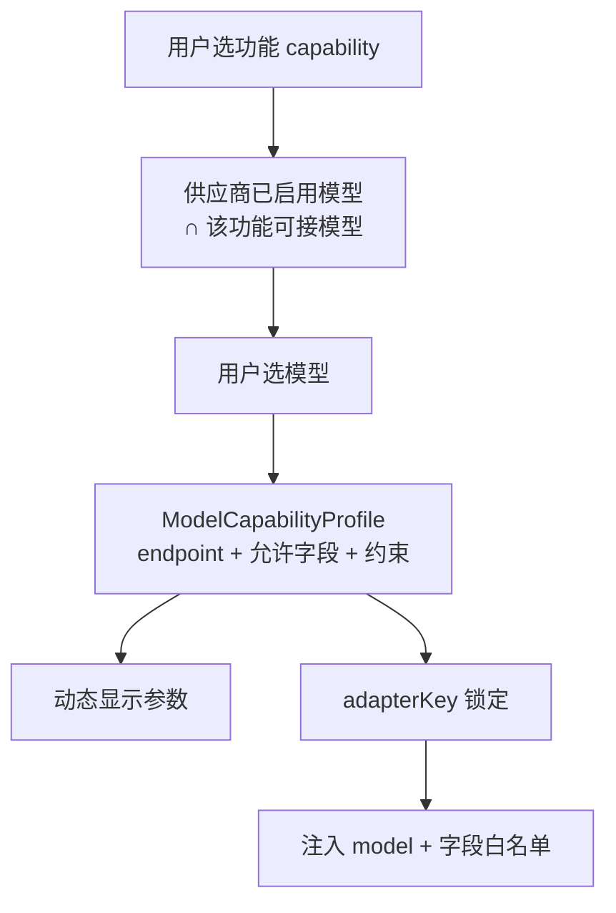

# 积分定价修复与参考生视频扩模型计划

版本：1.0  
日期：2026-08-03  
状态：计划已定稿，待实施

## 1. 文档目的

本文档记录下一阶段实施计划，覆盖：

- 修复 Vidu 视频积分单价解析与估价链路缺陷。
- 预留按厂商适配的响应用量提取，缺用量不阻断任务。
- 修复 sidecar 打包 `better-sqlite3` ABI 路径。
- 在不推翻现有「选功能 → 选模型 → 动态参数」交互的前提下，用配置表工厂扩展参考生视频模型。

本文档是实施和验收依据。先完成 A 节缺陷修复，再进入 B 节扩模型。

## 2. 背景与已发现问题

### 2.1 积分定价按 UUID 解析远端模型 ID

生产面板提交视频时传的是 `selectedModel.remoteModelId`（如 `viduq3-pro`），但 `AppSettingsService.resolveCreditPricing` 用 `requireUuid(modelId)` 查找本地模型主键。接通定价解析器后，带 profile/model 的 `video.generate.prepare` 会直接抛错。

### 2.2 Sidecar 预编译未进入 pkg assets

`build-sidecar.mjs` 已改为在 `dist-sidecar/node_modules/better-sqlite3` 中安装 Node 22 预编译，但 `apps/worker/package.json` 的 `pkg.assets` 仍指向真实 `node_modules` 中的开发机 ABI，打包产物可能无法在 sidecar 运行时加载。

### 2.3 参考生模型覆盖不足

当前 `REFERENCE_TO_VIDEO` 目录仅有 `viduq3` 与 `viduq3-drama`。官方参考生（非主体）还包含 `viduq3-ad` / `viduq3-mix` / `viduq3-turbo` / `viduq2-pro` 等；需按模型约束扩展，而不是做成「一个总适配器含官网全部参数」。

## 3. 设计结论：交互可保留，实现不用巨型适配器

目标交互（已接近现状）：

1. 用户选择功能（capability，如文生图 / 参考生视频）。
2. 在当前供应商连接中筛出支持该功能的已启用模型。
3. 用户选择模型后，按该模型的参数画像动态渲染表单。



不采用「单一总适配器塞入 Vidu 全部官方字段」：

| 做法 | 问题 |
|---|---|
| 巨型 schema 含全部字段 | 能力间字段串扰；违反 `additionalProperties: false` |
| WebView 自选 `model` / 任意字段 | 破坏 M4：model/host/path 必须原生注入与白名单 |
| 官网全量透传（`callback_url`、`payload` 等） | 回调与透传风险；产品已明确不暴露 |

推荐落地：`(capability, provider, model, apiVersion)` → 一份参数画像；运行时仍导出唯一 `adapterKey`；UI 渲染该画像。本轮用配置表工厂生成多条 `AdapterDescriptor`。

## 4. A. 缺陷修复（先做）

### A1. 积分定价按远端模型 ID

文件：`apps/worker/src/app-settings-service.ts`

- `providerProfileId` 继续 `requireUuid`。
- `modelId` 使用 `getByRemoteId(profile.id, normalizeModelId(modelId))`。
- 找不到 / 非 vidu / 无 `creditPrice` → 返回 `undefined`（不抛错）。
- 仅 profile UUID 非法时抛错。

### A2. 用量按厂商适配提取

在 `packages/generation-adapters` 增加：

```ts
extractVideoCost(provider: string, body: unknown): VideoGenerationCostInfo | undefined
```

- 按 provider 注册；Vidu 迁入现有 `credits` / `credits_used` / `creditsUsed`。
- Worker `observedMetadata`：`getAdapter(adapterKey)?.provider` → `extractVideoCost` → 再 `priceProviderCost`。
- 无用量字段返回 `undefined`，任务成功路径不变。
- 不把可执行提取函数挂到可 IPC 序列化的 catalog 描述符上。

### A3. Sidecar ABI

- 保持在 sidecar 副本中 prebuild Node `22.23.2`。
- `apps/worker/package.json` 的 `pkg.assets` 改为：  
  `dist-sidecar/node_modules/better-sqlite3/build/Release/better_sqlite3.node`
- 顺序：prebuild → esbuild → pkg → finally 清理副本。

## 5. B. 参考生扩模型

### B1. 范围

仅 `REFERENCE_TO_VIDEO`：`viduq3`、`viduq3-drama`（已有）、`viduq3-ad`、`viduq3-mix`、`viduq3-turbo`、`viduq2-pro`。

### B2. 配置表工厂

在 `packages/generation-adapters/src/index.ts`：

```ts
type ReferenceVideoModelSpec = {
  model: string;
  modelLabel: string;
  duration: { min: number; max: number; default: number };
  resolution: string[];
  aspectRatio: string[];
  supportsOffPeak: boolean;
};

function referenceVideoAdapter(spec: ReferenceVideoModelSpec): AdapterDescriptor
```

键名：`REFERENCE_TO_VIDEO:vidu:${model}:v2`，endpoint：`/ent/v2/reference2video`。

### B3. 参数边界（非主体、仅图片参考）

| model | duration | resolution | aspect_ratio | off_peak |
|---|---|---|---|---|
| viduq3 | 3–16，默认 5 | 540p/720p/1080p | 16:9/9:16/1:1/3:4/4:3 | 有 |
| viduq3-drama | 2–15，默认 8 | 720p/1080p | 16:9/9:16 | 有 |
| viduq3-ad | 3–15，默认 5 | 720p/1080p | 同 q3 常用集 | 有 |
| viduq3-mix | 3–15，默认 5 | 720p/1080p | 同 q3 常用集 | 无（官方注明 mix 不支持错峰） |
| viduq3-turbo | 3–16，默认 5 | 540p/720p/1080p | 同 q3 | 有 |
| viduq2-pro | 1–10，默认 5（不做 duration=0） | 540p/720p/1080p | 含 4:3/3:4 | 有（audio=false 时） |

共用字段：`images`(1–7)、`prompt`、`audio`、`seed`；专业区含 `off_peak`（mix 除外）。

### B4. 本轮明确不做

- `sounds` / `videos`（音视频参考）
- 主体库（`subjects` / `auto_subjects`）
- `watermark` / `wm_*` / `callback_url` / `payload` / `meta_data`
- 对 q3 无效的 `bgm`、`movement_amplitude`
- 文生 / 首尾帧 / 图生其它模型扩容（后续可复用工厂）

### B5. 联动改动

1. Adapters：工厂生成 6 条（含重构已有 q3 / drama）。
2. Rust `lib.rs`：`provider_target` / `ensure_video_adapter` 注册新 key，共用 `REFERENCE_VIDEO_FIELDS`。
3. `provider-registry.ts`：内置模型增加 ad / mix / turbo / q2-pro。
4. 已有 Vidu profile 补种缺失 built-in（否则旧连接看不到新模型）。
5. UI 选择器逻辑不改；`modelOptions` 自动出现新条目。
6. 更新 `docs/M4-ADAPTERS-PARAMETERS.md` 模型表。

## 6. 测试与验证

### 6.1 单测

- `resolveCreditPricing(profileId, remoteModelId)` 成功；非法/不存在返回 `undefined`。
- Vidu body 可提取 credits；无用量 body 返回 `undefined`。
- 有 pricingSnapshot + credits → `estimatedAmount`；无用量任务仍成功。
- 每个新 adapter key 可 resolve；mix 拒绝 `off_peak`；drama/mix duration 边界。
- 内置列表与补种幂等；Rust 注入正确 model。

### 6.2 门禁顺序

1. `pnpm --filter @ai-video/generation-adapters test`
2. `pnpm --filter @ai-video/worker test`
3. 环境允许时 `pnpm worker:sidecar`
4. 不强制本轮完整 Tauri/NSIS

## 7. 实施清单

| 序号 | 项 | 状态 |
|---|---|---|
| 1 | `resolveCreditPricing` 改远端模型 ID | 待做 |
| 2 | `extractVideoCost` + Worker 接入 | 待做 |
| 3 | sidecar `pkg.assets` 指向副本预编译 | 待做 |
| 4 | 参考生配置表工厂 + ad/mix/turbo/q2-pro | 待做 |
| 5 | Rust 白名单注册新 adapterKey | 待做 |
| 6 | 内置模型与已有 profile 补种 | 待做 |
| 7 | 适配器 / 注册表 / Rust / 必要 UI 测试 | 待做 |
| 8 | 跑相关测试与可选 sidecar | 待做 |

## 8. 不改动的范围

- 无边框窗口、目录对话框、生产区布局交互本身。
- schema v3 / `credit_price` 列已在进行中的功能改动中，本计划不回退。
- 动态参数渲染机制不变（仍按各 adapter schema 渲染）。
- UI 继续传 `remoteModelId`；`model` 继续由 Rust 注入。
