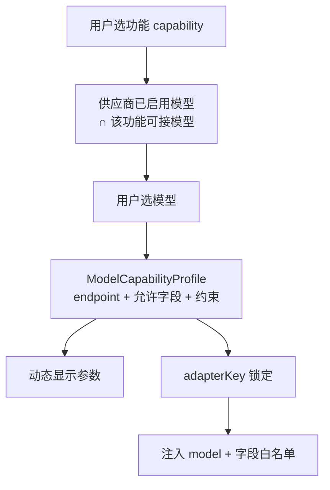

# 积分定价修复与参考生视频扩模型计划

版本：1.2  
日期：2026-08-04  
状态：审查修订稿，待实施

## 1. 文档目的

本文档记录下一阶段实施计划，覆盖：

- 修复 Vidu 视频积分单价解析缺陷（主阻断）。
- 将响应用量提取抽到按厂商适配的扩展点（行为保持，便于后续厂商）。
- 修复 sidecar 打包 `better-sqlite3` ABI 路径，并以 sidecar 产物验证为硬门禁。
- 在不推翻现有「选功能 → 选模型 → 动态参数」交互的前提下，用配置表工厂扩展参考生视频模型。

本文档是实施和验收依据。先完成 A 节（含 A3 sidecar 硬门禁），再进入 B 节扩模型。

依据：`docs/QUALITY-GATES.md`。本计划涉及应用设置库查询、视频任务元数据、原生白名单与 sidecar 打包，实施前以下不变量、故障矩阵和追踪表必须随代码一并落地。

## 2. 背景与已发现问题

### 2.1 积分定价 ID 语义不一致（主阻断）

生产面板 `video.generate.prepare` 传的是 `selectedModel.remoteModelId`（如 `viduq3-pro`），但 `AppSettingsService.resolveCreditPricing` 用 `requireUuid(modelId)` 按本地模型主键查找。接通定价解析器后会抛错，准备阶段失败。

同时存在另一条合法调用形态：设置页与现有单测传入的是本地模型 UUID（`model.id`）。只改成「仅 remote ID」会破坏 UUID 路径；只改 UI 传 UUID 又不处理 remote，会与草稿键（当前按 `remoteModelId` 隔离）和既有测试分叉。

根因是 **`modelId` 参数语义未统一**，不是单纯「应一律改成 remote」。

### 2.2 Sidecar 预编译未进入 pkg assets

`build-sidecar.mjs` 已在 `dist-sidecar/node_modules/better-sqlite3` 中安装 Node 22 预编译，但 `apps/worker/package.json` 的 `pkg.assets` 仍指向 workspace `node_modules` 中的开发机 ABI。打包产物可能无法在 sidecar（Node 22）运行时加载。

该问题必须以实际 sidecar 构建与启动验证证明，不能只改路径声明。

### 2.3 参考生模型覆盖不足

当前 `REFERENCE_TO_VIDEO` 目录仅有 `viduq3` 与 `viduq3-drama`。本轮还需覆盖 `viduq3-ad`、`viduq3-mix`、`viduq3-turbo`、`viduq2-pro`；需按模型约束扩展，而不是做成「一个总适配器含官网全部参数」。

### 2.4 用量提取已存在，不是当前主阻断

`video-generation-service.ts` 已内联解析 `credits` / `credits_used` / `creditsUsed` 并调用 `priceProviderCost`。缺用量时任务仍可成功。当前估价失败来自 2.1，不来自用量提取缺失。A2 是把现有逻辑抽到可按厂商扩展的位置，属重构与预留，不是独立缺陷修复。

## 3. 设计结论：交互可保留，实现不用巨型适配器

目标交互（已接近现状）：

1. 用户选择功能（capability，如文生图 / 参考生视频）。
2. 在当前供应商连接中筛出支持该功能的已启用模型。
3. 用户选择模型后，按该模型的参数画像动态渲染表单。



不采用「单一总适配器塞入 Vidu 全部官方字段」：

| 做法 | 问题 |
|---|---|
| 巨型 schema 含全部字段 | 能力间字段串扰；违反 `additionalProperties: false` |
| WebView 自选 `model` / 任意字段 | 破坏 M4：model/host/path 必须原生注入与白名单 |
| 官网全量透传（`callback_url`、`payload` 等） | 回调与透传风险；产品已明确不暴露 |

推荐落地：`(capability, provider, model, apiVersion)` → 一份参数画像；运行时仍导出唯一 `adapterKey`；UI 渲染该画像。本轮用配置表工厂生成多条 `AdapterDescriptor`。

## 4. 不变量与故障矩阵

### 4.1 领域不变量

1. `resolveCreditPricing` 在合法 profile 下对未知模型、非 Vidu、无 `creditPrice` 一律返回 `undefined`，不得抛错阻断 `video.generate.prepare`。
2. 仅 `providerProfileId` 非法 UUID 时抛错；`modelId` 无论 UUID 或 remote 形态，找不到时静默降级为无定价。
3. 同一连接下本地模型 UUID 与 `remoteModelId` 解析到的定价结果必须一致（有定价时）。
4. 无用量或无定价快照时，任务终态仍可为成功；不得写入虚假积分或虚假金额。
5. 有 `pricingSnapshot` 且供应商返回 credits 时，`estimatedAmount` 使用十进制定点计算，不使用二进制浮点作为权威值。
6. 新增参考生模型的 `adapterKey`、Rust `provider_target` 注入 model、Worker Schema 约束三者一致；WebView 不得改写 `model` / host / path。
7. mix 不得出现 `off_peak` 字段（Schema 与 Rust 白名单双侧拒绝）。
8. 支持错峰的模型必须满足官方 audio 条件：q3 系 `off_peak=true` 时要求 `audio=true`；q2 系 `off_peak=true` 时要求 `audio=false`。
9. sidecar 打包资产必须来自 Node `22.23.2` 预编译副本，不得打入开发机当前 Node ABI。
10. API Key、签名 URL query/fragment、请求正文不得因本轮改动进入 SQLite、日志或诊断包。
11. 旧 Vidu profile 补种 built-in 必须幂等；不得覆盖用户手动改过的显示名、启用状态或单价。

### 4.2 故障矩阵

| 场景 | 必须满足的结果 |
|---|---|
| prepare 传入 remoteModelId 且已配置积分单价 | 写入 `pricingSnapshot`，不抛错 |
| prepare 传入本地模型 UUID 且已配置积分单价 | 同上，结果与 remote 路径一致 |
| modelId 不存在或无 creditPrice | `pricingSnapshot` 为 `undefined`，任务照常创建 |
| providerProfileId 非法 | 明确失败，不创建任务 |
| 轮询 body 无 credits 字段 | 任务可成功；cost 可缺省 |
| 有 credits 无定价快照 | 保留 credits，不编造 estimatedAmount |
| mix + off_peak | Worker 与 Rust 均拒绝 |
| q2-pro + off_peak=true + audio=true | Schema/校验失败，不提交 |
| q3 + off_peak=true + audio=false | Schema/校验失败，不提交 |
| 旧 profile 重复补种 | 不新增重复 remoteModelId；保留用户定价 |
| sidecar 构建时副本目录被提前清理 | 构建失败，不得产出半包 |
| pkg.assets 指到开发机 ABI | 门禁失败（见 §8.2） |

### 4.3 状态与所有权

- 定价快照：在 `video.generate.prepare` 写入任务 `metadataJson.pricingSnapshot`，归属该视频任务；后续改价不影响已快照任务。
- 用量：在轮询 `observedMetadata` 中更新 `metadataJson.cost`，仍归属原任务；受项目会话令牌隔离。
- 适配器与模型目录：应用级 `app-settings.sqlite` + 静态 adapter 目录；密钥仍只在 Windows 凭据库。

## 5. A. 缺陷修复与打包（先做）

### A1. 积分定价双形态解析（主修复）

文件：`apps/worker/src/app-settings-service.ts`

行为：

1. `providerProfileId` 继续 `requireUuid`；非法则抛错。
2. `modelId` **同时接受**本地模型 UUID 与 `remoteModelId`：
   - 若符合模型/UUID 主键形态，先按本地 ID `get`，并校验 `model.providerProfileId === profile.id`；
   - 否则（或 UUID 未命中）再 `getByRemoteId(profile.id, normalizeModelId(modelId))`。
3. 找不到模型 / 非 vidu / 无 `creditPrice` → 返回 `undefined`，不抛错。
4. 本轮 **不强制** 修改 `ProductionPanel` 传参形态；允许继续传 `remoteModelId`，以保持草稿键稳定。
5. 单测必须同时覆盖 remote ID 与本地 UUID 两条成功路径，以及未知模型返回 `undefined`。

后续可选（不阻塞本轮）：视频 prepare 与 LLM 一样改为传本地 UUID；草稿键可继续用 `remoteModelId`。

### A2. 用量提取下沉为厂商扩展点（重构，非主阻断）

在 `packages/generation-adapters` 增加：

```ts
extractVideoCost(provider: string, body: unknown): VideoGenerationCostInfo | undefined
```

- 按 provider 注册；Vidu 迁入现有 `credits` / `credits_used` / `creditsUsed` 逻辑，行为与当前内联实现等价。
- Worker `observedMetadata`：`getAdapter(adapterKey)?.provider` → `extractVideoCost` → 再 `priceProviderCost`。
- 无用量字段返回 `undefined`，任务成功路径不变。
- 不把可执行提取函数挂到可 IPC 序列化的 catalog 描述符上。
- 回归测试：迁移前后同一 fixture body 的 cost 结果一致。

### A3. Sidecar ABI（硬门禁）

- 保持在 sidecar 副本中 prebuild Node `22.23.2`。
- `apps/worker/package.json` 的 `pkg.assets` 改为相对 worker 包根的：  
  `dist-sidecar/node_modules/better-sqlite3/build/Release/better_sqlite3.node`
- 顺序必须为：创建副本 → prebuild → esbuild → **pkg（此时副本仍在）** → finally 清理副本。
- **验收硬门禁**（A 节完成标志）：
  1. `pnpm worker:sidecar` 成功；
  2. 运行既有 M4/M7 sidecar 验证脚本中至少一项可证明 SQLite 可加载的检查（如 `validate:m7-sidecar` 或等价 health + SQLite 探针）；
  3. 构建日志或脚本断言 pkg 打包前目标 `.node` 文件存在，且不是开发机 ABI 回退路径。
- 本轮可不跑完整 NSIS，但 **不可** 把 sidecar 验证标成可选。

## 6. B. 参考生扩模型

### B1. 范围

仅 `REFERENCE_TO_VIDEO`，本轮纳入：

| model | 状态 | 依据 |
|---|---|---|
| `viduq3` | 已有，工厂重构 | 国际站 reference2video |
| `viduq3-drama` | 已有，工厂重构 | 既有中国站产品文档与实现 |
| `viduq3-ad` | 新增 | 产品要求纳入；国际站公开 reference2video / Pricing 表暂无逐字段条目，边界按下方暂定表，实施前用官方失败/成功样本复核 |
| `viduq3-mix` | 新增 | 国际站 reference2video + Pricing |
| `viduq3-turbo` | 新增 | 国际站 reference2video + Pricing |
| `viduq2-pro` | 新增 | 国际站 reference2video（仅图片参考，不做 videos） |

### B2. 配置表工厂

在 `packages/generation-adapters/src/index.ts`：

```ts
type OffPeakPolicy =
  | { mode: 'unsupported' }
  | { mode: 'whenAudio'; audio: boolean }; // off_peak=true 时 audio 必须等于该值

type ReferenceVideoModelSpec = {
  model: string;
  modelLabel: string;
  documentationUrl: string;
  duration: { min: number; max: number; default: number };
  resolution: string[];
  aspectRatio: string[];
  offPeak: OffPeakPolicy;
};

function referenceVideoAdapter(spec: ReferenceVideoModelSpec): AdapterDescriptor
```

键名：`REFERENCE_TO_VIDEO:vidu:${model}:v2`，endpoint：`/ent/v2/reference2video`。

工厂必须根据 `offPeak`：

- `unsupported`：Schema 与 uiSchema 均不含 `off_peak`；
- `whenAudio`：含 `off_peak`，并在校验中强制 `off_peak !== true || audio === spec.offPeak.audio`。

### B3. 参数边界（非主体、仅图片参考）

来源优先级：国际站 [Reference to Video](https://platform.vidu.com/docs/reference-to-video) 与 [Pricing](https://platform.vidu.com/docs/pricing)；`viduq3-drama` 沿用既有已验证边界。若 API 与 Pricing 冲突，取更窄的可计费区间，并在表中注明。

| model | duration | resolution | aspect_ratio | off_peak |
|---|---|---|---|---|
| viduq3 | 3–16，默认 5 | 540p/720p/1080p | 16:9/9:16/1:1/3:4/4:3 | 有；`off_peak=true` ⇒ `audio=true` |
| viduq3-drama | 2–15，默认 8 | 720p/1080p | 16:9/9:16 | 有；同 q3 audio 条件 |
| viduq3-ad | **3–15，默认 5（暂定）** | **720p/1080p（暂定）** | **同 q3 常用集（暂定）** | **有；同 q3 audio 条件（暂定）** |
| viduq3-mix | **3–16**，默认 5（Pricing 为 3–16；不用 API 文案 1–16） | 720p/1080p | 16:9/9:16/1:1/3:4/4:3 | **无**（Pricing：Not Supported） |
| viduq3-turbo | 3–16，默认 5 | 540p/720p/1080p | 同 q3 | 有；`off_peak=true` ⇒ `audio=true` |
| viduq2-pro | 1–10，默认 5（不做 duration=0 自动时长） | 540p/720p/1080p | 含 4:3/3:4 | 有；`off_peak=true` ⇒ `audio=false` |

`viduq3-ad` 说明：公开国际站文档未列出该 model 的逐字段矩阵。本轮按与广告向 Q3 特化模型相近的收窄边界落地（时长上限 15、无 540p），并在真实或官方错误样本复核前保持「暂定」。若复核发现更窄/更宽约束，只改该行 Spec，不改工厂结构。

共用字段：`images`(1–7)、`prompt`、`audio`、`seed`。专业区按模型决定是否含 `off_peak`。

### B4. 本轮明确不做

- `sounds` / `videos`（音视频参考）
- 主体库（`subjects` / `auto_subjects`）
- `watermark` / `wm_*` / `callback_url` / `payload` / `meta_data`
- 对 q3 无效的 `bgm`、`movement_amplitude`
- 文生 / 首尾帧 / 图生其它模型扩容（后续可复用工厂）
- 完整 NSIS / 签名发布（A3 sidecar 硬门禁除外）

### B5. 联动改动

1. Adapters：工厂生成 6 条（重构 q3 / drama，新增 ad / mix / turbo / q2-pro）。
2. Rust `lib.rs`：
   - 为每个新 `adapterKey` 注册 `provider_target` / `ensure_video_adapter`；
   - **不得**对 mix 共用含 `off_peak` 的字段表；mix 使用不含 `off_peak` 的白名单；
   - 其余参考生模型（含 `viduq3-ad`）可共用含 `off_peak` 的参考生字段表。
3. `provider-registry.ts`：内置模型增加 ad / mix / turbo / q2-pro。
4. 已有 Vidu profile 补种缺失 built-in（否则旧连接看不到新模型）；补种幂等且不覆盖用户定价与启用状态。
5. UI 选择器逻辑不改；`modelOptions` 通过 adapter.model ∩ 已启用模型自动出现新条目。
6. 更新 `docs/M4-ADAPTERS-PARAMETERS.md` 模型表。
7. 在 `docs/QUALITY-GATES.md` 追踪表追加本轮不变量对应测试条目（或在本文件 §7.3 维持追踪，合并时同步门禁文档）。

## 7. 测试与验证

### 7.1 单测

- `resolveCreditPricing(profileId, remoteModelId)` 与 `(profileId, modelUuid)` 均成功且结果一致。
- 非法 profile UUID 抛错；未知 model / 无定价返回 `undefined`。
- Vidu body 可提取 credits；无用量 body 返回 `undefined`；与重构前 fixture 一致。
- 有 pricingSnapshot + credits → `estimatedAmount`；无用量任务仍成功。
- 每个新 adapter key 可 resolve；mix 拒绝 `off_peak`；drama/ad/mix/turbo/q2-pro duration 与分辨率边界。
- q3-turbo / q3-ad：`off_peak=true` 且 `audio=false` 失败；q2-pro：`off_peak=true` 且 `audio=true` 失败。
- 内置列表与补种幂等；Rust 注入正确 model（含 `viduq3-ad`），且 mix 白名单不含 `off_peak`。

### 7.2 门禁顺序（A 完成前不得开始 B 的合并验收）

1. `pnpm --filter @ai-video/generation-adapters test`
2. `pnpm --filter @ai-video/worker test`
3. 相关 Rust 测试：`cargo test --manifest-path apps/desktop/src-tauri/Cargo.toml`
4. **`pnpm worker:sidecar`（A3 硬门禁）**
5. sidecar SQLite/health 验证（`validate:m7-sidecar` 或同等探针）
6. 本轮不强制完整 Tauri/NSIS；不得用“可选 sidecar”绕过第 4–5 步

### 7.3 需求追踪

| 不变量 | 负责模块 | 必需测试 |
|---|---|---|
| 定价双形态解析且失败不阻断 prepare | AppSettingsService / VideoGenerationService | remote-id/uuid pricing; missing-price prepare |
| 无用量不阻断成功 | VideoGenerationService / generation-adapters | extract-cost absent body |
| mix 无 off_peak（TS+Rust） | generation-adapters / lib.rs | mix-schema; mix-allowed-fields |
| 错峰与 audio 条件 | generation-adapters | q3/q2 off_peak audio matrix |
| sidecar Node22 ABI 资产 | build-sidecar / worker package.json | worker:sidecar + sqlite probe |
| 旧 profile 补种幂等 | AppSettingsService / provider-registry | seed-idempotent/preserve-pricing |

## 8. 实施清单

| 序号 | 项 | 状态 |
|---|---|---|
| 1 | `resolveCreditPricing` 双形态解析 + 双路径测试 | 待做 |
| 2 | `extractVideoCost` 下沉 + 行为等价回归 | 待做 |
| 3 | sidecar `pkg.assets` 指向副本预编译 | 待做 |
| 4 | `pnpm worker:sidecar` + SQLite/health 硬门禁 | 待做 |
| 5 | 参考生配置表工厂 + ad/mix/turbo/q2-pro（重构 q3/drama） | 待做 |
| 6 | Rust 白名单按模型区分（mix 无 off_peak；ad 注入 viduq3-ad） | 待做 |
| 7 | 内置模型与已有 profile 幂等补种（含 ad） | 待做 |
| 8 | 适配器 / 注册表 / Rust / 必要 UI 测试 | 待做 |
| 9 | 更新 M4 文档与质量门禁追踪 | 待做 |

## 9. 不改动的范围

- 无边框窗口、目录对话框、生产区布局交互本身。
- 应用库 `credit_price` 列（APP_MIGRATION_V3）已存在，本计划不回退、不改列语义。
- 动态参数渲染机制不变（仍按各 adapter schema 渲染）。
- 本轮允许 UI 继续向 prepare 传 `remoteModelId`；`model` 继续由 Rust 注入。
- 不实现视频参考 / 主体库。
- 不将完整 NSIS/签名发布作为本轮完成条件（sidecar 硬门禁除外）。
- 不包含本地文件级基础剪辑；该能力见后续里程碑 `docs/BASIC-VIDEO-EDITING-PLAN.md`（须本计划验收后再开工）。

## 10. 修订记录

| 版本 | 日期 | 说明 |
|---|---|---|
| 1.0 | 2026-08-03 | 初稿 |
| 1.1 | 2026-08-03 | 审查修订：A1 改为双形态解析；A2 降为重构；A3 升为硬门禁；暂缓无出处的 viduq3-ad；修正 mix 时长与 off_peak/audio 条件；补齐不变量、故障矩阵与追踪表 |
| 1.2 | 2026-08-04 | 按产品要求重新纳入 `viduq3-ad`；参数边界标为暂定，实施前用官方样本复核 |
