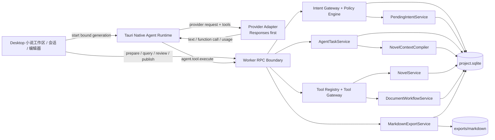

# 小说 Agent 工具业务与实施计划

版本：0.7  
日期：2026-08-16  
状态：P0 决策与业务合同完成，P1-P9 待实施  
适用范围：Desktop、Tauri Native、Worker、Contracts、Domain、Persistence、Context、LLM Provider

> 本文档定义“用户通过会话或小说工作区发出创作指令，Agent 自动生成可审阅章节草稿”的企业级业务逻辑与实施顺序。本文档只规划尚未完成的小说领域和真实 Provider 工具调用能力，不重复实现现有文档草稿、审核、发布、CAS、幂等、任务事件和不可变审计能力。

## 1. 执行摘要

目标业务闭环如下：

```text
用户明确发出创作指令
  -> 系统保存原始消息并解析当前小说作用域
  -> 策略引擎判定为“允许创建草稿”的结构化意图
  -> Worker 创建可恢复 Agent 任务并冻结权威上下文
  -> Native Runtime 调用支持 tools 的模型
  -> 模型发出原生 function/tool call
  -> Worker Tool Gateway 校验并原子保存章节草稿
  -> Desktop 自动打开章节编辑器
  -> 用户修改、审阅并显式发布
  -> 后续 Agent 只读取已发布版本
  -> 用户按需导出固定版本的 Markdown
```

首期采用以下已确认原则，D1-D17 后续变更必须由用户明确提出：

- 明确的“创建、续写、重写章节”指令自动生成草稿，不再要求用户点击“保存为草稿”；
- 普通聊天不产生任何项目数据副作用；
- Agent 可在显式用户意图和可信目标约束下查、增、改、归档和恢复项目文档；不能发布、purge 或覆盖权威版本；
- Worker 是项目 SQLite 和项目导出目录的唯一业务写入者；
- Native Runtime 负责 Provider 多轮工具协议，React 界面不承担工具循环；
- 章节正文的运行时权威源仍是 `document_versions.content_markdown`；
- `.md` 是可追溯导出产物，不是第二套运行时权威数据；
- 不支持 tools 的模型可以继续普通聊天，但不能进入 Agent 创作模式；
- 创作模式中的明确文本指令直接执行，动作按钮只是快捷入口；
- 首期一条创作任务只产生一个主要章节草稿，多章节请求拆为多个任务；
- 章节版本标题只保存章名；章节顺序使用 `position`，结构字段 `display_label` 支持“第十二章、序章、终章、番外一”等标签；
- 项目资料默认排除章节正文，但所有内容继续复用统一文档版本和编辑器；
- 面板或独立窗口关闭不取消后台任务；应用进程退出时持久化恢复状态，不启动脱离应用的守护进程。

## 2. 与现有计划的关系

本计划建立在 [AGENT-PROJECT-DOCUMENT-WORKFLOW-IMPLEMENTATION-PLAN.md](./AGENT-PROJECT-DOCUMENT-WORKFLOW-IMPLEMENTATION-PLAN.md) 已完成的基础能力之上。

### 2.1 直接复用，不重复建设

- `agent_tasks`、`agent_task_events`、`agent_task_generations` 和 `agent_tool_calls`；
- `llm_generations`、`llm_generation_attempts`、上下文快照、幂等、取消和恢复；
- `documents.current_version_id` 工作指针和 `documents.published_version_id` 权威指针；
- 不可变 `document_versions`；
- 草稿保存、审核、要求修改、拒绝、发布和文档审计；
- 草稿默认不进入 LLM 权威上下文；
- 文档应用内编辑、独立窗口编辑和 Worker 统一保存链路；
- 统一任务日志基础查询。

### 2.2 本计划新增

- 项目一对一的小说创作实体、卷、章节及小说资料绑定；
- 显式创作模式、结构化意图和稳定目标作用域；
- Tool Registry、Tool Gateway 和严格 JSON Schema；
- OpenAI Responses 首期原生工具调用循环；
- Provider 工具事件的统一协议和后续 Chat Completions 兼容层；
- 章节自动建草稿、自动打开编辑器及失败恢复；
- 小说专用上下文编译、章节摘要和一致性治理；
- Markdown 固定版本导出；
- 小说章节向同一项目内的短剧制作域生成可审阅改编提案的扩展边界。

## 3. 当前代码基线

当前项目 Schema 为 v13。通用 Agent 文档工作流已经把 v14 固定为任务 CRUD/证据保留、Provider step/tool 关联、文档归档/审计和上下文 manifest 增量；小说领域不得复用该版本号。实施时必须先完成通用 v14，再从 v15 开始小说能力迁移。

| 领域 | 当前事实 | 本计划处理 |
|---|---|---|
| Worker RPC | `packages/contracts/src/index.ts` 已有强类型方法映射 | 增加小说实体、Agent 意图、工具调用和导出合同 |
| 请求校验 | `apps/worker/src/request-validation.ts` 默认拒绝未知字段 | 作为 Tool Gateway 严格参数校验底座 |
| LLM generation | `GenerationService` 已有 generation/attempt、幂等、取消、流式增量、用量和费用 | Agent 任务必须先于 generation 创建，并正式关联 `agent_task_generations` |
| Native Provider | `llm_stream.rs` 已支持 Responses 和 Chat Completions SSE、凭据、超时和用量 | 增加 tools 请求、工具事件解析、Worker 执行和 continuation loop |
| Agent 任务 | Schema v13 已有任务、事件、工具调用和文档产物表 | 增加结构化意图、稳定目标、执行阶段和小说关联 |
| 文档工作流 | 已有草稿、CAS、审核、发布和审计 | 作为章节正文及小说资料正文的唯一版本系统 |
| 上下文 | 默认只读取已发布文档 | 增加小说来源优先级、摘要缓存和动态 Token 预算 |
| Desktop | 已有普通会话、手工“从回复创建草稿”和独立文档窗口 | 增加小说工作区、创作模式、任务进度和自动打开草稿 |
| 小说领域 | 尚不存在 | Schema v15 新增项目一对一小说资料、卷、章节和通用文档绑定 |
| Markdown | 已有安全导入，没有章节级固定版本导出 | 新增 Worker 受控导出、清单和原子写入 |

关键基线文件：

- [packages/contracts/src/index.ts](../packages/contracts/src/index.ts)
- [packages/domain/src/index.ts](../packages/domain/src/index.ts)
- [packages/persistence/src/schema.ts](../packages/persistence/src/schema.ts)
- [packages/persistence/src/repositories.ts](../packages/persistence/src/repositories.ts)
- [apps/worker/src/request-validation.ts](../apps/worker/src/request-validation.ts)
- [apps/worker/src/generation-service.ts](../apps/worker/src/generation-service.ts)
- [apps/worker/src/document-workflow-service.ts](../apps/worker/src/document-workflow-service.ts)
- [apps/worker/src/context-service.ts](../apps/worker/src/context-service.ts)
- [apps/desktop/src-tauri/src/llm_stream.rs](../apps/desktop/src-tauri/src/llm_stream.rs)
- [apps/desktop/src/llm-client.ts](../apps/desktop/src/llm-client.ts)
- [apps/desktop/src/ChatPanel.tsx](../apps/desktop/src/ChatPanel.tsx)
- [apps/desktop/src/App.tsx](../apps/desktop/src/App.tsx)

## 4. 范围与非目标

### 4.1 首期范围

- 为项目启用小说创作实体，并创建可选卷和章节；
- 从章节页面或显式创作模式发起创建、续写、重写和修改任务；
- 自动创建章节占位和 Agent 任务；
- 通过 Provider 原生工具调用保存章节草稿；
- 自动打开对应章节编辑器；
- 用户编辑并通过一次“发布”操作完成原子自审和发布；
- 按已发布版本编译小说上下文；
- 生成或更新大纲、人物设定、世界观、时间线和风格指南等小说资料草稿；
- 在显式用户意图下查找、读取、归档和恢复项目文档或章节，purge 仍只属于用户维护入口；
- 导出指定章节版本或整部作品的 Markdown；
- 在任务日志中定位源消息、任务、generation、工具调用、章节和版本。

### 4.2 明确非目标

- Agent 自动发布、purge 或未经明确用户意图归档/恢复正式章节；
- LLM 直接访问 SQLite、项目目录、任意文件路径或操作系统命令；
- 解析普通回答中的 Markdown/JSON 来伪装工具调用；
- 首期让一个模型调用批量创建整本小说；
- 首期依赖向量数据库、云端项目同步或 GitHub 保存运行时小说数据；
- 首期实现多人协作、租户权限、远程审核和服务端审计平台；
- 外部编辑 `.md` 后自动反向覆盖数据库；
- 将完整章节正文重复写入工具日志、任务事件或诊断包；
- 在真实 Provider 工具链稳定前实现自动短剧生产写入。

## 5. 已确认且不再询问的决策

以下决策来自现有产品讨论和已实施文档工作流，后续实施不得自行改变：

| 决策 | 固定结论 |
|---|---|
| 权威存储 | 项目 `project.sqlite` 是运行时权威源 |
| Markdown 定位 | `.md` 仅作为导入或导出产物，不作为第二权威源 |
| Agent 权限 | Agent 可在显式用户意图、唯一目标和 step-local 可信预授权/调用信封约束下执行 `list/read/create/update/archive/restore`；不能发布、purge 或覆盖权威版本 |
| 普通聊天 | 默认无项目数据副作用 |
| 草稿上下文 | 草稿默认不进入其他 LLM 任务的权威上下文 |
| Worker 所有权 | Worker 是 SQLite 和项目导出目录的唯一业务写入者 |
| 版本模型 | 每次生成、编辑、重写和恢复创建不可变版本，不更新历史正文 |
| 工具降级 | 不解析普通文本来模拟工具调用 |
| 多窗口 | 不同章节窗口互不覆盖，同一章节通过 Worker CAS 防止静默冲突 |
| 发布权限 | 发布必须由用户显式触发 |
| 项目与作品 | 一个项目只对应一部作品，项目本身是作品业务根 |
| 内容模块 | 同一项目同时支持小说编写和短剧制作，不创建独立小说项目或衍生短剧项目 |
| 作品名称 | `projects.name` 同时作为项目名称和作品名称，不维护第二个作品标题字段 |
| 章节命名 | 章节顺序由 `position` 管理，`display_label` 保存“第十二章/序章/番外一”等结构标签，版本 `title_snapshot` 只保存章名 |
| 项目资料视图 | 默认只展示非章节项目资料；章节正文通过章节导航展示，“全部文档”筛选才包含章节 |
| 约束权威 | 生产约束继续使用专用约束实体；普通文档不得通过标题、role 或正文获得约束权限 |
| 占位恢复 | 无草稿的失败/取消章节占位自动归档并可恢复；已有草稿的章节保持 active |
| 后台任务 | 页面和窗口关闭不取消任务；应用退出执行有界停止并持久化恢复状态，不运行独立系统守护进程 |

## 6. 产品决策登记

以下 D1-D17 已全部确认并作为固定实施要求，后续不得在实现阶段自行改变。

兼容说明：现有通用文档计划中的“模型不支持工具时返回普通文本”继续适用于普通聊天。D4 只决定有持久化副作用的小说 Agent 创作模式是否允许启动；P0 必须同步更新两个计划中的能力矩阵，避免 UI 出现静默降级。

| 编号 | 决策问题 | 结论/推荐默认值 | 状态 | 最晚冻结阶段 |
|---|---|---|---|---|
| D1 | 小说与短剧是否使用同一项目 | 同一项目同时承载小说和短剧；短剧产物绑定明确的小说章节版本 | 已确认 | P1 |
| D2 | 一个项目允许几部作品 | 一个项目只对应一部作品，Schema 也按一对一关系约束 | 已确认 | P1 |
| D3 | 明确写作指令是否无需二次确认就自动生成草稿 | 是；只有目标不唯一、存在否定表达或缺少关键参数时才询问 | 已确认 | P3 |
| D4 | 模型不支持 tools 时如何处理 | Agent 创作模式阻止执行并提示换模型；普通聊天仍可用 | 已确认 | P3 |
| D5 | 生成中断后的部分正文是否保留 | 保留为“未完成产物”，不可审核、发布或进入上下文，可恢复或丢弃 | 已确认 | P5 |
| D6 | 本地单用户是否保留“提交审核 -> 发布”两个显式按钮 | 界面只提供一次“发布”操作，内部仍创建自审记录和发布审计 | 已确认 | P6 |
| D7 | 是否允许导出未发布草稿 | 允许显式导出，并在文件名标记 `.draft`；默认只导出已发布版本 | 已确认 | P8 |
| D8 | 章节正文是否保存 `# 章节标题` | 不重复保存 H1；标题由章节关联文档标题管理，导出时统一生成 | 已确认 | P1 |
| D9 | 章序、章名和显示标签如何管理 | `position` 是排序权威；`display_label` 是可编辑结构字段并支持序章、终章和番外；普通数字章由系统生成默认 label；版本 `title_snapshot` 只保存章名 | 已确认 | P1 |
| D10 | 项目资料是否默认展示章节正文 | 默认排除章节正文；章节树是正文主入口，“全部文档”筛选可查看全部 Document Repository 投影 | 已确认 | P6 |
| D11 | 失败或取消后的章节占位如何处理 | 无正式草稿时自动归档并允许从任务日志恢复；已有草稿时保留 active，不自动删除 | 已确认 | P5 |
| D12 | 写作约束由文档还是专用实体承载 | 专用约束实体是唯一权威源；项目文档只能解释或引用约束，不能替代约束记录 | 已确认 | P1 |
| D13 | `document_bindings` 如何保证外键和单一来源 | 使用具体可空 FK 和 project-or-exactly-one-target CHECK；章节正文不写 binding，其他项目资料每文档一个主 binding | 已确认 | P1 |
| D14 | 创作模式中输入文本是否直接执行 | 是；模式即副作用授权，明确文本指令直接执行，按钮只预填 action，普通聊天仍零写入 | 已确认 | P3 |
| D15 | 后台任务生命周期 | UI 视图关闭后继续；应用退出有界取消并保存恢复点；首期不创建脱离应用进程的后台服务 | 已确认 | P3 |
| D16 | Markdown 多章导出的组织方式 | 每次导出创建不可变 job 目录和 manifest；默认输出多章文件目录，同时提供单一合并 Markdown 格式 | 已确认 | P8 |
| D17 | Agent 文档 CRUD 的“删除”如何实现 | 明确用户意图下允许 Agent 归档/恢复；已发布或关键引用目标需用户确认；purge 永远只允许用户维护入口 | 已确认 | P2 |

## 7. 术语

| 术语 | 定义 |
|---|---|
| 创作模式 | 明确允许系统创建或更新草稿的会话模式 |
| 普通聊天模式 | 只产生会话回答，不允许业务工具写入 |
| 结构化意图 | 系统从用户操作、页面作用域和原始指令得到的类型化业务命令 |
| 策略引擎 | 根据意图、目标唯一性、权限和副作用等级决定执行、澄清或拒绝的确定性组件 |
| Agent 任务 | 一次可恢复、可追踪、可能产生草稿产物的业务执行 |
| generation | Agent 任务中的一次模型调用事实记录 |
| Provider step | 工具循环中的一次模型请求和响应 |
| 工具调用 | 模型请求宿主执行某个白名单业务工具的结构化调用 |
| 章节占位 | 在生成开始前事务化预留的章节顺序和目标实体 |
| 章名 | 不含“第 N 章”等序号前缀的版本化标题，保存在 `document_versions.title_snapshot` |
| 显示标签 | 章节结构字段 `display_label`，保存“第十二章、序章、终章、番外一”等不含章名的标签；普通章节可由系统按位置生成默认值 |
| 未完成产物 | Provider 中断时保留的有界临时内容，不是可发布文档版本 |
| 权威章节 | 用户已发布，允许进入后续小说上下文的章节版本 |
| 作品 | 一个项目所对应的唯一内容作品，可同时包含小说表达和短剧表达 |
| 小说资料 | 大纲、人物设定、世界观、时间线、风格指南等通用版本化项目文档 |
| 固定版本导出 | 明确绑定 `documentVersionId + contentHash` 的 Markdown 输出 |
| 待澄清意图 | 已保存但尚未满足执行条件的 `pending intent`，不会创建章节、任务或其他业务副作用 |

## 8. 角色、职责与信任边界

### 8.1 用户

- 选择项目、卷、章节和创作模式；项目已经唯一确定作品；
- 提供创作目标、约束和修改意见；
- 审阅、编辑、发布、丢弃或重新生成草稿；
- 显式导出已发布版本或草稿版本；
- 在只读项目中只能查看，不得发起写入型 Agent 任务。

### 8.2 LLM

- 读取宿主提供的有界上下文；
- 根据系统公开的 Tool Schema 生成内容并请求提交草稿；
- 不能决定可信项目 ID、任务 ID、章节 ID、基础版本 ID、权限或发布行为；
- 不能直接访问 Worker、数据库、文件系统、凭据或 Provider 配置；
- 所有输出和工具参数均视为不可信输入。

### 8.3 Native Agent Runtime

- 从 Worker 获取已绑定任务和 generation 的运行时请求；
- 从安全凭据存储读取 Provider 密钥；
- 发送 tools 和 tool choice；
- 解析 Provider 文本、工具调用、完成、失败和 usage 事件；
- 对每个工具调用同步请求 Worker Tool Gateway；
- 将最小化工具结果回传 Provider 并继续循环；
- 执行调用步数、参数缓冲、单轮超时和任务取消限制；
- 不直接写项目数据库和导出目录。

### 8.4 Worker

- 保存原始消息、结构化意图、任务、generation 和上下文快照；
- 校验项目会话、模型能力、目标作用域、只读状态和并发限制；
- 执行 Tool Registry、Schema 校验、策略校验、幂等和事务；
- 创建章节、文档草稿、审核、发布、摘要和导出记录；
- 记录有界任务事件、工具审计和错误码；
- 是所有项目业务写入的唯一权威执行者。

### 8.5 Desktop

- 提供小说导航、创作模式、会话、任务卡和编辑器；
- 展示澄清、运行、失败、未完成产物和待审核状态；
- 订阅任务状态并自动打开草稿；
- 不执行工具、不拼接可信 ID、不直接写 SQLite；
- 主窗口关闭或独立窗口切换不能改变任务权威状态。

### 8.6 CRUD 权限矩阵

`C/R/U/A/D` 分别表示创建、读取、更新、归档和硬删除。首期业务删除统一使用归档；硬删除只允许项目维护流程在完成引用检查和备份后执行。

| 资源 | 用户 | LLM/Agent | Desktop | Worker |
|---|---|---|---|---|
| 项目/作品根 | `C/R/U/A`，改名需确认并写审计 | 仅读取注入的名称 | 发起请求和展示 | 校验并执行，禁止 LLM 改名 |
| `novel_profiles` | `C/R/U/A` | 只读上下文 | 发起请求 | 唯一写入者，强制一对一 |
| 卷 | `C/R/U/A` | 只读；不得直接增删改 | 发起排序/归档请求 | FK、CAS、顺序事务 |
| 章节结构 | `C/R/U/A` | 显式用户意图下可创建占位、归档或恢复；不得自行排序或 purge | 发起操作/确认关键影响 | 预留、激活、归档、恢复、CAS 和关键引用检查 |
| 章节/资料文档 | `C/R/U/A` | 有界 list/read；白名单工具创建/更新草稿；显式意图下归档/恢复 | 编辑、发起命令和确认 | 版本、CAS、binding、确认 token 和审计 |
| 文档版本 | `C/R`，通过新版本修改 | 仅追加草稿版本 | 展示/请求保存 | 不可变追加，禁止原地更新和删除 |
| 生产约束 | `C/R/U/A`，使用专用约束入口 | 只读；首期不能创建或修改 | 专用约束 UI | 专用约束服务唯一写入 |
| 审核/发布 | 用户显式发布或拒绝 | 无 `C/U/D` 权限 | 只发起用户动作 | 原子自审、publication 和审计 |
| Markdown 导出 | 显式创建、查看、重试 | 无文件写入权限 | 发起和展示 job | 创建 job/items、写文件和校验 |
| 短剧 change set | 审阅、批准、拒绝 | 只能提交提案 | 展示差异和批准入口 | 校验并原子应用 |

任何未在矩阵中授予的操作默认拒绝。归档已发布章节、已发布资料或存在关键引用的目标必须由 Worker 返回确认要求，并由用户确认后重新执行；模型不能代替确认。LLM 不能通过项目资料、工具参数或模型自行生成的自然语言扩大权限。

## 9. 核心业务不变量

1. 用户原始消息必须原样保存；结构化意图、解析器版本和提示词版本单独记录。
2. 一个项目只对应一部作品；小说、短剧、项目文档和任务都属于这一个作品边界。
3. “不要保存”“只讨论”“先给建议”等否定表达优先于创建或写作动词。
4. 普通聊天、解释、讨论和头脑风暴不得创建章节、文档或导出产物。
5. 只有策略引擎判定为 `draft-create`、`draft-update`、`archive` 或 `restore` 的任务可以公开对应写入型工具；list/read 仅在显式查询意图下开放。
6. Agent 可执行受控归档/恢复，但永远不能发布、purge 或覆盖权威版本；关键目标归档必须由用户确认。
7. Worker 是 SQLite 和项目 `exports/` 的唯一业务写入者。
8. 每个任务、generation、attempt、工具调用、上下文快照、章节、文档和版本必须属于同一项目。
9. `projectSessionId`、`projectId`、`taskId`、`generationId`、`attemptId`、目标实体和版本身份必须在每次异步回写时一致。
10. 模型提供的项目 ID、任务 ID、章节 ID、路径、权限声明和基础版本 ID 均不可信，必须由运行时注入或覆盖。
11. 同一目标章节默认只允许一个活动生成任务；不同章节可以在项目并发上限内执行。
12. 同一卷内章节位置预留必须在一个 SQLite 事务中完成，并使用唯一约束防止重复顺序。
13. 章节占位、空文档容器、Agent 任务和目标关联必须在同一事务中创建；失败时不得留下无任务占位。
14. 章节正文只保存在 `document_versions`；小说章节表不得复制正文。
15. 每次生成、编辑、续写、重写和恢复都创建不可变文档版本。
16. `documents.title` 仅是当前工作标题投影；审阅、发布、历史展示和导出必须读取目标版本的 `title_snapshot`。
17. `position` 是章节排序权威，`display_label` 是章节结构标签，二者由 Worker/CAS 管理且不属于 LLM 正文工具输出；章名只来自版本 `title_snapshot`。
18. `current_version_id` 表示工作版本，`published_version_id` 是唯一默认权威版本。
19. 草稿和未完成产物默认不进入其他任务上下文；当前修改任务只能显式引用自己的目标草稿。
20. 生产约束的唯一权威源是专用约束实体；文档 role、标题和正文不能提升为生产约束。
21. 相同幂等键和相同请求哈希返回首次结果；幂等键相同但请求不同必须拒绝。
22. 工具成功、文档版本创建、章节关联、任务产物、任务状态和事件必须在同一事务中完成。
23. 工具日志只保存目标 ID、正文哈希、正文长度和有界摘要，不能复制完整章节正文。
24. Agent 任务主状态保持粗粒度，执行细节使用 `phase` 和追加事件表达。
25. 上下文不足时不得静默丢弃生产约束、用户明确要求和权威大纲。
26. 工具调用次数、参数大小、运行时长、并发、输出 Token 和费用必须有硬上限。
27. `pending intent` 只保存澄清状态，不得预创建 Agent 任务、章节占位或文档。
28. Markdown 导出必须绑定固定版本、内容哈希和结构快照，导出期间不得追随当前指针变化。
29. 外部修改导出文件不得自动反向写入数据库，只能通过显式导入创建新草稿。
30. 项目资料默认查询排除章节正文；“全部文档”只是同一仓储的查询投影，不复制数据。
31. 页面、主窗口或独立窗口关闭不能取消后台任务或使旧回调写入新项目；应用退出按恢复协议有界停止。
32. ToolGateway 必须先校验 step-local 可信预授权/调用信封、任务/step 归属和白名单，再解析、一次规范化并计算参数 hash，最后才允许作用域内去重。
33. 取消与工具提交必须在同一数据库写事务内竞争 task `row_version` CAS；取消先赢则零写入，工具先赢则保留已提交草稿或归档/恢复事实。
34. 正文不得执行 NFKC 等会改变创作文本的兼容性规范化；标题/标识符最多执行一次 NFC，规范化后再计算 hash。
35. 未完成产物和任务证据必须遵守已冻结 TTL、项目字节上限和逻辑归档策略，清理只记录计数、hash 和 Actor，不记录正文。

## 10. 目标架构



关键架构结论：

- React 只发起和展示任务，不能成为 Provider tool loop 的执行权威；
- Native Runtime 已能直接调用 `WorkerState`，工具循环应留在 Tauri 与 Worker 之间；
- Provider 只看到经过裁剪的上下文和公开 Tool Schema；
- Worker 根据持久化任务上下文注入可信目标，不采信模型传入的安全字段；
- UI 崩溃或窗口关闭后，任务事实、已保存草稿和工具调用仍可恢复；
- Agent 运行由 Native Runtime 与 Worker 持有，React 卸载、路由切换和独立窗口关闭不得终止任务；
- 用户退出应用时，Native Runtime 停止接收新 step，在有界宽限期内取消 Provider 请求并由 Worker 持久化 `interrupted/recoverable` 状态；首期不运行脱离应用进程的守护服务。

## 11. 服务职责

### 11.1 IntentGateway

输入：

- 原始用户消息；
- 当前 conversation mode；
- 当前项目、卷、章节页面作用域；作品由项目唯一确定；
- 用户选择的显式动作；
- 项目权限和模型能力。

输出：版本化 `AgentIntent`，状态只能为：

```text
received -> chat
         -> executable
         -> pending
         -> rejected
```

它只解释意图，不执行工具。低置信度、目标不唯一或关键参数缺失时必须创建 `pending intent` 并返回澄清问题，不得预创建 Agent 任务、章节占位或正文草稿。用户回复后创建新的意图版本并将原 pending 记录原子转换为 `resolved`；取消、超时和项目切换分别进入 `cancelled`、`expired` 和 `invalidated`。

### 11.2 PendingIntentService

- 每个 conversation 最多存在一个活动 pending intent；
- 保存原始消息、解析结果、缺失字段、澄清问题、解析器/Policy 版本和过期时间；
- 用户澄清时将原请求与回复作为两个不可变消息引用，不拼接覆盖原文；
- 解析为 executable 后，在同一事务中结束 pending intent，并创建章节占位、空文档容器、Agent 任务和目标关联；
- pending intent 不编译上下文、不调用 Provider、不占用 Agent 并发配额；
- 项目关闭、会话删除或作用域版本变化时将其失效，不允许跨项目恢复。

### 11.3 AgentPolicyEngine

使用确定性规则判断：

- 当前模式是否允许副作用；
- 用户是否明确要求查询、创建、更新、归档或恢复；
- 是否存在“不要保存”等否定表达；
- 目标卷和章节是否唯一；
- 项目是否可写；
- 模型是否支持 text、streaming 和 tools；
- 目标章节是否已有活动任务；
- 归档目标是否已发布或存在关键引用，是否需要用户确认 token；
- 本次只允许创建一个主要产物。

策略结果：`allow`、`clarify` 或 `deny`。LLM 置信度不能覆盖策略拒绝。

### 11.4 AgentTaskService

- 在模型调用前创建任务；
- 记录原始消息、意图、目标、请求哈希、幂等键和执行阶段；
- 冻结上下文并关联 generation；
- 管理取消、失败、恢复、重试和任务事件；
- 维护任务与章节、文档版本和导出产物的关联；
- 保证终态不可回到活动态，重试创建新任务。

### 11.5 NovelService

- 管理项目一对一的小说创作实体、卷、章节、排序和归档；
- 事务化预留新章节位置；
- 将章节绑定到唯一文档；
- 校验章节、卷和项目归属；
- 管理 `position`、`display_label`、字数和发布状态投影；
- 不直接实现文档版本、审核和发布逻辑。

### 11.6 NovelContextCompiler

- 根据任务意图和模型窗口构建小说上下文；
- 只读取已发布权威版本，目标草稿按明确规则例外；
- 选择大纲、人物、世界观、时间线、前章摘要和相关章节；
- 记录来源版本、裁剪原因、Token 估算和编译器版本；
- 生产约束超预算时明确失败，不静默移除。

### 11.7 ToolRegistry

每个工具注册：

- 稳定名称和版本；
- 用途描述；
- 严格 JSON Schema；
- 允许的 AgentIntent；
- 所需项目权限；
- 参数和结果大小限制；
- 幂等策略；
- 超时；
- 日志脱敏器；
- 执行器。

### 11.8 ToolGateway

依次执行：

1. 校验当前 Native Runtime 的 step-local 不透明预授权 handle、项目运行会话、task/generation/attempt/provider-step 归属、授权 hash、状态和过期；Provider call ID/ordinal 只能来自该 step 的协议解析；
2. 验证工具在当前 AgentIntent 和预授权白名单中；未知工具或伪造可信字段先记录安全拒绝；
3. 严格解析 JSON，拒绝未知字段、深层异常对象和任何可信字段名；
4. 标题/标识符执行一次 NFC，正文只做 UTF-8、控制字符和长度校验，再计算规范参数 hash；
5. 预查询 `(task_id, attempt_id, provider_step_id, provider_call_id)` 只作快速路径提示；同一 SQLite 写事务内以 scoped 唯一约束原子插入/认领 tool call，唯一冲突后重读首次事实。相同参数 hash 返回首次结果且不重复计数，不同 hash 稳定返回 `IDEMPOTENCY_KEY_REUSED`，不得暴露裸 UNIQUE 错误；
6. 从预授权注入可信项目、任务、章节、文档、基础版本、允许操作和确认 token；
7. 在同一 SQLite 写事务内原子领取预授权调用额度、预留 task/step 工具配额，并 CAS 校验 task `row_version`、活动状态、项目可写、归属、基础版本和并发；
8. 记录 `received -> validated -> executing`，用 savepoint 包住章节/文档领域写入；业务失败时回滚领域变更但提交 `failed` tool-call 事实和已消耗配额，连接级失败则用独立有界失败落证事务重试，不能伪装成未调用；成功则提交工具、产物、任务和事件终态；
9. 写入脱敏结果和终态；
10. 返回不含不必要正文的最小化工具结果。

确认后的内部 `executeConfirmedCall` 只接受数据库中原始 `awaiting_confirmation` Provider call 和 replacement authorization；它不执行新 call 的原子 INSERT，也不接收 Desktop/模型/Native Runtime 提供的 call ID、ordinal、目标或参数，而是重新校验已持久化的 scoped identity、规范 hash、任务 CAS、目标版本和配额后执行第 7-9 步。

本文的“可信执行信封”均复用通用计划 13.1 的两阶段定义：Provider 请求前只有 step-local 预授权，收到 Provider call 后才产生绑定 call ID/ordinal 的调用信封；不存在预先持久化未知 call ID 的路径。

取消使用第 7 步相同的 task CAS 作为线性化点。取消先提交时工具不得创建版本、章节或 binding；工具先提交时取消响应必须返回“产物已提交”，保留草稿或归档/恢复结果，并禁止补偿性硬删除。

### 11.9 NativeAgentRuntime

- 使用应用级 `NativeAgentRuntimeState` 管理后台 attempt，不把任务生命周期绑定到任一 React 页面或 Tauri window channel；
- 提供 `agent.runtime.start/subscribe/query/cancel` 命令和按 attempt ID 的有界事件补播；订阅断开只移除订阅者，不取消任务；
- Runtime state 通过 `AppHandle.state()`/`Arc` 访问 Worker 客户端和取消句柄，`llm_stream.rs` 的 Channel send 失败不得直接映射为业务取消；
- 统一 Provider 请求和事件为内部协议；
- 聚合流式工具参数并执行大小限制；
- 每次工具调用同步进入 Worker；
- 将 `function_call_output` 或协议等价物回传 Provider；
- 最多执行配置的 Provider steps 和 Schema 修复次数；
- 不依赖 UI 页面保持打开；
- 应用仍运行时即使所有相关面板关闭也继续任务；应用退出时停止接收新任务，在超时窗口内把 in-flight step/attempt 持久化为 `interrupted`，下次启动按 step/tool 事实恢复；
- Provider 不兼容 continuation ID 时，使用显式规范化消息项继续，不盲目依赖服务端状态。

### 11.10 MarkdownExportService

- 解析项目唯一作品下的章节和固定文档版本；
- 清理 Windows 文件名和路径；
- 在最终 package 的同级目录创建不可见 staging package，排他创建全部文件；
- 逐项 flush、校验字节数和内容哈希，最后生成并 flush manifest；
- 校验父目录句柄/file ID 未变化后，将完整 staging 目录原子重命名为最终 package；
- 创建不可变 export job、逐项 item、manifest、版本快照、路径、状态和错误；
- 启动时对 `writing/verifying` job 执行 staging/final package 对账，验证 manifest 和 item hash 后恢复或标记失败；
- 不接受模型提供的任意目标路径。

## 12. 数据模型设计

### 12.1 增量 Schema 原则

- v14 由通用 Agent 文档工作流计划独占，小说计划复用其 v13 `agent_tasks.version` 无损迁移而来的唯一 task `row_version`、CRUD task type、证据保留、step-local 工具预授权、Provider step/tool 关联、脱敏工具摘要、归档/审计和 manifest 能力；
- v15 只新增小说领域必要字段和表，不重复重建通用 v14 已完成的任务/工具表；
- 底层使用通用 `document-create | document-update | document-query | document-archive | document-restore`，小说语义由 `intent_type` 和带具体 FK 的 `agent_task_targets` 表达；
- 正文和正文版本继续复用现有文档工作流；
- 新表全部包含项目边界、外键、唯一约束、索引和迁移测试；
- 迁移前继续执行项目备份和完整性检查。

### 12.2 `projects` 作为唯一作品根

- 一个 `projects` 记录就是一部作品；
- `projects.name` 是作品名称，不再额外保存小说作品标题；
- 同一项目内可以同时存在小说卷/章节和短剧场次/镜头；
- 不新增互斥的 `project_type`，也不实现作品选择器；
- 小说与短剧通过领域表、任务类型、上下文策略和固定来源版本隔离，而不是通过拆分项目隔离。

### 12.3 `novel_profiles`

`novel_profiles` 是项目一对一的小说创作扩展实体，不代表第二个作品根。

建议字段：

| 字段 | 约束/说明 |
|---|---|
| `project_id` | 主键且 FK projects，强制一个项目最多一条小说资料 |
| `language` | 默认 `zh-CN`，有界枚举或 BCP 47 文本 |
| `status` | `active | archived` |
| `row_version` | CAS |
| `created_at/updated_at` | ISO 时间 |

首次进入小说工作区时可以懒初始化该记录。作品名称始终读取 `projects.name`。

### 12.4 `novel_volumes`

建议字段：

| 字段 | 约束/说明 |
|---|---|
| `id` | UUID，主键 |
| `project_id` | FK projects |
| `title` | 非空 |
| `position` | 同项目内唯一、非负 |
| `status` | `active | archived` |
| `row_version` | CAS |
| `created_at/updated_at` | ISO 时间 |

卷是可选层级。未分卷章节允许 `volume_id = NULL`。

卷排序使用 `CREATE UNIQUE INDEX uq_novel_volume_position ON novel_volumes(project_id, position)`；卷归档仍保留位置，重排与章节排序使用同一事务化 CAS 规则。

### 12.5 `novel_chapters`

建议字段：

| 字段 | 约束/说明 |
|---|---|
| `id` | UUID，主键 |
| `project_id` | FK projects，作品边界 |
| `volume_id` | 可空 FK novel_volumes |
| `document_id` | 唯一 FK documents，正文和标题的权威容器 |
| `position` | 同项目/卷范围内唯一排序位置 |
| `display_label` | 非空、最大 80 个 Unicode 标量值；支持“第十二章、序章、终章、番外一”；普通章节由 Worker 生成默认值 |
| `lifecycle_status` | `reserved | active | archived` |
| `archive_reason` | `NULL`，或仅在 archived 时为 `user_archive | generation_placeholder`；决定恢复分支 |
| `row_version` | 章节结构 CAS |
| `created_at/updated_at` | ISO 时间 |

说明：

- `novel_chapters` 不保存正文；
- `documents.title` 仅投影当前工作版本的章名；审核、发布和历史标题读取 `document_versions.title_snapshot`；
- `display_label` 不包含章名；界面标签按 `display_label + title_snapshot` 组合；
- 审核和发布状态从关联文档工作流投影，不在章节表重复维护；
- `reserved` 用于生成前占位，工具成功后切换 `active`；
- 正常用户归档将 `archive_reason=user_archive`；只有失败/取消且尚无正式草稿的生成占位可以写 `generation_placeholder`；`active/reserved` 必须清空该字段；
- CHECK 强制 `(lifecycle_status='archived')` 当且仅当 `archive_reason` 为上述两个枚举之一；归档、普通恢复和恢复生成均通过章节/关联文档同一事务的 CAS 更新；
- 同一范围的章节顺序使用两个 SQLite partial unique index，不能依赖 `NULL` 的普通复合 UNIQUE：

```sql
CREATE UNIQUE INDEX uq_novel_chapter_position_unscoped
  ON novel_chapters(project_id, position)
  WHERE volume_id IS NULL;
CREATE UNIQUE INDEX uq_novel_chapter_position_scoped
  ON novel_chapters(project_id, volume_id, position)
  WHERE volume_id IS NOT NULL;
```

重排在 `BEGIN IMMEDIATE` 中以临时无冲突 position 区间写入后再落最终顺序，任何冲突全部回滚；归档章节继续占用其 position，恢复不会静默重排。
- 触发器校验 `volume_id`（若存在）和 `document_id` 均属于 `novel_chapters.project_id`；`document_id` 只能绑定一个章节，跨项目 volume/document 插入或更新必须失败。

发布章节时，同一 selfPublish 事务必须写入不可变结构快照，避免后来项目改名、卷改名、章节重排或 display label 修改后再次导出同一发布版本却得到不同结果：

```text
novel_chapter_publication_snapshots
- publication_id PK FK document_publications ON DELETE RESTRICT
- project_id FK projects
- chapter_id FK novel_chapters
- document_version_id FK document_versions
- work_title_snapshot
- volume_title_snapshot nullable
- position_snapshot
- display_label_snapshot
- chapter_title_snapshot
- structure_hash
- snapshot_origin: native | migrated-current
- created_at
```

v15 在 `document_publications` 的章节文档插入路径上安装同事务触发器：它必须在 publication 写入时创建完整 `native` 结构快照，或中止整个 publication，不能让应用层遗漏快照。触发器校验 publication、chapter、document version 和 project 对应。迁移前已有当前发布版本只能按迁移时结构回填为 `migrated-current`，UI 和 manifest 必须显示该来源，不能伪称原始发布时快照。Schema v15 可以在通用 v14 后先迁移，但小说章节的发布 feature flag 必须等通用计划 P5 的原子 `document.selfPublish` 通过故障注入与本触发器集成测试后才启用；旧的非原子发布入口不得用于章节文档。

### 12.6 `document_bindings`

所有项目资料继续使用通用 `documents/document_versions`。章节正文只通过 `novel_chapters.document_id` 直接绑定，不写入 `document_bindings`。`document_bindings` 只为非章节正文的项目资料保存一个主业务归属，不建立小说专用文档存储。

建议字段：

```text
id
project_id FK projects
document_id UNIQUE FK documents
volume_id nullable FK novel_volumes
chapter_id nullable FK novel_chapters
scene_id nullable FK scenes
shot_id nullable FK shots
role: work-outline | volume-outline | character-bible | world-bible | timeline | style-guide | adaptation-proposal | screenplay | scene-outline | shot-plan | research | note
domain_scope: shared | novel | short-drama
status: active | archived | needs_review
migration_issue_code nullable
row_version
created_at
updated_at
```

数据库约束：

- 项目级资料的四个目标 FK 全部为 NULL；实体级资料必须且只能有一个目标 FK 非 NULL；
- 触发器校验目标实体、document 和 binding 的 `project_id` 一致；
- 触发器拒绝任何已经作为 `novel_chapters.document_id` 的正文文档写入 binding，防止章节正文出现第二个归属来源；
- `volume-outline` 只能绑定 volume；scene/shot role 只能绑定对应短剧实体；其他 role/domain 组合由固定矩阵校验；
- `writing-constraint` 不属于 role 枚举，生产约束继续由专用约束实体承载；
- `document_id UNIQUE` 表示首期每个非章节文档只有一个主绑定；未来多关联使用独立 link 表，不放宽本表语义。

`needs_review` 只用于旧数据迁移异常，默认项目资料列表提供单独“待迁移确认”筛选，但 ContextCompiler、Agent list/read 默认查询和导出全部排除。`role` 是由系统、明确用户动作或受限 AgentIntent 确定的业务元数据，不依赖标题、文件名或旧 `documents.kind`。项目资料默认查询排除 `novel_chapters.document_id` 指向的正文；“全部文档”查询再合并章节投影。所有文档仍使用同一个编辑器，正文只在 `document_versions`。

### 12.7 `agent_pending_intents`

```text
id
project_id FK projects
project_session_id
conversation_id FK conversations
user_message_id FK chat_messages
intent_version
intent_json
missing_fields_json
clarification_question
status: pending | resolved | cancelled | expired | invalidated
resolved_task_id nullable FK agent_tasks
expires_at
created_at
updated_at
UNIQUE(conversation_id) WHERE status = 'pending'
```

记录只保存有界结构化意图和消息引用，不复制完整会话。转为 executable 时，pending 终态、章节占位、空文档、Agent 任务和目标关联在同一事务提交。

### 12.8 `agent_tasks` 扩展

建议新增：

```text
intent_type
intent_version
intent_json
prompt_template_version
policy_version
```

小说 v16 **不新增或重定义** `agent_tasks.phase`。它完全复用通用 v14 的唯一枚举：`queued | intent_resolving | context_compiling | model_running | tool_validating | waiting_confirmation | artifact_persisting | waiting_review | recovering`；`phase` 只用于进度和恢复，不替代现有主状态机。`waiting_tool` 只能作为追加事件类型或 UI 文案，绝不是额外的 task/provider-step phase。可信目标不使用无 FK 的 `target_type + target_id`，而是新增领域目标表：

```text
agent_task_targets
- task_id PK FK agent_tasks ON DELETE RESTRICT
- project_id FK projects
- target_kind: project | volume | chapter | document
- volume_id nullable FK novel_volumes
- chapter_id nullable FK novel_chapters
- document_id nullable FK documents
- document_binding_id nullable FK document_bindings
- created_at
```

CHECK 固定合法组合：project 的四个目标 FK 全 NULL；volume 只允许 volume_id；chapter 只允许 chapter_id（卷和正文从 chapter 派生，不能由调用方另填）；document 必须有 document_id，且 binding 可空但一旦存在必须满足 `document_bindings.document_id = agent_task_targets.document_id`。触发器校验 task、project、volume/chapter/document/binding 全部同项目，并校验 chapter 的 `novel_chapters.document_id` 和 volume 归属。`intent_json` 中的目标只作请求快照，执行时只能读取该 FK 目标表。

小说工具目标必须满足“精确相等或唯一派生”，同项目不足以授权写入：chapter 目标时 `agent_tool_calls.target_chapter_id = agent_task_targets.chapter_id`，其 `target_document_id` 和 `agent_tool_authorizations.target_document_id` 必须等于该章节的唯一 `document_id`；document 目标时 tool call/authorization 的 document 与 target 的 `document_id` 精确相等，若 target 有 binding，则数据库校验该 binding 的 `document_id` 与 target 相等，调用方不携带 binding ID，工具和授权从同一 task target 派生；project/reference-create 只允许创建时由 Worker 分配新 document/binding，调用前不得携带任意已有 document/chapter ID。所有等式/派生关系由复合 FK 加触发器在 INSERT 和 UPDATE 同时校验，不能由 Repository 预查询代替。

同章活动任务使用数据库锁表，而不是 UI 或查询后再插入：

```text
novel_chapter_task_locks
- chapter_id TEXT PRIMARY KEY REFERENCES novel_chapters(id) ON DELETE RESTRICT
- project_id TEXT NOT NULL REFERENCES projects(id) ON DELETE RESTRICT
- task_id TEXT NOT NULL UNIQUE REFERENCES agent_tasks(id) ON DELETE RESTRICT
- acquired_at TEXT NOT NULL
```

创建章节 Agent task 时，Worker 在同一 `BEGIN IMMEDIATE` 事务中先插入该锁、再创建 target/task/占位；唯一冲突返回 `NOVEL_TARGET_BUSY` 并打开现有任务。任务进入 `completed/failed/cancelled` 时在同一事务释放锁；`waiting_review` 仍持锁，避免未审核草稿被第二个任务覆盖。启动恢复以 task 状态核对并只清理已终态的陈旧锁，绝不无条件删除。项目并发上限也在同一写事务内以活动锁/任务计数条件领取，不能依赖前置查询。
章节归档、恢复、重排和生成恢复都必须先检查该锁；锁存在时只能通过同一任务 CAS 取消/终止后再操作，不能由 UI 直接释放锁或覆盖活动任务。

小说任务不新增第二个任务并发版本或第二套工具授权。所有任务状态、取消、工具额度预留都只使用通用 v14 `agent_tasks.row_version`；Provider function call 只使用通用 v14 `agent_tool_authorizations` 的 step-local 不透明 handle。v16 只能补小说具体目标 FK，不能重写 v14 的授权、计数、Provider call 去重或脱敏字段。

小说也完整继承通用 v14 的确认状态和 IPC 合同：高影响的章节/资料归档或恢复在工具执行前进入 `waiting_confirmation`，写入 `agent_task_confirmations`，不产生领域副作用、不消耗工具配额；Desktop 只能调用 `agent.task.confirm` 或 `agent.task.reject`，不能直接调用归档 primitive。确认 token 仅在 confirmation 事务中一次性消费，Worker 用无正文 continuation descriptor（operation/可信目标/CAS/策略/有界 reason code）而非工具原始参数恢复动作；业务失败仍提交已消费 token、失败事实和配额，必须新建请求。确认成功后由 Worker 在同一事务以 task `row_version`、目标当前版本和 token 未过期为条件，为原始 Provider step 签发 replacement authorization，并通过内部 `executeConfirmedCall` 将**原始** call 从 `awaiting_confirmation` 继续为 `executing`；不新建 tool-call 记录、不伪造 Provider call ID/ordinal，也不落入 manual 路径。原始 scoped call ID 是重放和恢复的唯一身份；拒绝、过期或 CAS 失败只结束/更新任务，不创建章节版本。小说测试必须覆盖确认双窗口竞争、重复确认、确认后恢复、跨项目/跨 step 重放和 UI 直接归档拒绝。

### 12.9 `agent_tool_calls` 调整

- 复用通用 v14 的 `arguments_summary_json/result_summary_json`、`content_hash/content_length`、`result_document_id/result_document_version_id`、authorization、`provider_step_id`、`tool_ordinal`、规范参数 hash 和 scoped call ID 唯一约束；不得恢复 `arguments_json/result_json` 或保存章节正文、完整 read 结果、Provider 原始内容和可逆编码；
- v16 仅另存 `target_chapter_id`、`target_document_id` 和必要的具体 FK，目标不使用多态 ID；触发器校验它们与 task target、authorization、结果 document/version 不仅同项目，还必须符合 12.8 的精确相等/唯一派生关系；
- 相同 `(task_id, attempt_id, provider_step_id, provider_call_id)` 只有参数 hash 一致时才返回首次结果，不同 hash 返回 `IDEMPOTENCY_KEY_REUSED`；manual/legacy 调用仍使用通用 v14 的独立 task-scoped idempotency 规则；
- 工具额度只在新的、已授权、已规范化 Provider 调用被原子领取时消耗；重放和拒绝调用不重复计数；
- 迁移旧记录只保留通用 v14 的 `legacy_redacted` 摘要、hash 和长度，不补写正文或猜测小说目标。

### 12.10 `llm_provider_steps`

每次 Provider continuation 都需要独立事实记录，不能把多轮工具循环压缩成一个不可恢复 attempt。本计划直接复用通用 Agent 文档工作流 Schema v14 定义的 `llm_provider_steps`，不得再次建表或定义第二套状态枚举。

共享合同以通用计划第 12.3 节为准：step 通过 `generation_id + attempt_id + ordinal` 标识一次 Provider 请求/响应，状态只使用 `prepared | in_flight | complete | failed | interrupted`，Token 和费用使用独立数值字段，continuation 信息保存到有界 `continuation_manifest_json`，并保存 request/response hash、Provider response ID、完成原因和有界错误。

`provider_step_id`、`tool_ordinal` 和 scoped call ID 唯一约束已经由通用 Schema v14 提供，小说 Schema v16 不得重复增加。小说仅补充具体目标 FK；触发器校验 tool call、task、generation、attempt、provider step 和目标属于同一项目。`waiting_tool` 仅是 Agent task 事件/UI 展示，不是 task phase，也不是 Provider step 状态；任务取消时，已发出的未终结 step 记为 `interrupted`，task/attempt 再进入各自取消终态。

恢复时以 step、Provider call ID 和已提交产物共同判断是否继续，禁止盲目重放。日志不保存完整上下文、完整工具参数或章节正文。

### 12.11 未完成产物

按 D5 新增 `agent_partial_artifacts`：

```text
id
project_id TEXT NOT NULL REFERENCES projects(id) ON DELETE RESTRICT
task_id TEXT NOT NULL REFERENCES agent_tasks(id) ON DELETE RESTRICT
generation_id TEXT NOT NULL REFERENCES llm_generations(id) ON DELETE RESTRICT
attempt_id TEXT NOT NULL REFERENCES llm_generation_attempts(id) ON DELETE RESTRICT
provider_step_id TEXT NOT NULL
tool_call_id TEXT NULL
source_ordinal NOT NULL INTEGER
target_kind: chapter | reference-create | reference-update
chapter_id nullable FK novel_chapters
document_id nullable FK documents
content_text
content_hash
content_length
format: validated-text
status: recoverable | recovered | discarded | expired
row_version
recovered_document_id nullable FK documents
recovered_document_version_id nullable FK document_versions
recovered_by_type/recovered_by_id nullable
recovered_at nullable
expires_at
created_at
updated_at
FOREIGN KEY(provider_step_id, project_id)
  REFERENCES llm_provider_steps(id, project_id) ON DELETE RESTRICT
FOREIGN KEY(tool_call_id, project_id)
  REFERENCES agent_tool_calls(id, project_id) ON DELETE RESTRICT
```

约束：

- 只保存有界内容；
- `provider_step_id` 是 partial 的必需来源；`tool_call_id` 在 Provider 已产生 function call 时填写，未产生 function call 的流式中断可为空，但必须用 `(provider_step_id, source_ordinal)` 唯一定位。表建立 `UNIQUE(provider_step_id, source_ordinal)`，并对非空 `tool_call_id` 建立 partial unique index，保证同一 scoped call 只能有一个可恢复 partial；tool-linked 恢复从该 call 反查 scoped call ID 和规范参数 hash，stream-only partial 不得伪造 call 或重放工具；`FOREIGN KEY(provider_step_id, project_id)`/`FOREIGN KEY(tool_call_id, project_id)` 分别引用通用 v14 提供的同项目复合唯一键，触发器再校验 task、generation、attempt、step、call 和 project 完全一致；
- CHECK 要求 chapter 必须有 chapter_id；reference-update 必须有 document_id；reference-create 两者均为空，目标项目/作用域从 `agent_task_targets` 读取；触发器校验全部同项目；
- 只有已经完成 UTF-8/长度校验的可读文本才能进入 recoverable；无法完整解析的 JSON 参数片段只保留哈希、长度和错误摘要，不允许恢复为正文；
- 不进入 ContextService；
- 不可提交审核或发布；
- 只有 `recovered` 才能同时写入 `recovered_document_id`、`recovered_document_version_id`、`recovered_by_*` 和 `recovered_at`；`recoverable/discarded/expired` 必须保持这些恢复字段全部 NULL。恢复触发器必须强制恢复版本 `state='draft'`、`author_type='user'`、`author_id=recovered_by_id`、`source_task_id IS NULL`、Actor 为发起恢复的用户、恢复出的 document/version 与章节或资料目标和 project 对应，并且版本 `content_hash`、`length(CAST(document_versions.content_markdown AS BLOB))` 与 partial 的 hash/UTF-8 字节长度完全相等；不得登记已发布版本、无关版本或不匹配目标；
- `recovered_by_type` 只能为 `user`，且与 `recovered_by_id` 同时非空；它只记录发起恢复的用户，不能伪造 Agent/Provider Actor；
- 恢复是用户拥有的草稿保存，不会尝试完成已经 `failed/cancelled` 的原 Agent task。原 task 只通过 partial 的 `task_id` 和 `partial_artifact_recovered` 审计事件关联；恢复版本故意不写 `source_task_id`，从而沿用通用 selfPublish 的手工草稿分支。恢复、丢弃和过期都以 `status + row_version + expires_at` 为条件更新。恢复在单个 SQLite 事务中先条件领取仍为 `recoverable` 且未到期的记录，再创建正式文档草稿版本、写入恢复关联、用户审计和 partial 状态 `recovered`；任一步失败回滚领取和草稿，第二个窗口只能得到 `AGENT_PARTIAL_ARTIFACT_UNAVAILABLE`，不能创建第二个版本；
- 维护任务以数据库时钟原子将到期的 `recoverable` 转为 `expired`，随后才清理 `expired/discarded` 的正文或记录；恢复与过期/丢弃竞争时以第一个条件更新为唯一赢家，清理从不删除仍可恢复的记录；
- 任务日志只展示摘要，不展示完整内容；
- 默认 TTL 7 天、硬上限 30 天；单项最大 1 MiB UTF-8、单项目总配额 32 MiB；达到配额时先拒绝新 partial，不得静默删除未过期内容；
- 后台维护只清理 expired/discarded 且未被恢复流程引用的记录，按最早过期顺序执行；
- 自动和手工清理都追加 `partial_artifact_cleaned` 审计，只记录数量、总字节、ID hash、Actor 和时间，不记录正文；
- 项目维护功能提供查看、提前丢弃和清理入口。

### 12.12 `markdown_export_jobs` 与 `markdown_export_items`

每次导出先创建 job，再为每个目标章节创建不可变 item。多章、卷和整部作品始终写入独立 package 目录。

```text
markdown_export_jobs
- id
- project_id FK projects
- export_type: chapter | selection | volume | work
- export_format: files | merged
- destination_root
- package_relative_path UNIQUE
- staging_relative_path UNIQUE
- status: queued | writing | verifying | succeeded | failed | cancelled
- requested_by_type / requested_by_id
- item_count
- manifest_hash nullable
- error_code / error_message nullable
- created_at / started_at / completed_at nullable

markdown_export_items
- id
- job_id FK markdown_export_jobs ON DELETE RESTRICT
- project_id FK projects
- ordinal
- chapter_id FK novel_chapters
- document_id FK documents
- document_version_id FK document_versions
- source_state: published | draft
- source_content_hash
- work_title_snapshot
- volume_title_snapshot nullable
- position_snapshot
- display_label_snapshot
- chapter_title_snapshot
- publication_no nullable
- document_version_no
- relative_path
- status: queued | writing | verifying | succeeded | failed
- byte_size nullable
- output_hash nullable
- error_code / error_message nullable
- UNIQUE(job_id, ordinal)
- UNIQUE(job_id, chapter_id)
```

job 和 items 在开始写文件前冻结。manifest 只由 items 生成；任何 item 失败时 job 不得标记 succeeded。重试创建新 job，不修改已完成 package。

数据库触发器必须验证：item.project_id 等于 job.project_id；chapter 属于该项目；`novel_chapters.document_id = item.document_id`；document version 属于 item.document_id；草稿/发布状态与 publication_no 一致。published item 的作品名、卷名、position、display label 和章名必须复制自对应 `novel_chapter_publication_snapshots`；draft item 才冻结导出开始时的当前结构。任何 mismatch 在写文件前拒绝。成功 job/items 不提供硬删除接口，维护只能逻辑归档导出记录。

`files` 是默认格式，每章一个 Markdown；`merged` 在同一不可变 package 中生成一个合并 Markdown，同时仍为每章保留 item 和结构快照，manifest 能定位合并文件中的章节顺序和 hash。

### 12.13 增量迁移与旧数据规则

计划迁移按阶段递增，不把未启用能力预建成无主表：

| 迁移 | 阶段 | 内容 |
|---|---|---|
| v14 | 通用计划前置 | task `row_version`/CRUD 类型、证据 RESTRICT 外键、`llm_provider_steps`、tool-step 关联、文档归档/审计和 manifest-only 治理；本计划只复用 |
| v15 | P1；章节发布启用依赖通用 P5 | `novel_profiles`、`novel_volumes`、`novel_chapters`、发布结构快照 trigger、`document_bindings` 及约束/索引 |
| v16 | P3-P4 | `agent_pending_intents`、AgentIntent、`agent_task_targets`、`novel_chapter_task_locks` 以及 `agent_tool_calls` 的小说具体目标 FK；phase 复用通用 v14 |
| v17 | P5 | `agent_partial_artifacts` |
| v18 | P8 | `markdown_export_jobs`、`markdown_export_items` |

迁移版本号由仓库唯一迁移登记表串行分配。若其他已批准功能需要插入版本，必须先同步更新两个计划和 ADR 后整体顺延，禁止在代码中静默占号。依赖顺序不得改变。每次迁移都必须先 checkpoint、创建一致性备份并对备份执行 `quick_check` 与 `foreign_key_check`。v14 的父子表重建只能调用通用计划定义的 `runV14Rebuild` SQLite 12-step 路径；小说 v15-v18 不得自行关闭 FK、直接删除通用表或重新定义通用授权/工具表。

v13/v14 旧项目进入小说 Schema v15 时的迁移规则：

1. 不增加或回填 ProjectType，不拆分现有小说/短剧项目；
2. `novel_profiles` 可在首次进入小说工作区时懒初始化，`projects.name` 始终是唯一作品名；
3. 不根据标题、文件名、Markdown H1 或正文内容猜测旧文档是章节；只有用户明确创建/导入为章节时才建立 `novel_chapters`；
4. 现有 `documents` 和所有 `document_versions` 原样保留，不重写正文、不自动删除历史 H1；无 H1 规范只适用于迁移后的新章节；
5. 已有 `title_snapshot` 继续作为版本标题事实，`documents.title` 只作为当前工作投影；
6. 已知旧 `kind/scope` 使用固定映射回填非章节 `document_bindings`；未知 kind 统一映射为 `role=note, domain_scope=shared`，禁止标题启发式；
7. 有效 project scope 回填为四个目标 FK 全 NULL；有效 scene/shot scope 回填具体 FK；目标不存在、跨项目或不支持的 scope 只能创建 `status=needs_review` 的隔离 binding（或暂不建 binding），写入 `migration_issue_code` 和维护报告，默认列表、Agent 查询、上下文和导出全部排除，禁止静默扩大为 active 项目级资料；
8. 旧约束和记忆保持在各自专用表，不复制为普通文档或 binding；
9. FK、project-or-exactly-one-target CHECK、role/domain 矩阵或唯一约束失败时整次迁移回滚，原数据库保持可恢复；
10. 迁移完成后执行行数对账、`quick_check`、`foreign_key_check`、孤立文档/版本检查和项目维护报告导出。

已有 publication 只有在文档被用户明确转换/绑定为章节后才回填 `novel_chapter_publication_snapshots(snapshot_origin=migrated-current)`；该快照表示迁移时结构，不推断历史结构。之后同一 publication 的快照不可更新。

## 13. 结构化意图协议

推荐 `AgentIntent`：

```ts
interface AgentIntentV1 {
  version: 1;
  mode: 'chat' | 'novel-writing';
  action:
    | 'chat.respond'
    | 'novel.chapter.create'
    | 'novel.chapter.continue'
    | 'novel.chapter.rewrite'
    | 'novel.chapter.revise'
    | 'novel.chapter.archive'
    | 'novel.chapter.restore'
    | 'novel.reference.create'
    | 'novel.reference.update'
    | 'document.list'
    | 'document.read'
    | 'document.archive'
    | 'document.restore'
    | 'novel.adaptation.propose';
  sideEffect: 'none' | 'draft-create' | 'draft-update' | 'archive' | 'restore';
  source: 'explicit-ui' | 'scoped-natural-language' | 'global-natural-language';
  target: {
    volumeId?: string;
    chapterId?: string;
    referenceDocumentId?: string;
    requestedDisplayLabel?: string;
    insertAfterChapterId?: string;
  };
  requiresUserConfirmation?: boolean;
  userInstruction: string;
  status: 'chat' | 'executable' | 'pending' | 'rejected';
  pendingIntentId?: string;
  clarificationReason?: string;
}
```

安全字段不属于模型输出：

```text
projectId
projectSessionId
conversationId
taskId
generationId
attemptId
documentId
baseVersionId
expectedDocumentRowVersion
idempotencyKey
```

这些字段由 Worker 持久化任务上下文提供，并在 Tool Gateway 执行时注入。`requestedDisplayLabel` 和插入锚点由 IntentGateway 从用户消息、页面作用域或 action hint 解析并由 Worker 校验，不属于正文工具参数。

## 14. 指令理解与副作用判定

### 14.1 首期推荐方案

采用“创作模式授权 + 当前页面作用域 + 自然语言指令”的混合方式：

- 用户切换到创作模式后，输入“创建章节”“续写”“重写”等明确文本指令即可直接执行；
- “创建章节”“续写”“重写”等按钮只负责预填 action 和目标提示，不是执行必需条件；
- 作品由当前项目固定确定，卷和章节由页面作用域确定；
- 用户自然语言同时表达操作、剧情、风格、长度和必须遵守的要求；
- 明确指令和唯一目标满足后自动创建草稿；
- 普通聊天模式即使出现写作动词，也不自动写项目资料；
- 首期只在 `novel-writing` 模式和受支持的小说页面作用域内自动执行；项目全局普通聊天的隐式自动意图识别不启用。

### 14.2 判定顺序

```text
保存原始消息
  -> 检查 conversation mode 和可选 action hint
  -> 检查否定表达
  -> 解析页面作用域
  -> 解析操作与目标
  -> 校验目标唯一性
  -> 校验项目权限和模型能力
  -> 计算副作用等级
  -> allow / pending / deny
```

### 14.3 必须澄清的情况

- 用户说“重写这一章”，但当前没有唯一章节；
- 创建章节时目标卷不唯一，且用户没有选择；
- 用户同时要求创建多个主要章节，但首期只支持一个产物；
- 用户同时出现“帮我写”与“先不要保存”等冲突表达；
- 重写已发布章节但目标基础版本已变化；
- 用户要求发布、purge、写任意路径或修改数据库；普通“删除文档/章节”按归档解释，但目标不唯一或影响已发布/关键引用时必须澄清并确认；
- 模型不支持 tools 或项目只读；该情况直接 deny，不创建 pending intent。

进入澄清时，Worker 创建或更新 `agent_pending_intents` 并返回 `pendingIntentId`。用户回答后，系统只补足缺失字段；若回复改变目标或操作，则生成新的 intent 版本。pending 解析为 executable 之前不得创建 Agent 任务或业务占位。

### 14.4 不可接受的实现

- 只靠一个 LLM 分类置信度决定是否写数据库；
- 从最终自然语言回答中提取 Markdown 并自动落库；
- 让模型选择项目 ID、章节 ID 或发布状态；
- 因为模型说“已保存”就认为保存成功；
- 在工具失败后静默退回手工“保存为草稿”而不提示行为变化。

## 15. 端到端业务流程

### 15.1 创建新章节

1. Desktop 保存用户原始消息、conversation mode、页面作用域和可选 action hint。
2. Worker 生成 `AgentIntentV1` 并执行策略校验。
3. 若目标不唯一，持久化 pending intent 并返回澄清问题；不创建任务、章节或文档。
4. 意图 executable 后，Worker 根据插入锚点预留 position，并校验/生成 display label；随后在一个事务中创建 `novel_chapters(reserved)`、关联空文档容器、幂等 Agent 任务和目标关联。
5. Worker 将已消费的 pending intent（若有）原子标记为 resolved 并关联新任务。
6. Worker 编译并保存上下文快照。
7. Worker 创建 generation/attempt，并写入 `agent_task_generations`。
8. Native Runtime 获取只包含本任务允许工具的运行时请求。
9. Provider 生成 `novel.chapter.submit_draft` 调用。
10. Native Runtime 聚合并限制工具参数后调用 `agent.tool.execute`。
11. Worker 严格校验工具参数并注入可信章节目标。
12. Worker 在同一事务中创建文档草稿版本、关联任务产物、激活章节、更新任务状态和追加事件。
13. Worker 返回 `documentId`、`documentVersionId`、章名、`displayLabel`、长度和哈希，不返回完整正文。
14. Native Runtime 将最小化工具结果回传 Provider，允许模型生成简短完成说明。
15. Desktop 收到 `waiting_review` 后自动打开章节编辑器。
16. 用户修改、发布或丢弃草稿。

### 15.2 续写章节

- 目标必须是唯一章节；
- Worker 冻结当前已发布版本作为 `baseVersionId`；
- 上下文可包含目标章节已发布全文和明确的续写边界；
- 工具成功创建新的工作版本，不直接修改旧版本；
- 若发布版本在生成期间变化，工具执行返回 CAS 冲突并保留生成事实。

### 15.3 重写或修改章节

- 已发布章节：创建基于当前发布版本的新草稿；
- 未发布草稿：必须明确由用户选择是否基于当前草稿重写；
- 同一目标只允许一个活动生成任务；
- 用户手工编辑产生的新版本优先，Agent 回写不得静默覆盖；
- 冲突时提供“查看生成结果”“基于最新版本重新生成”“保留双方版本”。

### 15.4 生成小说资料

1. 意图确定资料角色和作用域；
2. Worker 创建通用文档草稿任务；
3. Provider 调用 `novel.reference.submit_draft`；
4. Worker 复用 DocumentWorkflowService 保存草稿；
5. `document_bindings` 记录资料角色以及项目、卷或章节作用域；
6. 用户发布后，该版本才进入对应小说上下文。

### 15.5 文档查询、归档与恢复

- 默认由 Worker 在 Provider 调用前解析用户提到的文档并编译上下文；只有用户明确说“列出/查找/打开项目文档”时才开放有界 `document.list/read`；
- list 最多返回 20 条任务内短期句柄，默认排除 archived、needs_review 和未授权草稿；read 默认只读发布版本；
- 用户明确说“删除/归档某文档或章节”时，策略转换为 archive；目标 ID、当前版本和允许操作全部来自 `agent_task_targets`/可信预授权与调用信封；
- 已发布或存在关键引用的目标先返回确认卡；用户确认后生成一次性确认 token，Agent 只能在同一任务中完成归档；
- 恢复同样要求明确用户意图和唯一目标；恢复 lifecycle 不自动改变发布指针或把历史版本设为当前草稿；
- 普通章节的归档恢复只接受 `archive_reason=user_archive`，在同一事务将章节和关联文档恢复为 active；失败生成占位的“恢复”是单独的恢复生成动作，只允许 `generation_placeholder` 且无正式草稿回到 reserved 并创建新任务；
- purge、提交审核和发布永远不向 LLM 公开。

### 15.6 普通聊天

- 继续使用现有普通 generation；
- 不创建 Agent 任务；
- 不公开写入型工具；
- 保留“从回复创建草稿”作为用户显式提升内容的兼容入口；
- 该兼容入口不应成为 Agent 创作模式的正常成功路径。

### 15.7 用户取消

- pending intent 阶段：标记 cancelled，不创建章节或任务；
- 取消和工具执行在同一 SQLite 写事务中对 task `row_version` 做条件更新；成功 CAS 是唯一线性化点；
- 取消先赢：Native Runtime/step 进入 interrupted/cancelled，工具事务返回 `AGENT_TASK_CANCELLED` 且零业务写入；若没有正式草稿，将 reserved 章节和空文档自动归档；
- 工具先赢：草稿、归档或恢复结果保留，取消响应返回“产物已提交”；创建/更新任务进入 `waiting_review`，管理任务记录对应 completed outcome，不执行补偿性删除；
- 取消事件必须记录取消阶段和是否已有产物。

失败规则与取消一致：无正式草稿时自动归档占位；存在 recoverable partial 时仍归档占位，并由恢复动作重新激活原章节；已有正式草稿时章节保持 `active`。任何路径都不执行硬删除。

### 15.8 审核与发布

- Agent 工具成功后只到 `waiting_review`；
- 用户编辑继续复用不可变文档版本和 CAS；
- 本地单用户界面只提供一次“发布”操作，不要求先点击“提交审核”；
- Worker 在一个事务中校验项目权限、工作版本 CAS、基础发布版本和用户可见版本，然后创建自审记录并直接记录 approved 决策；
- 同一事务将版本执行 `draft/changes_requested -> in_review -> published` 内部状态转换，写入 publication、不可变章节发布结构快照、更新 `published_version_id/current_version_id`、完成来源任务并追加审核/发布审计；
- 章节正文可以来自 Agent 草稿，也可以来自用户手工编辑；沿用通用 selfPublish 规则：`source_task_id=NULL` 的手工草稿仍创建自审、publication、结构快照和审计，但不创建或完成伪 Agent 任务；只有存在来源任务且其主要产物与版本 CAS 校验通过时，才更新该任务为 `completed + outcome=published`；编辑后版本必须以当前草稿的 `source_task_id` 为准，不得把手工版本倒挂到旧任务；
- 任一步失败全部回滚，草稿保持原状态；Agent、LLM 和 Provider 均不能调用该发布入口；
- 未来团队审核启用独立策略和 UI，不改变本地单用户的原子发布合同；
- 发布后异步创建或刷新章节摘要；
- 下一次 ContextCompiler 才读取新发布版本。

## 16. Agent 工具设计

### 16.1 首期公开工具

#### `novel.chapter.submit_draft`

模型可提供：

```json
{
  "chapterTitle": "雨夜来客",
  "contentMarkdown": "正文内容",
  "authorNote": "可选且有界的创作说明"
}
```

限制：

- `additionalProperties: false`；
- `chapterTitle` 只允许章名，不包含 `display_label`；最大 200 个 Unicode 标量值；
- 正文最大 200,000 个 Unicode 标量值且 UTF-8 最大 1 MiB；整个工具聚合 JSON 最大 4 MiB，并与单个 SSE 事件缓冲分开实现；
- `authorNote` 最大 2,000 字符；
- 正文不得为空；
- 不接受项目、任务、章节、文档、版本、路径、状态或权限字段；
- 工具的 create/update/rewrite 语义由持久化 AgentIntent 决定。

#### `novel.reference.submit_draft`

模型可提供：

```json
{
  "documentTitle": "主要人物设定",
  "contentMarkdown": "文档内容"
}
```

资料角色、卷和目标文档由 AgentIntent 注入，作品由项目唯一确定，不由模型选择。

#### 通用项目文档 CRUD 工具

小说工作区直接复用通用计划的受控工具，不建立第二套文件系统 API：

```text
document.list
document.read
document.archive
document.restore
```

- `document.list` 只在显式查询意图下开放，接受有界 query/role/limit，返回最多 20 个任务内短期不透明句柄；
- `document.read` 只能读取当前任务句柄指向的同项目版本，默认 published，目标任务 working 版本必须显式授权；
- `document.archive/restore` 的目标、允许操作、task row version 和确认 token 全部来自可信预授权与调用信封，模型只能提供可选有界 reason；
- 章节归档/恢复由 Worker 原子更新章节结构与关联文档 lifecycle，不能只改其中一侧；
- 所有读取结果进入当前 Token 预算但不写入任务日志正文；归档/恢复写审计和任务 outcome，不创建主要文档产物。

### 16.2 后续工具

- `novel.chapter.submit_revision`：在需要区分原始生成和编辑建议时启用；
- `novel.consistency.submit_report`：只创建检查报告草稿，不改章节；
- `novel.adaptation.submit_proposal`：创建短剧改编提案，不直接创建正式场次和镜头。

### 16.3 永不向 LLM 暴露的工具

```text
document.publish
document.purge
chapter.purge
project.delete
file.write
file.delete
shell.exec
sql.execute
credential.read
provider.configure
arbitrary.http.request
```

### 16.4 工具结果

推荐结果：

```json
{
  "ok": true,
  "artifact": {
    "chapterId": "...",
    "documentId": "...",
    "documentVersionId": "...",
    "state": "draft",
    "chapterTitle": "雨夜来客",
    "displayLabel": "第十二章",
    "contentLength": 12345,
    "contentHash": "sha256:..."
  }
}
```

工具结果不回传完整正文，避免上下文重复和日志膨胀。

list/read 使用有界结果和当前预算；archive/restore 只返回 `documentId/chapterId/lifecycleStatus/rowVersion/auditEventId`。任何工具结果都不能声称已经发布或 purge。

## 17. Provider 工具调用协议

### 17.1 统一内部事件

Contracts 新增 Native 事件：

```text
started
text_delta
tool_call_started
tool_arguments_delta
tool_call_completed
tool_result_submitted
usage
completed
failed
cancelled
```

Provider Adapter 将 Responses 和 Chat Completions 的不同事件映射到该内部协议。

### 17.2 首期 Provider 策略

- P4 首先完成 OpenAI Responses 原生工具调用；
- Chat Completions 兼容层在 Responses 端到端稳定后实施；
- Provider profile 必须声明并通过实际探测确认 `tools` 能力；
- Agent 模式筛选模型时强制 `text && streaming && tools`；
- 工具协议能力快照写入任务和 generation，避免配置变化后无法审计。

### 17.3 工具循环

```text
step = 0
while task is active:
  enforce step/time/token/cost limits
  send provider request with allowed tools
  stream text and tool events
  if expected tool call received:
    execute through Worker ToolGateway
    append normalized tool result
    if artifact saved:
      optionally request final short explanation
      complete generation and wait for review
  else if final text without expected tool:
    if correction_count < 2:
      append bounded correction instruction
      continue
    fail EXPECTED_TOOL_CALL_MISSING
```

### 17.4 Continuation 策略

- 内部保存规范化 response items、call ID 和 tool output；
- `previous_response_id` 只在 Provider profile 明确支持且配置允许时使用；
- 默认能够通过显式携带必要 continuation items 完成后续步骤；
- `store: false` 或中转 Provider 不兼容服务端状态时，不能导致工具链失效；
- Provider 原始响应只保留有界诊断摘要，不完整落盘。

### 17.5 默认限制

| 限制 | 推荐值 |
|---|---:|
| 单任务最大 Provider steps | 默认 4，硬上限 8 |
| 单 Provider step 工具调用 | 默认 4，硬上限 8 |
| 单 Agent task 工具调用 | 默认 8，硬上限 16 |
| Schema 修复次数 | 2 |
| 单任务主要产物 | 1 |
| 单工具聚合 JSON | 4 MiB，独立于 Native 单 SSE 事件缓冲 |
| 单章正文 | 200,000 个 Unicode 标量值且 UTF-8 不超过 1 MiB |
| 单 step 输入 Token | `min(96,000, 模型窗口的 70%)`，硬上限 `min(256,000, 模型窗口减安全余量)` |
| 单 step 输出 Token | `min(16,384, 模型最大输出)`，硬上限 `min(65,536, 模型最大输出)` |
| 单任务累计 Token | 默认 256,000，硬上限 512,000 |
| 单任务估算费用 | 默认 2 USD 等值，硬上限 10 USD；无价格时标记不可估算并继续执行 Token 限制 |
| 单轮 Provider 超时 | 默认 180 秒；由通用 Provider profile 设硬上限 |
| 单任务总运行时长 | 默认 10 分钟，硬上限 30 分钟 |
| 同一章节活动任务 | 1 |
| 同一项目并发 Agent 任务 | 2 |
| 未完成产物 TTL | 默认 7 天，硬上限 30 天 |
| 未完成产物项目配额 | 32 MiB，单项不超过 1 MiB UTF-8 |

限制必须配置化，并有最小值、最大值和安全默认值。新的、已授权且已规范化的 Provider call 在同一 SQLite 写事务内用 task `row_version` CAS 同时递增 task 与 step 计数；同 call ID/同 hash 的重放只返回首次结果、不计数，hash 不同或未通过授权/Schema 的调用不消耗执行配额。计数预留、取消和领域写入竞争同一任务 CAS，未获预留的并列调用不得执行。Token、费用、JSON 或工具次数超限时分别返回 `AGENT_INPUT_TOKEN_LIMIT`、`AGENT_OUTPUT_TOKEN_LIMIT`、`AGENT_TOTAL_TOKEN_LIMIT`、`AGENT_COST_LIMIT`、`TOOL_ARGUMENT_BYTES_EXCEEDED` 或 `TOOL_CALL_LIMIT_EXCEEDED`；不得截断正文后继续写入。

## 18. 小说上下文编译

### 18.1 上下文层级

按优先级从高到低：

1. 系统安全边界和工具契约；
2. 用户本次明确指令；
3. 专用约束实体中的项目生产约束；
4. 当前任务意图、目标和输出要求；
5. 已发布作品大纲和卷大纲；
6. 已发布人物设定、世界观、时间线和风格指南；
7. 目标章节的已发布基础版本；
8. 相邻章节全文或摘要；
9. 与当前情节相关的已发布章节摘要；
10. 当前会话最近消息；
11. 可裁剪的普通项目记忆和低优先级参考资料。

### 18.2 预算规则

```text
model_context_window
  - reserved_output_tokens
  - tool_schema_tokens
  - tool_result_reserve
  - system_and_policy_reserve
  - safety_margin
  = source_budget
```

- 不再使用固定全局预算适配所有模型；
- 先去重，再摘要，再裁剪低优先级来源；
- 生产约束、用户本次要求和目标基础版本不能静默丢失；
- `document_bindings.role`、文档标题和正文不得被解释为生产约束；普通说明文档按已发布权威资料优先级处理；
- 仍超限时返回 `CONTEXT_BUDGET_EXCEEDED` 和可解释的来源清单；
- 上下文快照记录来源版本、内容哈希、Token 估算、裁剪和编译器版本。

### 18.3 章节摘要

建议新增派生缓存，绑定：

```text
chapter_id
source_document_version_id
source_content_hash
summary_version
summary_text
model/profile
created_at
```

- 仅对已发布章节生成；
- 章节重新发布后旧摘要自动标记过期；
- 摘要不是权威正文，只是可重建派生数据；
- 摘要失败不影响章节发布，但影响长篇上下文时应显示降级状态。

### 18.4 一致性能力

在基础闭环后逐步增加：

- 人物当前状态；
- 时间线事件；
- 地点和物品状态；
- 未解决伏笔；
- 已知事实冲突报告；
- 章节间称谓、视角和时态检查。

一致性检查只生成报告或修订草稿，不能直接修改发布章节。

## 19. Desktop 交互设计

### 19.1 小说工作区

建议布局：

```text
作品信息/卷/章节导航 | 章节编辑器 | 会话/Agent 任务
```

- 三栏沿用现有可调整宽度和独立窗口能力；
- 章节导航按 `position` 排序，显示 `display_label + 当前工作版本 title_snapshot` 以及草稿/已发布/生成中状态；
- 编辑器显示基础版本、当前版本、来源任务和冲突状态；
- 会话栏提供普通聊天与创作模式切换；
- “项目资料”默认只列非章节文档；“全部文档”筛选将章节正文作为同一 Document Repository 的只读查询投影合并显示，不复制记录；
- 不在页面中显示教学式功能说明，状态和操作用短标签、图标和工具提示表达。

### 19.2 创作动作

- 创建章节；
- 续写当前章节；
- 重写当前章节；
- 按意见修改；
- 生成大纲/人物/世界观等资料；
- 取消任务；
- 恢复未完成产物；
- 查看来源和任务日志。

### 19.3 自动打开规则

- 工具成功并创建草稿后自动打开对应章节；
- 用户当前正在编辑其他章节时，不抢夺输入焦点，显示可点击通知；
- 同一章节已有窗口时聚焦现有窗口，不创建重复编辑实例；
- 主窗口和独立窗口共享 Worker CAS，不共享未经保存的内存正文；
- 项目切换后拒绝旧项目回调并关闭或冻结旧项目窗口。

### 19.4 手工“从回复创建草稿”

保留但重新定位：

- 只用于将普通聊天中的有价值回答显式提升为草稿；
- 按钮文案应明确为“从回复创建草稿”；
- 不作为 Agent 创作失败的自动降级路径；
- 创建的草稿继续记录源消息和人工提升事件。

### 19.5 Pending intent 与后台任务

- pending intent 以会话内澄清卡显示，用户可回复、取消或重新指定目标；
- pending 期间不显示“生成中”，不占用章节位置和 Agent 并发；
- 关闭会话面板后 pending 仍保留，但项目切换或作用域失效后必须重新确认；
- Agent 任务开始后由 Native Runtime/Worker 继续执行，关闭面板、文档窗口或切换页面不取消；
- 应用退出时显示有界等待状态，宽限期结束后取消 Provider transport，并把活动 step 标记 `interrupted`、任务标记为可恢复失败；
- 下次打开项目时从任务日志恢复或重试，不自动重放处于未知提交状态的工具调用。

## 20. 状态机

### 20.1 Agent 任务主状态

沿用现有状态：

```text
queued -> running -> waiting_review -> completed
   |         |
   |         +-> failed
   |         +-> cancelled
   +-> cancelled
```

重新生成和重试始终创建新任务和新 generation，并使用 `retry_of_task_id` 关联；`waiting_review` 不回到 running，终态也不恢复为活动态。

### 20.2 Pending intent

```text
pending -> resolved
        -> cancelled
        -> expired
        -> invalidated
```

只有 `resolved` 可以在同一事务中产生 Agent 任务和章节占位。

### 20.3 章节结构状态

```text
reserved --工具成功--> active --普通归档--> archived (user_archive)
archived (user_archive) --普通恢复--> active
reserved --失败/取消且无正式草稿--> archived (generation_placeholder)
archived (generation_placeholder) --恢复生成--> reserved
```

工具成功产生正式草稿后进入 active；失败或取消且没有正式草稿时进入 `archived + archive_reason=generation_placeholder`。普通用户归档的章节写 `archived + archive_reason=user_archive`，其 `document.restore`/章节恢复在同一事务通过 CAS 回到 active，并清空 reason，不改变历史版本或发布指针。只有生成占位且确认没有正式草稿时，用户从任务日志执行“恢复生成”才复用章节 ID 通过 CAS 回到 reserved 并创建新的 Agent 任务；它不是普通 `document.restore` 的分支。正文审核发布状态继续由文档版本状态机表达，避免双状态源。

### 20.4 工具调用

```text
received -> validated -> executing -> succeeded
    |           |             |
    +-> failed  +-> failed    +-> failed
```

### 20.5 未完成产物

```text
recoverable -> recovered
            -> discarded
            -> expired
```

三个终态均不可逆。恢复、丢弃和到期维护以 12.11 的条件状态更新在同一事务竞争；只有一方可以从 `recoverable` 提交。

### 20.6 Markdown 导出

```text
job:  queued -> writing -> verifying -> succeeded
        |         |          |
        +---------+----------+-> failed/cancelled

item: queued -> writing -> verifying -> succeeded
                     |
                     +-> failed
```

## 21. 错误码与恢复矩阵

| 错误码 | 是否可重试 | Worker 行为 | Desktop 行为 |
|---|---:|---|---|
| `AGENT_INTENT_AMBIGUOUS` | 否 | 不创建正文，返回澄清项 | 在原会话询问目标 |
| `PENDING_INTENT_EXPIRED` | 否 | 将 pending 标记 expired | 重新提交或重新选择目标 |
| `PENDING_INTENT_SCOPE_CHANGED` | 否 | 将 pending 标记 invalidated | 基于当前页面重新确认 |
| `AGENT_MODE_REQUIRED` | 否 | 拒绝写入工具 | 提示切换创作模式 |
| `MODEL_TOOLS_REQUIRED` | 否 | 不创建 generation | 提示选择兼容模型 |
| `PROJECT_READ_ONLY` | 否 | 拒绝任务和工具 | 禁用写入动作 |
| `NOVEL_TARGET_NOT_FOUND` | 否 | 不执行工具 | 刷新导航并重新选择 |
| `NOVEL_TARGET_BUSY` | 是 | 拒绝第二个活动任务 | 打开已有任务 |
| `EXPECTED_TOOL_CALL_MISSING` | 是 | 保存失败 generation | 提供重试，不自动转草稿 |
| `TOOL_UNKNOWN` | 否 | 记录安全事件并拒绝 | 显示通用失败 |
| `TOOL_ARGUMENTS_INVALID` | 是 | 返回有界 Schema 错误 | Runtime 最多修复两次 |
| `TOOL_SCOPE_VIOLATION` | 否 | 拒绝并记录安全事件 | 显示权限/目标错误 |
| `DOCUMENT_ARCHIVE_CONFIRMATION_REQUIRED` | 否 | 不归档已发布/关键引用目标 | 用户确认影响后重试 |
| `TOOL_CALL_LIMIT_EXCEEDED` | 否 | 当前调用不执行副作用，终止任务并拒绝未获预留的并列调用 | 显示工具循环异常 |
| `AGENT_PARTIAL_ARTIFACT_UNAVAILABLE` | 否 | 产物已恢复、已丢弃、已到期或 CAS 失败，不创建第二个草稿 | 刷新恢复视图 |
| `TOOL_LOOP_DETECTED` | 否 | 终止任务 | 显示模型行为异常 |
| `CONTEXT_BUDGET_EXCEEDED` | 是 | 不调用模型 | 展示缺失预算和来源 |
| `DOCUMENT_BASE_CONFLICT` | 是 | 保留生成事实，不覆盖 | 比较、重新生成或保留双方 |
| `PROVIDER_STREAM_INTERRUPTED` | 是 | 保存 attempt 和有界部分产物 | 恢复或重试 |
| `AGENT_PARTIAL_ARTIFACT_AVAILABLE` | 是 | 标记可恢复 | 打开恢复视图 |
| `NOVEL_PLACEHOLDER_ARCHIVED` | 是 | 无草稿失败后归档占位 | 从任务日志恢复或保持归档 |
| `EXPORT_PATH_UNSAFE` | 否 | 拒绝写入 | 要求使用受控导出入口 |
| `EXPORT_REPARSE_POINT_REJECTED` | 否 | 拒绝符号链接、junction 和其他 reparse point | 选择普通目录 |
| `EXPORT_NAMESPACE_REJECTED` | 否 | 拒绝 UNC、设备命名空间和 ADS | 选择本地普通目录 |
| `EXPORT_PARENT_CHANGED` | 是 | 父目录 handle/file ID 变化，放弃提交 | 重新选择目录并重试 |
| `EXPORT_ALREADY_EXISTS` | 否 | 不覆盖现有 package/item | 创建新导出 job |
| `EXPORT_DISK_FULL` | 是 | 清理临时文件并保留失败记录 | 选择其他位置或清理磁盘 |
| `AGENT_INPUT_TOKEN_LIMIT` / `AGENT_OUTPUT_TOKEN_LIMIT` | 是 | 不继续 Provider step | 缩小上下文或输出要求 |
| `AGENT_TOTAL_TOKEN_LIMIT` / `AGENT_COST_LIMIT` | 否 | 终止任务并保留事实 | 调整受控预算后新建任务 |
| `TOOL_ARGUMENT_BYTES_EXCEEDED` | 是 | 不执行工具 | 缩短正文或拆分任务 |

## 22. 安全与隐私

### 22.1 Tool Schema 安全

- 使用严格 JSON Schema，全部对象 `additionalProperties: false`；
- 标题和标识符最多执行一次 NFC；正文只执行 UTF-8、控制字符和长度校验，不执行 NFKC 等会改写创作内容的兼容性规范化；
- Markdown 作为纯文本存储，不在 Worker 执行 HTML、脚本或链接；
- 只允许 Registry 中当前任务公开的工具；
- Runtime 注入可信 ID，忽略或拒绝模型同名字段；
- 工具结果大小有界，错误消息脱敏。

### 22.2 项目边界

- 所有查询带 `project_id`；
- 章节、卷、作品、文档和版本归属由 Worker 和数据库触发器双重验证；
- 项目切换使用 `projectSessionId` 拒绝旧回调；
- 只读项目在任务创建前和工具执行前都检查；
- 独立窗口不持有项目写入能力，只转发用户操作。

### 22.3 文件系统边界

- 导出目标必须来自项目固定目录或用户受控系统对话框，不接受 LLM、Markdown 或自然语言提供的路径；
- 首期只允许本地卷路径；拒绝 UNC、`\\?\\`、`\\.\\`、设备路径和 NTFS Alternate Data Streams，盘符后的额外冒号一律非法；
- Worker 解析批准根目录的绝对规范路径，并逐级 `lstat`/Windows reparse-point 检查；符号链接、junction、mount point 和其他重解析点一律拒绝；
- Worker 打开批准根目录和目标父目录句柄，记录 volume serial/file ID；新建 package 和文件使用相对该句柄的排他创建，提交前再次查询句柄身份，任何变化返回 `EXPORT_PARENT_CHANGED`；
- 拒绝目标既有硬链接、多链接文件和校验后替换；最终 package 必须不存在，禁止覆盖；
- 不跟随目录联接，不用字符串前缀代替路径归属判断；
- 临时文件与最终文件位于同一已验证目录，flush、哈希校验后原子 rename；
- 清理孤立临时文件时再次执行同样的根目录与 reparse-point 校验。

### 22.4 Prompt Injection 边界

- 项目文档、导入 Markdown 和历史会话均作为不可信内容源标记；
- 系统安全规则和 Tool Schema 与资料内容分层；
- 资料中的“调用工具、忽略系统规则、发布文件”等文本不得改变策略；
- 只有 Worker 持久化的 AgentIntent 和 Tool Registry 决定可执行能力。

### 22.5 Markdown 渲染与网络边界

- Desktop 预览默认禁用 raw HTML，不渲染 script、iframe、object、embed、事件属性或内联 style；
- 普通链接只允许 `http/https` 并通过应用受控外部打开；拒绝 `javascript:`、`file:`、`data:`、`vbscript:` 和未知 scheme；
- 图片、音频和视频只允许项目资产仓储验证后的应用内 asset/blob URL；远程媒体显示占位符，绝不自动请求；
- WebView CSP 禁止 Markdown 扩大 `script-src/connect-src/img-src/media-src`，从而防止模型生成内容借远程资源外传项目信息。

### 22.6 日志与诊断

禁止记录：

- Provider 密钥；
- 完整上下文；
- 完整章节正文；
- 完整工具参数正文；
- 签名 URL；
- 未脱敏 Provider 原始响应。

允许记录：

- ID、状态、阶段、耗时、Token、费用；
- 内容哈希和字符数；
- 有界标题和错误摘要；
- Tool Schema 版本、Prompt 版本、Policy 版本；
- 来源版本 ID 和上下文裁剪统计。

## 23. Markdown 导出业务规则

### 23.1 默认目录

```text
exports/
  markdown/
    <yyyyMMdd-HHmmss>-<short-job-id>/
      manifest.json
      <safe-work-title>.merged.md  # export_format=merged 时
      001-<safe-display-label>-<safe-chapter-title>.v<publication-no>.md
      002-<safe-display-label>-<safe-chapter-title>.draft.v<document-version>.md
      <safe-volume-position>-<safe-volume-title>/
        003-<safe-display-label>-<safe-chapter-title>.v<publication-no>.md
```

每次章节、选定多章、卷或整部作品导出都创建新的不可变 package 目录。`files` 为默认格式；用户可选择 `merged`，在 package 中生成一个合并 Markdown，但仍保留逐章 item/快照和 manifest。未分卷章节放在 package 根目录；分卷章节进入带卷位置前缀的目录。排序前缀使用冻结的 `position_snapshot`，人类可读部分使用冻结的 `display_label_snapshot` 和 `chapter_title_snapshot`。草稿文件增加 `.draft.v<document-version>`。

### 23.2 文件内容

默认清洁稿：

```markdown
# 第十二章 雨夜来客

正文内容
```

- H1 由导出器根据 item 的 `display_label_snapshot + chapter_title_snapshot` 生成；章名来自目标版本 `title_snapshot`，不能读取当前 `documents.title`；
- 正文数据库不重复保存 H1；
- 追溯信息写入独立 `manifest.json`，不污染正文；
- manifest 记录 job、item、chapter、document version、内容哈希、来源状态、作品名/卷名/位置/display label/章名快照、输出哈希和导出时间；
- 已发布章节的结构字段读取不可变 publication snapshot；草稿导出才在 job 创建时冻结当前结构，并在 manifest 标记 `snapshot_origin`；
- 项目或作品改名必须由用户确认并写审计；已创建 package 的作品名快照和文件不随项目改名变化。

### 23.3 写入安全

- 只允许写入项目 `exports/markdown` 或用户通过受控系统对话框选择的目录；
- Worker 验证解析后的最终路径位于批准目录内，并执行 22.3 的 Windows reparse-point 防护；
- 清理 Windows 保留名称、结尾点/空格、分隔符和过长路径；
- 默认不覆盖任何既有 package 或 item；重复导出创建新 job 目录；
- 在最终 package 同级创建 `.tmp-<job-id>` staging 目录，用户可见列表隐藏 staging；所有 item 写入、flush 和 output hash 验证完成后，最后写入并 flush manifest；
- manifest 校验 item 数、源/输出 hash、结构快照和 merged 章节索引后，重新验证父目录 handle/file ID，再将整个 staging package 原子 rename 为最终目录；final 目录出现前不得标记 succeeded；
- 应用启动时扫描 `writing/verifying` job：final 存在则按 manifest/hash 对账；仅 staging 存在则验证后继续或标记 failed；二者冲突时拒绝自动猜测并进入维护报告；
- 失败 staging 默认保留 24 小时用于诊断，之后经相同路径安全校验清理并写清理审计；成功 package 永不被重试覆盖。

## 24. 小说到短剧的扩展边界

短剧改编不应直接把小说正文转换为正式场次和镜头。推荐流程：

```text
选择已发布章节版本
  -> 冻结来源版本和内容哈希
  -> 创建改编 Agent 任务
  -> 生成“短剧改编提案”草稿
  -> 用户审阅节奏、删改、场次数和角色合并
  -> 在当前项目生成短剧分集/场次/镜头 change set
  -> 校验现有短剧实体的 CAS 和顺序约束
  -> 用户批准后原子应用到当前项目
```

来源关系至少记录：

```text
project_id
source_chapter_id
source_document_version_id
source_content_hash
proposal_document_version_id
target_change_set_id
adaptation_task_id
created_at
```

该能力应在章节 Agent、文档审核和结构化场次/镜头提案全部稳定后实施。

## 25. 可观测性和任务日志

每个 Agent 任务至少展示：

- 原始用户消息和来源会话；
- 结构化意图和目标章节；
- 当前主状态和 phase；
- Provider、模型和能力快照；
- generation/attempt 数量；
- 输入、缓存、输出和推理 Token；
- 费用和耗时；
- 上下文来源数量和裁剪摘要；
- 工具调用名称、状态、参数哈希和目标；
- 章节草稿、版本和发布结果；
- 失败错误码、是否可重试和恢复入口。

事件时间线建议：

```text
message.saved
intent.pending
intent.pending.resolved
intent.resolved
task.created
chapter.reserved
context.compiled
generation.prepared
provider.started
provider.step.interrupted
tool.received
tool.validated
draft.created
review.waiting
document.published
export.completed
```

## 26. 分阶段实施计划

阶段必须按顺序执行。每个阶段只有在代码、测试和验证记录全部完成后才能勾选。

### P0：产品决策与 ADR 冻结（已完成）

目标：将已确认的 D1-D17 固化为本计划内业务 ADR，冻结术语、边界、状态和默认限制。

工作项：

- [x] 审核本计划并确认 D1-D17；
- [x] 冻结同项目小说/短剧领域边界、创作触发、pending intent、部分产物、后台任务和单用户发布；
- [x] 冻结 `position + display_label + title_snapshot` 的章节命名来源；
- [x] 冻结统一文档查询、binding/FK、专用约束权威和 CRUD 权限矩阵；
- [x] 冻结 Agent 模式不支持 tools 时的行为；
- [x] 冻结首期章节长度、工具缓冲、并发、超时和费用策略；
- [x] 冻结 export job/items、不可变 package 和 Windows reparse-point 安全边界；
- [x] 在本计划登记需要由通用文档工作流遵守的运行时注入、标题快照和原子发布合同。

退出门禁：D1-D17 全部已确认，本计划所有相关章节、检查清单和决策登记采用同一合同。状态：通过。

### P1：小说领域与 Schema v15

目标：建立项目一对一小说资料、卷、章节和通用文档绑定，不改变现有文档权威模型。

主要文件：

- `packages/contracts/src/index.ts`
- `packages/domain/src/index.ts`
- `packages/persistence/src/schema.ts`
- `packages/persistence/src/database.ts`
- `packages/persistence/src/repositories.ts`
- `apps/worker/src/novel-service.ts`（新增）
- `apps/worker/src/handler.ts`

工作项：

- 新增 NovelProfile、NovelVolume、NovelChapter 和 DocumentBinding 合同；
- 在通用 Schema v14 前置迁移完成后，Schema v15 新增小说核心表、具体 binding FK、project-or-exactly-one-target CHECK、role/domain 矩阵、索引和触发器；章节发布 feature flag 还必须等待通用计划 P5 的原子 `document.selfPublish` 完成；
- 旧项目不回填 ProjectType，首次进入小说工作区时懒初始化唯一 `novel_profiles`；
- 实现小说资料、卷、章节创建、列表、`position/display_label` 编辑、排序、归档和 CAS；未分卷/分卷 position 分别使用 partial unique index，并以事务化重排处理冲突；
- 实现章节占位与唯一文档绑定；以 database trigger 保证每次章节 publication 同事务写入不可变结构快照，缺失快照必须使 publication 回滚；旧非原子发布入口在章节文档上被拒绝；
- 实现非章节资料主 binding；章节正文只使用 `novel_chapters.document_id`；
- 生产约束继续使用专用约束实体，不增加 `writing-constraint` 文档 role；
- 实施 12.13 的旧文档固定映射和维护报告；
- 保证正文和审核状态不在小说表重复保存。

测试门禁：新库直建、v13 -> v14 -> v15、v14 -> v15、重复迁移、旧文档映射、未知 kind、无效/跨项目 scope 隔离为 needs_review 且不进上下文、约束不复制、只读项目、项目隔离、卷 position 唯一性、序章/终章/番外 label、分卷与未分卷 position partial unique/并发重排、正常归档恢复 active、仅 generation-placeholder 恢复生成回到 reserved、唯一正文绑定、publication snapshot trigger 原子性、旧发布入口对章节拒绝、通用 P5 selfPublish 集成、具体 FK、role/domain 矩阵、级联/限制删除和完整性检查通过。

### P2：Agent Intent、Tool Schema 与 Tool Gateway

目标：建立可审计、无越权的工具执行边界。

主要文件：

- `packages/contracts/src/index.ts`
- `packages/domain/src/index.ts`
- `apps/worker/src/request-validation.ts`
- `apps/worker/src/agent-tool-schemas.ts`（新增）
- `apps/worker/src/agent-tool-registry.ts`（新增）
- `apps/worker/src/agent-tool-gateway.ts`（新增）
- `apps/worker/src/document-workflow-service.ts`
- `apps/worker/src/handler.ts`

工作项：

- 定义版本化 AgentIntent，并确保模型可见参数不包含项目、目标、版本、display label 或权限字段；
- 定义 `novel.chapter.submit_draft` 和 `novel.reference.submit_draft`；
- 复用通用 `document.list/read/archive/restore`，只在显式查询/归档/恢复意图下开放；purge、审核和发布永不开放；
- 严格 Schema、未知字段拒绝；标题/标识符一次 NFC，正文仅 UTF-8/控制字符/长度校验；
- 工具仅接收 `chapterTitle`/`documentTitle`、正文和有界说明；
- 将 DocumentWorkflowService 的草稿 primitive 提取为可复用事务能力；
- 实现 Registry 白名单、权限、作用域、幂等、CAS 和脱敏；
- 固定执行顺序为可信信封/白名单、JSON 校验、规范参数 hash、scoped call ID 去重、事务内 task CAS 和领域写入；
- 工具参数日志只保存 hash/length/IDs；
- 模型无法请求 publish/purge/file/sql 能力；已发布或关键引用归档要求用户确认 token。

测试门禁：list/read 句柄越权、step-local 预授权 handle 伪造/过期/撤销/跨 step 重放、archive/restore 显式意图和确认 token 单次消费、publish/purge 拒绝、未知工具、错误 Schema、额外字段、恶意 ID、跨项目、只读项目、同 call ID 同/不同 hash、正文超限、task/step 工具调用配额、同 step 并列调用原子预留、重放不重复计数、task 取消竞态、CAS 冲突、日志正文泄露和事务回滚通过。

### P3：显式创作模式与 Agent 任务编排

目标：在模型调用前确定意图、目标和副作用，并创建可恢复任务。

主要文件：

- `packages/contracts/src/index.ts`
- `apps/worker/src/agent-intent-service.ts`（新增）
- `apps/worker/src/agent-policy-service.ts`（新增）
- `apps/worker/src/agent-orchestration-service.ts`（新增）
- `apps/worker/src/generation-service.ts`
- `apps/worker/src/handler.ts`
- `apps/desktop/src-tauri/src/lib.rs`
- `apps/desktop/src-tauri/src/agent_runtime.rs`（新增）
- `apps/desktop/src/ChatPanel.tsx`
- `apps/desktop/src/App.tsx`

工作项：

- 增加普通聊天/小说创作模式；创作模式中的明确文本指令直接执行，按钮只提供 action hint；
- 使用当前项目、卷和章节作为稳定作用域，作品由项目唯一确定；
- 实现否定表达、目标唯一性和模型能力策略；
- 明确指令自动允许草稿副作用，歧义请求持久化 `agent_pending_intents`；
- Schema v16 增加 pending intent、AgentIntent、`agent_task_targets`、小说具体 tool target FK 和 `novel_chapter_task_locks`；task phase 只复用通用 v14 既有字段和枚举；
- Agent 任务先于 generation 创建；
- 正式写入 `agent_task_generations`；
- executable 时原子创建章节占位、空文档、Agent 任务和目标关联；pending 阶段不创建业务实体；
- 建立应用级 Native runtime state 和 `start/subscribe/query/cancel`/有界事件补播；面板关闭只取消订阅，应用退出有界持久化 interrupted，项目重开重新订阅；
- 用 `novel_chapter_task_locks` 的事务化唯一插入限制同章一个活动任务，并与项目级并发领取、单任务一个主产物在同一写事务中完成。

测试门禁：普通聊天零写入、创作文本直接建任务、按钮 action hint、否定表达、pending 创建/回复/取消/过期/失效、pending 零业务写入、不支持 tools、只读项目、同项目但错 chapter/document/binding 的精确目标 FK mismatch、原子占位、重复提交、同章锁并发/终态释放/启动恢复、UI channel 断开、面板关闭、事件补播、应用退出恢复和项目切换通过。

### P4：Responses 原生工具调用循环

目标：实现真实 Provider function call，不再依赖回复后手工保存。

主要文件：

- `packages/contracts/src/index.ts`
- `packages/llm/src/index.ts`
- `apps/desktop/src-tauri/src/lib.rs`
- `apps/desktop/src-tauri/src/agent_runtime.rs`（新增）
- `apps/desktop/src-tauri/src/llm_stream.rs`
- `apps/desktop/src/llm-client.ts`
- `apps/worker/src/generation-service.ts`
- `apps/worker/src/handler.ts`

工作项：

- 扩展 Native runtime 请求包含 tools、tool choice 和循环限制；
- 解析 Responses 文本、function call、arguments delta、完成和 usage；
- Native Runtime 直接调用 Worker `agent.tool.execute`；
- 回传 function call output 并继续 Provider step；
- 处理文本与工具混合响应、多个调用、重复调用和缺失调用；
- 最多两次 Schema 修复；
- 复用通用 Schema v14 的 `llm_provider_steps`、tool call 到 step/ordinal 关联和 attempt/generation 复合 FK；Schema v16 只补小说具体目标 FK；
- 工具聚合 JSON 统一限制为 4 MiB并与 2 MiB 单 SSE 事件缓冲分离；正文同时执行 200,000 Unicode 标量值和 1 MiB UTF-8 双上限；
- 支持取消、总超时和 Worker 重启错误映射；
- 完成后再实现 Chat Completions 工具调用兼容层。

测试门禁：Responses 单工具、多 delta、Unicode/转义 JSON、4 MiB aggregate 与单事件边界、工具失败回传、同 call ID 不同 hash、单 step/单任务工具次数超限、并列 call 预留、缺失 call、Token/费用超限、取消 CAS、流截断、usage 汇总、step/attempt mismatch、授权恢复失效和 continuation 通过；真实 Provider 结果单独记录。

### P5：章节草稿自动落库与失败恢复

目标：工具成功后自动生成可编辑章节草稿，并正确处理部分失败。

主要文件：

- `apps/worker/src/agent-tool-gateway.ts`
- `apps/worker/src/novel-service.ts`
- `apps/worker/src/document-workflow-service.ts`
- `apps/worker/src/agent-orchestration-service.ts`
- `packages/persistence/src/repositories.ts`
- `apps/desktop/src/TaskLogView.tsx`

工作项：

- 工具执行事务化创建草稿、章节关联、任务产物和事件；
- 章节从 `reserved` 切换 `active`；
- 工具结果不重复返回正文；
- 实现 `EXPECTED_TOOL_CALL_MISSING`；
- 按 D5 实现只接受 validated-text 的未完成产物、恢复、丢弃和清理；执行 7 天默认/30 天硬上限 TTL、1 MiB 单项和 32 MiB 项目配额；不可解析 JSON 片段不得恢复为正文；
- 无正式草稿的失败/取消占位自动归档并可恢复；已有草稿保持 active；
- Worker 重启时按 scoped call ID、参数 hash、`provider_step_id + source_ordinal` 和产物关联恢复，不重复写版本；带 tool call 的 partial 必须反查同一 step/task/generation/attempt；
- 取消和工具写入使用 task `row_version` CAS 决定唯一赢家；
- Provider 成功但最终说明失败时保留有效草稿并进入待审核。

测试门禁：原子性、故障注入、重启恢复、partial 的 step/call/ordinal 同项目复合 FK 和唯一性、partial TTL/配额/清理审计、双窗口恢复竞争、恢复与到期/丢弃清理竞争、恢复版本必须是同目标/hash/length 一致且 `source_task_id=NULL` 的 draft、原失败任务不被完成、非 recovered 恢复字段为 NULL、重复工具同/不同 hash、草稿已保存但说明失败、取消/提交 CAS 竞态和任务日志定位通过。

### P6：小说工作区与编辑器闭环

目标：提供专业、可恢复的小说导航和创作体验。

主要文件：

- `apps/desktop/src/App.tsx`
- `apps/desktop/src/ChatPanel.tsx`
- `apps/desktop/src/TaskLogView.tsx`
- `apps/desktop/src/styles.css`
- `apps/desktop/src/workspace/*`
- 新增小说导航、章节列表和任务卡组件

工作项：

- 增加固定作品信息、卷和章节导航，不提供作品切换器；
- 增加创作模式；文本指令是主流程，明确动作按钮仅为快捷入口；
- 显示章节占位、生成阶段、取消、失败和恢复；
- 章节树按 position 排序并显示 display label 与版本章名；项目资料默认排除章节，提供“全部文档”筛选；
- 提供文档 list/read、显式归档/恢复和已发布/关键引用确认卡；purge 只存在于用户维护入口；
- 草稿成功后自动打开编辑器；
- 当前编辑不中断、不强抢焦点；
- 同一章节聚焦现有窗口；
- 不同章节独立窗口互不影响；
- 冲突、只读和项目切换有稳定 UI；
- 按 D6 实现一次“发布”调用的原子自审、publication、权威指针和审计事务；
- 将旧按钮定位为“从回复创建草稿”。

测试门禁：导航排序、自动打开、焦点规则、多窗口、关闭/重开、项目切换、只读、冲突、窄屏、长标题和键盘操作通过；Windows 实机验收记录完成。

### P7：小说上下文、摘要与一致性

目标：在长篇创作中控制 Token 并保持连续性。

主要文件：

- `packages/context/src/index.ts`
- `apps/worker/src/context-service.ts`
- `apps/worker/src/novel-context-service.ts`（新增）
- `packages/persistence/src/schema.ts`（后续迁移）
- `packages/persistence/src/repositories.ts`

工作项：

- 按任务类型和 binding `domain_scope` 选择小说写作或短剧制作上下文；共享项目资料和固定来源版本，但系统提示词、工具白名单、Token 预算及产物权限按领域隔离；
- 生产约束只从专用约束实体读取，文档 role 不得提升约束权限；
- 按小说层级和任务意图编译来源；
- 按第 17.5 节默认值/硬上限动态计算输入、输出、总 Token 和费用预算；
- 实现已发布章节摘要缓存和失效；
- 当前任务显式引用目标草稿时标记为未审核；
- 增加前章、相关章节和资料选择策略；
- 增加一致性报告只读能力；
- `context.preview` 展示来源、版本、裁剪和预算。

测试门禁：草稿隔离、发布后可读、摘要失效、约束不丢失、超预算失败、作用域隔离、长篇性能和确定性来源顺序通过。

### P8：Markdown 导出与同项目短剧改编

目标：导出可追溯固定版本，并为短剧改编提供安全来源。

主要文件：

- `packages/contracts/src/index.ts`
- `apps/worker/src/markdown-export-service.ts`（新增）
- `apps/worker/src/handler.ts`
- `packages/persistence/src/repositories.ts`
- Desktop 导出入口和任务日志

工作项：

- 导出章节、选定多章、卷和整部作品；
- 默认导出已发布版本；
- 按 D7 支持显式草稿导出；
- Schema v18 创建 `markdown_export_jobs/items`，冻结标题、position、display label、卷名、作品名和内容版本快照；
- 每次导出创建不可变 package 和 `manifest.json`；默认 files 目录格式，同时支持 merged 单 Markdown；
- item/job/chapter/document/version 使用具体 FK/触发器保证同项目和对应关系；
- 使用同级 staging package、manifest-last、父目录 handle/file ID 复验和目录级原子 rename；启动时对 writing/verifying job 对账；
- 路径清理并拒绝 UNC、设备命名空间、ADS、hardlink、symlink/junction/reparse point 和目录替换；
- 不覆盖旧固定版本；
- 实现导出失败恢复和孤立临时文件清理；
- 增加 `novel.adaptation.submit_proposal` 只生成改编提案；
- 冻结来源章节版本；提案审核后生成项目内短剧 change set，经用户批准才原子写入分集、场次和镜头。

测试门禁：Windows 本地路径、UNC/`\\?\\`/`\\.\\`/ADS 拒绝、中文和序章/番外文件名、保留名称、路径穿越、hardlink/symlink/junction/reparse point、handle/file ID 目录替换竞态、磁盘失败、staging/manifest-last/启动对账、job/item 跨项目或错版本拒绝、项目改名/重排后重导同一 publication 仍使用原结构快照、files/merged package 和外部修改不反向同步通过。

### P9：企业级硬化与发布门禁

目标：完成性能、安全、迁移、恢复和发布质量验证。

工作项：

- 工具参数和上下文模糊测试；
- Prompt injection 和跨项目攻击测试；
- Markdown raw HTML、危险 scheme、远程媒体与 WebView CSP 数据外传测试；
- Provider 兼容矩阵；
- 大章节、长篇项目和并发性能测试；
- Worker、Native Runtime 和 Desktop 崩溃恢复演练；
- 迁移前备份、`quick_check`、`foreign_key_check` 和恢复；
- 诊断包、任务日志和导出脱敏；
- task/generation/attempt/step/tool/event 逻辑归档和证据保留边界验证；
- 更新用户帮助、架构文档、质量门禁和回滚说明；
- Windows 安装包和独立窗口实机验收。

退出门禁：全量 TypeScript、Rust、构建、迁移、恢复、安全和 Windows 实机验证全部通过，所有未验证边界明确记录。

## 27. 测试矩阵

### 27.1 单元测试

- AgentIntent 解析、创作文本直接执行和否定表达优先级；
- PolicyEngine allow/pending/deny；
- Tool Schema、NFC/正文不改写规范、step-local 预授权、scoped 去重、任务/step 调用配额和脱敏；
- 任务和工具状态机；
- 小说 position、display label、章名快照和作用域；
- 上下文来源优先级和预算；
- 导出文件名和路径清理；
- 错误码和 retryable 映射。

### 27.2 Persistence 测试

- v13 -> v14 -> v15 和新库直建；
- v14 -> v15、v16-v18 顺序迁移、经双计划/ADR 登记后的版本号顺延和逐阶段回滚；
- v13 task `version` 到唯一 `row_version` 的无损迁移、provider step/预授权复合 FK、task target/export item 同项目触发器、旧 tool-call 索引替换、唯一索引和 CAS；
- 同卷章节并发预留；
- 同章活动任务互斥；
- 工具调用先预授权/规范化/hash 后 scoped 幂等；同 step 并列调用、任务/step 配额预留和取消竞争；
- 工具、草稿、任务和事件事务原子性；
- 章节正文不写 document binding，非章节 binding 使用具体 FK 和 project-or-exactly-one-target CHECK；
- 专用约束不复制为普通文档；
- pending intent 零业务副作用；
- Provider step、partial artifact 和 export job/items 外键；partial 的 step/call/ordinal 唯一性、partial 恢复-丢弃-到期 CAS 竞争、恢复 document/version 的 draft/`source_task_id=NULL`/用户 Actor/目标/hash/length 关联；
- 章节正常归档恢复 active、generation-placeholder 恢复生成 reserved；publication snapshot trigger 和导出 items 固定内容与结构快照；
- 迁移失败回滚和备份恢复。

### 27.3 Worker 集成测试

- 创作模式文本指令 -> 任务 -> generation -> 工具 -> 草稿；
- 歧义指令 -> pending -> 澄清 -> 原子任务/占位；
- 普通聊天零写入；
- 不支持 tools 的模型拒绝 Agent 模式；
- 跨项目、只读、旧 projectSession 回调和预授权 handle 过期/撤销/跨 step 重放拒绝；
- 工具参数错误修复；
- 缺失工具调用；
- Provider/Worker 中断恢复；
- 取消和工具提交 task row_version CAS 竞态；
- 原子自审发布和上下文切换；
- 未完成产物 TTL/配额/恢复和清理审计，以及双窗口恢复与恢复-清理竞态；
- document list/read/archive/restore、`waiting_confirmation` 的 confirm/reject/重新授权、确认 token 单次消费和 purge 拒绝；
- Markdown job/items files/merged staging package 原子导出与启动对账。

### 27.4 Native Rust 测试

- Responses 工具事件解析；
- Chat Completions 工具事件解析；
- 分块 JSON、Unicode、转义和多个调用；
- 参数缓冲和响应体上限；
- 应用级 runtime start/subscribe/query/cancel、UI channel 断开和事件补播；
- Worker 工具结果回传；
- continuation items；
- 最大 step/工具调用数、循环检测、超时和取消；
- usage 跨 step 汇总；
- 流截断和失败事件。

### 27.5 Desktop 测试

- 创作模式文本直执行和动作快捷入口；
- pending intent 澄清、取消、过期和作用域失效；
- 章节占位和任务阶段；
- 自动打开且不抢编辑焦点；
- 多章节窗口互不影响；
- 同章节窗口聚焦和 CAS 冲突；
- 未完成产物恢复；
- 单用户一次发布与事务失败回滚；
- 项目资料默认排除章节及“全部文档”筛选；
- 显式文档归档/恢复、关键影响确认和维护入口 purge 隔离；
- 导出状态和失败恢复；
- 任务日志双向定位。

### 27.6 安全测试

- 模型伪造 project/task/chapter/version ID、预授权 handle、Provider step/call/ordinal 或确认 token；
- 模型请求 publish/purge/sql/file/shell，或无显式意图请求 archive/restore；
- Markdown 中的 Prompt Injection；
- raw HTML、危险 URL scheme、远程媒体自动加载和 CSP 绕过；
- 路径穿越、Windows 设备名、UNC、`\\?\\`、`\\.\\`、ADS、hardlink、符号链接、junction、mount point、reparse point 和父目录 file ID 替换；
- 超大 JSON、深层对象、非法 UTF-8 和控制字符；
- 重放 Provider call ID、同 call ID 不同参数 hash、step/attempt/task mismatch；
- 日志、诊断和导出正文泄露；
- 项目切换后的旧回调写入。

## 28. 质量命令

每个阶段运行聚焦测试，整体完成前运行：

```powershell
pnpm test
pnpm typecheck
pnpm lint
pnpm format:check
pnpm build
cargo fmt --check --manifest-path apps/desktop/src-tauri/Cargo.toml
cargo test --manifest-path apps/desktop/src-tauri/Cargo.toml
```

另需记录：

- Schema 迁移和恢复演练；
- 真实 OpenAI Responses 工具调用；
- 至少一个 Chat Completions 兼容 Provider；
- Windows 主窗口关闭、独立窗口和项目切换；
- 应用退出时 Provider 有界取消及项目重开恢复；
- 大章节、长上下文和并发任务；
- Markdown 中文路径和异常磁盘场景。

## 29. 发布与回滚

1. 迁移前 checkpoint 并备份项目数据库；
2. 备份执行 `quick_check` 和 `foreign_key_check`；
3. 先完成通用计划 v14，再按 12.13 的 v15-v18 顺序迁移；每个阶段完成后执行完整性检查，不跨阶段回填未启用表。v15 Schema 可先部署，但章节发布 feature flag 必须等通用计划 P5 的原子 `document.selfPublish` 与 snapshot trigger 集成验证通过；
4. 不增加 ProjectType；旧项目首次进入小说工作区时建立唯一 `novel_profiles`，作品名称继承 `projects.name`；
5. 旧文档仅按固定 kind/scope 映射绑定，不根据标题、文件名、H1 或正文猜测章节；
6. 旧约束和记忆保持专用权威表，不复制为普通文档；
7. 迁移失败保持原项目可恢复，不执行破坏性逆向迁移；
8. 新功能使用 feature flag 分离 `novel-domain`、`agent-tools` 和 `markdown-export`；
9. Tool loop 未通过真实 Provider 验证前，不对普通用户默认启用；
10. 回滚应用使用升级前备份，已导出的不可变 Markdown package 保留但不反向导入；
11. 发布说明明确模型 tools 能力、后台任务退出语义和不支持 Provider；
12. 每阶段验证结果写入本计划实施记录。

## 30. 风险与缓解

| 风险 | 影响 | 缓解 |
|---|---|---|
| 普通聊天误建章节 | 用户失去数据控制 | 显式模式、确定性策略、否定表达优先 |
| 模型伪造目标 ID | 跨章节或跨项目写入 | Runtime 注入可信 ID，Worker 归属校验 |
| React 关闭导致工具中断 | 任务丢失或半完成 | Native Runtime + Worker 编排，UI 只订阅；应用退出有界取消并持久化 interrupted |
| 工具参数包含整章导致请求过大 | Native/SSE 缓冲超限 | 4 MiB 独立聚合 JSON、200,000 标量值、1 MiB 正文 UTF-8 三重限制和早期中止 |
| Agent 误归档权威资料 | 后续上下文缺失 | 仅显式意图、唯一可信目标、已发布/关键引用确认 token、可恢复归档和审计 |
| 工具日志复制正文 | 数据膨胀和隐私风险 | 只记录 hash、length 和 IDs |
| 同章并发覆盖 | 用户编辑丢失 | 活动任务互斥、baseVersionId 和 row_version CAS |
| 草稿进入权威上下文 | 未审核内容污染后续创作 | published 指针、显式草稿引用和测试门禁 |
| Provider 工具协议差异 | 同一任务行为不一致 | 内部事件归一化、能力矩阵、Responses 先行 |
| `previous_response_id` 不可用 | 中转 Provider 工具链中断 | 显式 continuation items，服务端状态仅作为优化 |
| 长篇上下文超限 | Provider 拒绝或连续性下降 | 摘要缓存、动态预算、来源优先级和明确失败 |
| 部分工具参数不可解析 | 中断内容无法恢复或错误恢复 | 仅 validated-text 可恢复；不可解析 JSON 只记 hash/length/error |
| 导出与数据库版本漂移 | 文件不是用户审核版本 | export item 冻结 version/hash/title/position/display label/work/volume 快照 |
| Windows 命名空间或 TOCTOU 绕过导出根目录 | 写入未批准位置 | 拒绝 UNC/设备路径/ADS/hardlink，固定父目录 handle/file ID，staging package 与目录级原子提交 |
| 模型生成 Markdown 触发远程请求 | 项目内容通过 URL/媒体外传 | raw HTML 禁用、危险 scheme 拒绝、远程媒体不自动加载和 WebView CSP |
| 同项目小说和短剧上下文相互污染 | 生成结果引用错误资料或越权写入另一领域 | 按任务类型隔离上下文和工具白名单，冻结来源版本，先提案后应用 change set |

## 31. 实施检查清单

- [x] P0 产品决策与 ADR 冻结
- [ ] P1 小说领域与 Schema v15
- [ ] P2 Agent Intent、Tool Schema 与 Tool Gateway
- [ ] P3 显式创作模式与任务编排
- [ ] P4 Responses 原生工具调用循环
- [ ] P5 章节草稿自动落库与失败恢复
- [ ] P6 小说工作区与编辑器闭环
- [ ] P7 小说上下文、摘要与一致性
- [ ] P8 Markdown 导出与同项目短剧改编
- [ ] P9 企业级硬化与发布门禁

## 32. 完成定义

只有以下条件全部满足，本计划才可标记完成：

- 用户明确写作指令能自动生成章节草稿并打开编辑器；
- 创作模式纯文本指令可直接执行，歧义请求通过 pending intent 澄清且保持零业务副作用；
- 普通聊天和否定请求在自动化测试中保持零业务写入；
- Provider 使用真实原生工具调用，不解析普通文本伪造工具；
- Agent 无法发布、purge、写任意文件或执行数据库命令；归档/恢复仅按 D17 受控执行；
- 任务、generation、attempt、tool call、章节、文档和版本可双向定位；
- 章节正文只有一个运行时权威来源；
- `position/display_label/title_snapshot`、项目资料默认查询和专用约束权威均只有一个数据来源；
- 草稿、未完成产物和已发布内容的上下文边界清晰；
- 同章并发、多窗口、项目切换和 Worker 重启不会静默覆盖数据；
- 长篇上下文预算和章节摘要通过性能验证；
- Markdown export job/items 绑定固定内容与结构快照，并通过 files/merged、staging/manifest-last、复合归属、Windows handle/file ID 和崩溃对账测试；
- 面板关闭不终止后台任务，应用退出和项目重开恢复通过实机验证；
- 通用 Schema v14 前置能力和小说 Schema v15-v18 增量迁移、备份、恢复及完整性检查通过；
- 全量 TypeScript、Rust、构建和 Windows 实机质量门禁通过；
- 所有阶段均记录验证命令、结果和未验证边界。

## 33. 实施与验证记录

| 日期 | 阶段 | 状态 | 验证命令/证据 | 未验证边界 | 负责人 |
|---|---|---|---|---|---|
| 2026-08-16 | 计划 v0.7 | 完成 | 复用通用唯一 phase 与确认续执行合同；补齐 task target 精确派生、chapter lock、分卷/未分卷排序唯一性、手工 partial 恢复发布闭环；最终格式、链接和结构校验见本轮执行结果 | 仅完成计划合同，P1-P9 代码仍待实施 | Codex |
| 2026-08-16 | 计划 v0.6 | 完成 | 继承通用 `waiting_confirmation`/confirm-reject/重新授权合同；partial 绑定同项目 step/call/ordinal，恢复强制 draft/目标/hash/长度一致；手工章节 selfPublish 不创建伪任务；最终格式、链接和结构校验见本轮执行结果 | 仅完成计划合同，P1-P9 代码仍待实施 | Codex |
| 2026-08-16 | 计划 v0.5 | 完成 | Agent CRUD、scoped 去重、取消 CAS、task target/export 复合归属、Native 后台 Runtime、资源/保留上限、Markdown 网络隔离和 Windows 原子导出合同已补齐；最终格式/链接验证见本轮执行结果 | 仅完成计划合同，P1-P9 代码仍待实施 | Codex |
| 2026-08-16 | 计划 v0.4 | 完成 | 与通用 Agent 计划交叉复核；v14 固定为共享前置，小说迁移顺延为 v15-v18；Provider step 合同统一复用 | 仅完成计划合同，未执行 P1-P9 代码 | Codex |
| 2026-08-16 | 计划审计 | 完成 | 审阅 Contracts、GenerationService、DocumentWorkflowService、ContextService、Schema v13 和 Native LLM stream | 真实 Provider 工具调用尚未实现 | Codex |
| 2026-08-16 | P0 决策登记 | 完成 | D1-D17 全部确认；本文第 5-9、12-23 节固化项目/作品、命名、binding、约束、pending、受控 CRUD、后台任务、自审发布和导出合同 | 代码和跨计划实现仍由 P1-P9 执行 | 用户 / Codex |
| 2026-08-16 | P0 | 完成 | 决策表、CRUD 矩阵、不变量、迁移顺序、阶段门禁和完成定义已同步 | 尚未开始代码实现 | Codex |
| 待填写 | P1 | 未开始 |  |  |  |
| 待填写 | P2 | 未开始 |  |  |  |
| 待填写 | P3 | 未开始 |  |  |  |
| 待填写 | P4 | 未开始 |  |  |  |
| 待填写 | P5 | 未开始 |  |  |  |
| 待填写 | P6 | 未开始 |  |  |  |
| 待填写 | P7 | 未开始 |  |  |  |
| 待填写 | P8 | 未开始 |  |  |  |
| 待填写 | P9 | 未开始 |  |  |  |
