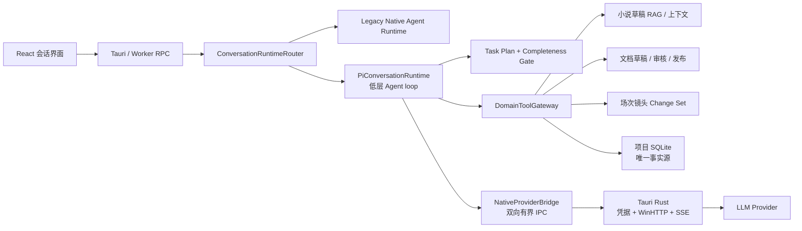

# Pi 会话 Agent Runtime 二开与集成方案

版本：0.6  
日期：2026-08-28  
最近同步：2026-09-03  
状态：P0、P1、P2、P3、P4 完成；P5 核心 Worker 集成、P6 基础 Desktop/Runtime 接线与全系统编排 P1 统一会话扩展已完成，仍有生产审计与发布边界  
适用范围：Desktop、Tauri Native、Worker、Contracts、Domain、Persistence、Context、LLM Provider

> 本文档规划如何选择性引入 `@earendil-works/pi-agent-core` 的低层 Agent 循环，改造当前会话中的模型工具选择、多工具连续执行和多交付物完整性治理。本文档本身不授权直接修改代码；用户已于 2026-08-28 分别授权执行 P1、P2、P3、P4，各阶段仍必须按顺序实施并在完成后记录验证证据。

## 1. 执行摘要

项目可以基于 Pi 二开会话 Agent Runtime，但不应整体替换当前会话、持久化、RAG、权限和 Native Provider 架构。

目标边界如下：

- Pi 负责模型轮次、Tool Call 参数流、工具执行顺序、Tool Result 回灌、连续生成、steering 和 follow-up；
- Worker 继续负责结构化任务计划、项目/章节/文档范围、工具授权、参数二次校验、SQLite 事务、幂等、审核、变更集和审计；
- Tauri Native 继续负责凭据读取、Provider HTTP、SSE 解析、超时、取消和网络安全；
- 当前项目 SQLite 继续作为会话、消息、generation、Agent task、工具调用、业务文档和 RAG 的唯一运行时权威源；
- React Desktop 只发起任务、订阅状态、处理用户确认和展示产物，不拥有后台 Agent 循环。

首期只使用 Pi 已完成的低层 `Agent` / `agentLoop`，不使用当前仍未完成的持久化 `AgentHarness`，不引入 Pi Server，不引入 Pi SQLite session backend，也不启用 Pi 的文件、Shell 或任意网络工具。

目标流程：

```text
用户输入自然语言提示词
  -> Worker 冻结项目、会话、所选章节和原始提示词
  -> Pi 第一轮只允许提交结构化任务计划
  -> Worker 校验并冻结多交付物计划
  -> Worker 为该计划签发有界业务工具授权
  -> Pi 调用一个或多个业务工具
  -> Worker 事务化保存草稿、change set 或镜头提示词
  -> Tool Result 回到 Pi，模型决定继续调用或总结
  -> 完整性门禁检查所有必需交付物
  -> 完成后进入用户审核；不完整则有界修复或保留 partial
```

## 2. 评估基线

### 2.1 Pi 审查基线

本方案基于以下审查结果：

- 仓库：[earendil-works/pi](https://github.com/earendil-works/pi/tree/main)
- 审查 commit：`4e494929998d6bc4fccf75e0a233f727db4b70ee`
- npm 最新版：`@earendil-works/pi-agent-core@0.84.3`
- Node 要求：`>=22.19.0`
- 许可证：MIT
- 当前 Worker sidecar 构建目标：Node `22.23.2` / `node22-win-x64`

Pi 可复用能力：

- 原生模型 Tool Call 循环；
- JSON Schema 参数校验；
- `beforeToolCall` / `afterToolCall`；
- 工具并行或串行执行；
- Tool Result 自动回灌下一轮模型请求；
- `shouldStopAfterTurn`、steering、follow-up 和取消；
- 自定义 `streamFunction`、上下文转换和消息投影；
- 独立的会话树、压缩和 SQLite 组件设计。

当前不能作为生产依赖的 Pi 能力：

- `AgentHarness.prompt()`、`compact()`、`resume()`、`steer()`、`watch()` 等在 v0.84.3 仍返回 `HarnessNotImplemented`；
- `@earendil-works/pi-server` 官方标记为 Experimental；
- Pi 不提供文件、进程、网络和凭据权限系统；
- Pi SQLite session backend 使用自己的 session schema，直接接入会形成第二套会话权威源。

审查参考：

- [Pi Agent README](https://github.com/earendil-works/pi/blob/v0.84.3/packages/agent/README.md)
- [Pi Agent loop](https://github.com/earendil-works/pi/blob/v0.84.3/packages/agent/src/agent-loop.ts)
- [Pi AgentHarness scaffold](https://github.com/earendil-works/pi/blob/v0.84.3/packages/agent/src/harness/agent-harness.ts)
- [Pi SQLite backend](https://github.com/earendil-works/pi/tree/v0.84.3/packages/session-backends/sqlite-node)
- [Pi Server experimental notice](https://github.com/earendil-works/pi/blob/v0.84.3/packages/server/README.md)

### 2.2 当前项目基线

本计划必须增量复用以下现有能力：

| 领域 | 当前权威实现 | 本计划处理方式 |
|---|---|---|
| 会话与消息 | `conversations`、`chat_messages` | 保留为唯一事实源，不迁移到 Pi session |
| Generation | `llm_generations`、`llm_generation_attempts` | 保留状态机、幂等、重试和用量记录 |
| Agent task | `agent_tasks`、events、targets、tool calls | 保留任务生命周期、授权、审计和恢复 |
| Provider loop | Tauri `llm_stream.rs` | Legacy 路径保留；Pi 路径将 Native 降为 Provider broker |
| 凭据 | Tauri/Rust 系统凭据边界 | 不允许进入 Desktop JS、Worker、Pi context、日志或数据库 |
| 文档工作流 | 草稿、不可变版本、审核、发布、change set | 所有 Pi 工具必须复用，不直接写正式表 |
| 小说上下文 | 当前草稿 RAG 切片、selected chapter scope | 继续由 Worker 编译并冻结，不交给 Pi 自行读取文件 |
| 短剧生成 | 本集把控、角色/场景资料、场次/镜头 change set | 扩展为多交付物任务，不改变人工门禁 |
| 本地优先 | 项目 SQLite 和本地项目目录 | 保持不变，GitHub 不参与运行时数据同步 |

相关计划：

- [会话功能企业级优化实施计划](./SESSION-ENTERPRISE-OPTIMIZATION-PLAN.md)
- [Provider 与 LLM 优化计划](./PROVIDER-LLM-OPTIMIZATION-PLAN.md)
- [通用 Agent 项目文档工作流计划](./AGENT-PROJECT-DOCUMENT-WORKFLOW-IMPLEMENTATION-PLAN.md)
- [小说 Agent 工具计划](./NOVEL-AGENT-TOOL-IMPLEMENTATION-PLAN.md)
- [短剧分集内容生成计划](./SHORT-DRAMA-EPISODE-GENERATION-PLAN.md)

## 3. 目标与非目标

### 3.1 目标

1. 用语义化结构计划替代短剧提示词的单一关键词意图分支。
2. 一次用户任务可包含多个明确交付物，并可调用多个受控业务工具。
3. 模型负责选择下一步工具，Worker 对选择结果执行确定性权限和业务校验。
4. 工具完成后自动把有界 Tool Result 回灌模型，直至任务完整或有界终止。
5. 支持顺序依赖、并行只读/分析工具、用户确认、取消、partial 和重试。
6. 不把 Provider 凭据、项目路径、SQLite 句柄或任意系统能力交给 Pi。
7. 新旧 Runtime 可按会话或功能开关共存，失败时可以无数据迁移回退。
8. Windows sidecar、Tauri Release 和 NSIS 打包仍可离线或固定依赖构建。

### 3.2 非目标

- 不 fork 整个 Pi Coding Agent/TUI 作为桌面应用基础；
- 不把现有会话数据迁移到 Pi JSONL 或 Pi SQLite；
- 不使用当前未实现的 Pi `AgentHarness` 作为恢复事实源；
- 不在 Worker 中保存或请求 Provider 密钥；
- 不开放 Pi 自带 `read`、`write`、`edit`、`bash` 等通用工具；
- 不允许模型直接发布、purge、覆盖已发布版本或绕过 change set；
- 不因为接入 Pi 自动启用向量数据库、云同步或外部 RAG 服务；
- 不在首期同时重写普通聊天、小说写作、短剧创作和所有 Provider 路径；
- 不保证模型仅靠提示词就能完成所有交付物，完整性必须由 Worker 状态机保证。

## 4. 固定架构决策

以下作为本方案推荐默认值；P0 评审如需改变，必须在本文决策记录中明确登记。

### D1：选择性依赖，不整体 fork

首期精确固定 `@earendil-works/pi-agent-core@0.84.3`。只有确需修复且上游未接受时才创建最小补丁或内部 fork；禁止运行时跟随 `main` 或使用宽松 semver。

### D2：仅使用低层 Agent loop

使用 `Agent` / `agentLoop`、Tool Call 校验、事件和队列能力。`AgentHarness`、Pi Server、Pi Client 和 Pi session backend 不进入首期生产依赖。

### D3：当前项目 SQLite 是唯一事实源

Pi 内存 transcript 是一次 task run 的执行视图，不是权威记录。用户/助手消息、工具调用、Provider step、任务事件、交付物和用量继续写入当前项目 SQLite。

### D4：Pi Runtime 位于 Worker

生产路径的 Pi loop 运行在 Node Worker sidecar，不运行在 React renderer。窗口关闭、面板分离和订阅丢失不能终止后台任务。

### D5：Native 继续持有 Provider 凭据

Worker 只发送 `providerProfileId`、`modelId`、无密钥请求体和工具 Schema。Rust 从受控凭据存储读取 secret 并执行网络请求；任何 Worker/Pi 消息均不得包含 secret。

### D5a：媒体 Provider/模型必须由用户明确选择

会话 Agent LLM 与图片/视频生成模型是两项独立选择。Pi 只能调用 `media.image.prepare` / `media.video.prepare` 请求兼容候选；Desktop 展示候选并把用户选定的 `providerProfileId`、`modelId` 作为本次请求显式传回。Worker 只校验 Provider、区域、Adapter、Schema 和权限并冻结快照，不从 Agent LLM 或持久化记录自动推导媒体模型，也不静默替换用户选择。已保存的媒体偏好只能由 Desktop 作为下一次请求的明确参数发送。

### D6：建立 Worker ↔ Native 双向 Provider bridge

现有 Native-owned Agent loop 保留为 Legacy Runtime。Pi Runtime 需要可复用的双向、带关联 ID 和序号的 host bridge，使 Worker 发起 Provider stream，而 Rust 只承担 Provider broker。

### D7：先计划，后授权业务工具

每个 Pi Agent task 第一轮只暴露 `task.plan.submit`。计划通过 Worker 校验并冻结后，才暴露与交付物对应的业务工具，避免把所有写工具无条件交给模型。

### D8：多交付物由状态机保证

Worker 持久化每个必需交付物状态。模型返回普通文本不等于任务完成；只有完整性门禁通过且终结工具成功后，任务才能进入 `waiting_review` 或 `completed`。

### D9：业务写工具默认串行

RAG 查询、引用查询和纯分析工具可并行；文档创建/更新、change set、审核、归档、恢复和最终提交必须串行。

### D10：现有审核边界不变

Pi 只能创建草稿、proposal 或 change set。普通派生文档仍需用户审核/发布，场次与镜头仍需用户批准 change set，模型不能自行发布。

### D11：Legacy Runtime 始终可回退

首期默认仍使用当前 Runtime。Pi Runtime 通过显式 feature flag 启用；关闭 flag 不需要回滚消息、文档或项目 Schema。

### D12：本地优先不变

Pi 依赖仅属于应用源码和打包产物。会话、任务、RAG 和产物不上传到 GitHub 或 Pi 服务。

## 5. 目标架构



### 5.1 组件职责

#### `ConversationRuntimeRouter`

- 根据会话配置、功能开关和任务类型选择 `legacy` 或 `pi`；
- 对 Desktop 暴露稳定的 start/subscribe/cancel/confirm/status 合同；
- 禁止 UI 直接依赖 Pi 类型；
- Runtime 失败只影响当前 task，不自动切换后重复执行有副作用的工具。

#### `PiConversationRuntime`

- 从当前 SQLite 和冻结 context snapshot 构建一次执行上下文；
- 创建低层 Pi `Agent`；
- 注册当前阶段允许的工具；
- 把 Pi event 映射为现有 generation/task/tool-call 状态；
- 应用 turn、tool call、Token、时间和自动修复上限；
- 在完成、失败、取消或等待用户确认时释放内存状态。

#### `NativeProviderBridge`

- 处理 Worker 发起的 Provider stream 请求；
- 在 Rust 中解析 provider profile、model 和 secret；
- 复用现有 endpoint、HTTPS、SSE、缓冲、超时和错误分类；
- 向 Worker 返回 started/delta/toolCalls/usage/complete/failed/cancelled 事件；
- 支持取消、背压、事件序号、断连检测和多运行时隔离。

#### `DomainToolGateway`

- 把 Pi Tool 定义映射到现有 Worker service；
- 不接受来自模型的 project/task/conversation/chapter/document 权威 ID；
- 从冻结 task target 注入真实目标；
- 对模型参数执行严格 Schema、长度、枚举和引用校验；
- 在现有事务中完成写入；
- 只返回有界、脱敏、足够模型继续决策的 Tool Result。

#### `TaskPlanService`

- 接收模型提交的结构化多交付物计划；
- 校验与当前 mode、章节范围和用户原始请求一致；
- 冻结 target platform、交付物、依赖、限制和授权工具；
- 创建可查询的交付物状态；
- 检测遗漏、重复、冲突和提前完成。

## 6. Provider Bridge 协议

### 6.1 设计原则

当前 stdio 是以 Rust 为请求方、Worker 为响应方的 JSON line RPC。Pi 位于 Worker 后，需要增加可区分的双向 envelope，而不是让 Worker直接访问凭据或 Provider。

建议统一 envelope：

```ts
type SidecarEnvelope =
  | { kind: 'worker.response'; requestId: string; payload: WorkerResponse }
  | { kind: 'host.request'; requestId: string; method: HostMethod; params: unknown }
  | { kind: 'host.event'; requestId: string; sequence: number; event: HostEvent }
  | { kind: 'host.response'; requestId: string; ok: true; result: unknown }
  | { kind: 'host.response'; requestId: string; ok: false; error: HostError };
```

首期 Host 方法：

```text
provider.stream.start
provider.stream.cancel
provider.confirmation.wait
provider.confirmation.resolve
```

Provider 事件：

```text
started
text_delta
thinking_delta
tool_call_start
tool_call_delta
tool_call_end
usage
complete
failed
cancelled
```

### 6.2 协议不变量

1. 每个 request 有全局唯一 ID；每个 stream 事件有从 0 开始的单调序号。
2. Rust 和 Worker 各自只有一个 stdout/stdin writer queue，禁止行片段交错。
3. 每个 envelope 有 2 MiB 硬上限；Tool Result 正文使用更低的业务上限。
4. profile ID 和 model ID 允许跨边界，secret、Authorization header 和签名 URL 禁止跨边界。
5. Worker 收到重复 sequence 必须幂等忽略；跳号必须中止该 stream 并持久化为 interrupted。
6. 取消必须同时触发 Pi AbortSignal、Rust WinHTTP 取消和 Worker 任务终态竞争保护。
7. 项目关闭/重开后，旧 `projectSessionId` 的 bridge 事件不得写入新 session。
8. Desktop 订阅失败不能取消 Runtime；重新订阅从持久化 task event sequence 补播。

### 6.3 迁移策略

- Legacy `agent_runtime_start` 等命令保持不变；
- Pi 使用独立 `conversation.runtime.start` / `conversation.runtime.subscribe` 合同；
- 首期不在同一个 task 中跨 Runtime 恢复；
- Legacy 和 Pi 共用 Provider parser，但拥有不同的 orchestration owner；
- Pi 稳定前不删除 Native-owned Agent loop。

## 7. 多意图任务计划

### 7.1 结构化合同

建议新增版本化合同：

```ts
type ConversationTaskMode =
  | 'document'
  | 'novel-writing'
  | 'short-drama';

type DeliverableKind =
  | 'episode-outline'
  | 'character-prompts'
  | 'scene-prompts'
  | 'scene-shot-structure'
  | 'shot-prompts'
  | 'production-notes';

interface ConversationTaskPlanV1 {
  version: 1;
  mode: ConversationTaskMode;
  action: 'generate' | 'revise' | 'analyze';
  targetPlatform?: 'seedance' | 'generic-video' | 'generic-image';
  deliverables: Array<{
    kind: DeliverableKind;
    required: boolean;
    dependsOn: DeliverableKind[];
  }>;
  constraints: string[];
}
```

模型提交的计划不得包含以下权威字段：

- `projectId`
- `projectSessionId`
- `conversationId`
- `taskId`
- `chapterIds`
- `documentId`
- 本地路径
- Provider credential/profile secret

这些字段只能由 Worker 从用户操作和任务快照注入。

### 7.2 示例映射

用户输入：

> 我要生成主要大纲、镜头、角色的提示词，用于生成 AI 漫剧，使用 Seedance。

在用户已经选择小说章节的前提下，期望计划：

```json
{
  "version": 1,
  "mode": "short-drama",
  "action": "generate",
  "targetPlatform": "seedance",
  "deliverables": [
    {
      "kind": "episode-outline",
      "required": true,
      "dependsOn": []
    },
    {
      "kind": "character-prompts",
      "required": true,
      "dependsOn": []
    },
    {
      "kind": "scene-shot-structure",
      "required": true,
      "dependsOn": ["episode-outline", "character-prompts"]
    },
    {
      "kind": "shot-prompts",
      "required": true,
      "dependsOn": ["scene-shot-structure"]
    }
  ],
  "constraints": [
    "镜头提示词适配 Seedance",
    "保持所选小说章节中的角色、时间线和场景一致"
  ]
}
```

### 7.3 计划解析流程

1. Desktop 把原始 prompt、composer mode 和用户选择的 chapter IDs 发给 Worker。
2. Worker 保存原始用户消息，创建 task 并冻结可信 scope。
3. Pi 第一轮上下文只提供 `task.plan.submit`。
4. 模型提交 `ConversationTaskPlanV1`。
5. Worker 校验 mode、action、平台、交付物、依赖图和限制。
6. 若关键信息缺失或冲突，进入有界计划修正；仍无法确定则创建 pending intent，请用户澄清。
7. 计划通过后写入不可变 plan snapshot，并创建 deliverable 状态。
8. Runtime 下一轮仅启用计划映射出的工具。

### 7.4 计划校验规则

- `deliverables` 去重后 1–8 项；
- 依赖必须指向同一计划内交付物；
- 依赖图不得有环；
- `short-drama` 必须存在冻结章节范围；
- `seedance` 只影响提示词模板和输出约束，不自动选择文本 LLM；
- `revise` 必须有可信目标产物；
- `analyze` 默认不得获得写工具；
- 计划不能要求自动发布、purge、任意文件操作或跳过审核；
- 用户明确否定写入时只能执行只读分析；
- 计划与用户请求明显冲突时不得静默扩展范围。

## 8. 工具注册、授权与执行

### 8.1 首期工具集合

| 工具 | 对应交付物/作用 | 执行模式 | 写入边界 |
|---|---|---|---|
| `task.plan.submit` | 提交结构化任务计划 | sequential | 只写 task plan |
| `novel.context.search` | 查询冻结章节 RAG | parallel | 只读 |
| `novel.reference.list` | 查询已发布角色/场景资料 | parallel | 只读 |
| `novel.episode.submit_draft` | 本集主要大纲/整体把控 | sequential | 创建可审阅草稿 |
| `document.create_draft` | 角色、场景或制作说明文档 | sequential | 创建可审阅草稿 |
| `novel.episode.submit_structure` | 场次、镜头和镜头提示词 | sequential | 创建 change set |
| `document.update_draft` | 修订已冻结目标草稿 | sequential | 新建不可变版本 |
| `task.package.complete` | 校验完整性并结束任务 | sequential | 只更新任务/交付物状态 |

不注册：

- 任意 SQL；
- 任意文件读取/写入；
- Bash、PowerShell 或进程执行；
- 任意 HTTP fetch；
- 发布、purge 或无目标归档；
- 未经用户选择的跨项目/跨章节读取。

### 8.2 授权生命周期

```text
task created
  -> plan-only authorization
  -> plan validated and frozen
  -> deliverable-specific authorizations issued
  -> tool arguments validated
  -> beforeToolCall verifies task/target/quota/state
  -> tool transaction executes
  -> afterToolCall records result and deliverable state
  -> authorization consumed or retained by configured quota
```

沿用现有原则：

- authorization handle 由 Worker 生成，不由模型提供可信目标；
- Provider continuation 中不得回显 secret handle；
- 参数 hash、Provider call ID、step ordinal 和 tool ordinal 继续用于去重；
- 工具调用成功与业务写入必须在同一事务或现有幂等边界内完成；
- Tool Result 只包含状态、稳定实体引用和下一步提示，不返回整份敏感正文；
- 工具失败结果可回灌模型修正，但不得消耗新的业务写入配额，除非确实开始执行。

### 8.3 Tool Result 约定

建议统一最小结果：

```ts
interface DomainToolResultV1 {
  version: 1;
  status: 'succeeded' | 'rejected' | 'needs_confirmation' | 'conflicted';
  deliverable?: DeliverableKind;
  entityType?: 'document' | 'change-set' | 'task';
  entityId?: string;
  summary: string;
  remainingRequiredDeliverables: DeliverableKind[];
  retryable: boolean;
}
```

正文、项目绝对路径、Provider 响应原文和凭据不能进入结果。

## 9. 连续生成与完整性门禁

### 9.1 Pi 默认循环

Pi 默认行为：

1. 模型返回 Tool Call；
2. Runtime 校验并执行；
3. Tool Result 追加到上下文；
4. 若该批工具结果未全部要求 `terminate`，自动请求下一轮模型；
5. 模型无 Tool Call 且没有 steering/follow-up 时结束。

本项目不能把第 5 步直接等价为业务完成。

### 9.2 业务完成条件

任务只有同时满足以下条件才可完成：

- 结构化 plan 已冻结；
- 所有 `required=true` 交付物状态为 `succeeded`；
- 每个交付物的业务实体仍属于当前 project/task/target；
- 所有写工具事务已进入确定终态；
- 不存在等待确认或未解决 conflict；
- `task.package.complete` 校验成功；
- generation/Provider step 用量和终态已经持久化。

完成后的业务状态：

- 有文档草稿或 change set 需要用户操作：`waiting_review`；
- 纯分析且无待审产物：`completed`；
- 有部分产物但修复失败：保存 partial，task `failed` 且 `retryable=true`；
- 用户确认待处理：`waiting_confirmation`；
- 用户取消：`cancelled`。

### 9.3 提前返回修复

如果模型输出最终文本但仍缺交付物，Runtime 通过动态 follow-up 注入：

```text
任务尚未完成。缺少：character-prompts、shot-prompts。
请调用已授权工具完成剩余交付物；不要仅返回完成说明。
```

默认最多自动修复 2 轮。超过上限后：

- 不伪造完成；
- 保留已成功产物和 partial；
- 记录缺失交付物；
- 标记为可重试失败；
- Desktop 提供“继续完成缺失项”入口。

### 9.4 资源上限

首期沿用或收紧现有上限：

- 每 task Tool Call 上限：16；
- 计划修正上限：2；
- 提前返回自动修复上限：2；
- 并行工具仅限只读/纯分析；
- 单 Tool Result 使用业务上限和 2 MiB 总 envelope 上限；
- 达到 Token、费用、时间或调用上限时停止并持久化 partial；
- Provider 返回长度截断的 Tool Call 不执行，回灌错误要求模型重新提交完整参数。

## 10. 数据模型与权威映射

### 10.1 消息映射

| Pi 消息/事件 | 当前持久化位置 |
|---|---|
| user message | `chat_messages` |
| assistant text | `chat_messages` |
| assistant Tool Call | `agent_tool_calls` + Provider step manifest |
| Tool Result | `agent_tool_calls` 结果摘要 + task event；Pi 内存 context 保留完整有界结果 |
| context/system instruction | `context_snapshots` manifest |
| Provider usage | generation/attempt/provider step usage |
| Pi lifecycle event | 有选择地映射为有界 task event/metric，不逐 delta 落审计 |

禁止同时把同一会话完整写入 Pi JSONL/Pi SQLite 和项目 SQLite。

### 10.2 建议新增持久化实体

具体 Schema 版本在实施开始时基于最新主干重新分配，不在本计划硬编码 v31。

#### `agent_task_plans`

```text
id PRIMARY KEY
project_id
task_id UNIQUE
schema_version
mode
action
target_platform
plan_json
plan_hash
status
created_at
validated_at
```

不变量：

- 与 task 同项目；
- plan 通过后不可原位修改；修正创建新 revision 或在冻结前替换；
- `plan_json` 不含凭据、绝对路径或正文；
- `plan_hash` 用于幂等和恢复校验。

#### `agent_task_deliverables`

```text
id PRIMARY KEY
project_id
task_id
plan_id
kind
required
status
depends_on_json
result_entity_type
result_entity_id
completed_tool_call_id
error_code
created_at
updated_at
UNIQUE(task_id, kind)
```

状态建议：

```text
pending -> running -> succeeded
                   -> failed
pending/running -> skipped（仅 optional）
```

必需交付物不得进入 `skipped`。

#### `conversation_runtime_configs`（可延后）

```text
conversation_id PRIMARY KEY
runtime_kind ('legacy' | 'pi')
runtime_version
row_version
updated_at
```

PoC 阶段先用应用级实验开关，不提前迁移所有 conversation。

### 10.3 不新增的权威表

- 不新增第二份 chat message 表；
- 不新增 Pi session entry tree；
- 不复制 document version 正文；
- 不复制小说 RAG chunk；
- 不复制 Provider profile 或 secret；
- 不把 Pi 内存状态 JSON 作为恢复事实源。

## 11. Native、Worker 与 Desktop 生命周期

### 11.1 启动

1. Desktop 请求 `conversation.runtime.start`；
2. Worker 验证 conversation、project session、模型能力和幂等键；
3. Worker 创建/恢复 generation 和 task；
4. `ConversationRuntimeRouter` 选择 Runtime；
5. Pi task 在 Worker 后台运行；
6. Desktop 通过 task/attempt ID 订阅 Native 转发事件和 Worker task events。

### 11.2 取消

取消必须幂等传播：

```text
Desktop cancel
  -> Worker task cancellation requested
  -> Pi AbortController.abort()
  -> Native provider bridge cancel
  -> Rust WinHTTP request interrupt
  -> Worker 持久化 generation/task/tool-call/partial 终态
```

任一层重复取消不得把终态恢复为运行态。

### 11.3 应用退出

- 沿用当前两秒有界退出策略；
- 活动 Pi Runtime 接收 Abort；
- Worker 在期限内持久化 interrupted/cancelled 和 partial；
- 不启动脱离应用的守护进程；
- 下次打开项目时不尝试恢复已断开的 Provider socket；
- 可从冻结 plan、deliverable 状态和 partial 创建新的 retry task。

### 11.4 窗口与订阅

- 面板关闭、浮动窗口关闭或订阅失败不取消 task；
- 多窗口只能有一个 Runtime owner；
- 其他窗口使用只读订阅和确认命令；
- event replay 使用现有 task event sequence；
- 旧窗口、旧 project session 和旧 attempt 的事件必须被拒绝。

## 12. 安全与隐私

### 12.1 必须保留的安全边界

- Rust 凭据边界；
- HTTPS endpoint/host 校验；
- Worker project/session/target 归属校验；
- 严格 Tool JSON Schema 和未知字段拒绝；
- 文档草稿、审核、发布与 change set 门禁；
- 本地优先存储；
- 日志、诊断、task event 和 Tool Result 脱敏。

### 12.2 Pi 依赖治理

- 精确版本和完整 lockfile；
- MIT NOTICE/License 保留；
- SBOM 增加 Pi 及其传递依赖；
- `pnpm audit --prod`、许可证和依赖脚本审查；
- 禁止运行 Pi extension 自动发现；
- 禁止加载用户目录下的 Pi skills、prompt templates 或 tools；
- 禁止 Pi telemetry 发送外部数据，首期使用 no-op 或项目内有界指标适配器；
- 升级 Pi 前必须检查 tool loop、message type、provider DTO 和 Node engine 变更。

### 12.3 Prompt injection 防护

- 小说正文、RAG、外部研究结果均标记为不可信内容，不是系统指令；
- 工具目标不从正文或模型参数推导；
- 模型要求扩大章节/项目范围时必须拒绝；
- 角色/场景占位符继续执行 Worker 引用校验；
- 模型不能通过 Tool Result 请求启用新工具，工具集合只能由冻结 plan 和 Worker policy 决定；
- 外部研究工具与业务写工具分阶段授权，避免研究内容直接驱动高风险写入。

## 13. Desktop 交互方案

### 13.1 模式与范围

- 保留 chat/document/novel-writing/short-drama 明确模式；
- 模式和用户选择的章节是可信范围提示，不依赖自然语言猜测；
- 短剧模式未选择章节时禁止启动 plan；
- 不再用 `inferShortDramaIntent` 的单一关键词优先级决定最终写工具。

### 13.2 计划预览

Pi Runtime 稳定前，建议显示简洁计划摘要：

```text
将生成：
✓ 本集主要大纲
✓ 角色提示词
✓ 场次与镜头
✓ Seedance 镜头提示词
来源：已选择 3 个小说章节
```

只读分析可直接运行；包含多个写交付物的计划可根据产品决定是否需要一次总确认。高风险工具仍使用现有逐工具确认。

### 13.3 运行状态

显示业务阶段，而不是暴露 Pi 内部事件：

```text
正在理解任务
正在准备资料
正在生成本集大纲
正在生成角色提示词
正在生成场次和镜头
正在检查完整性
等待审核
```

### 13.4 失败与继续

- 明确展示已完成和缺失交付物；
- 支持“继续完成缺失项”；
- 支持查看 partial，但不把 partial 当正式文档；
- 冲突时显示目标已被其他窗口修改；
- Runtime 内部错误不得只显示“生成失败”，应映射稳定错误码和 retryable 状态。

## 14. 分阶段实施计划

> 阶段必须按顺序执行。每阶段完成后更新本节清单和第 18 节验证记录，不得仅因代码已写而标记完成。

### P0：方案评审与决策冻结

目标：确认接入边界、依赖策略、数据权威、Runtime owner 和回退路径。

工作项：

- [x] 审核 D1–D12；
- [x] 确认首期只支持 `short-drama`，普通 chat/document/novel-writing 保持 Legacy；
- [x] 确认 `task.plan.submit` 和 `task.package.complete` 合同；
- [x] 确认自动修复 2 轮、Tool Call 16 次等上限；
- [x] 确认 Pi npm 精确版本、MIT 归属和 SBOM 策略；
- [x] 确认不使用 Pi AgentHarness、Server 和 session backend；
- [x] 确认 schema 迁移和回滚策略。

退出门禁：架构、状态机、数据权威、安全边界和非目标评审通过；本文状态更新为“P0 完成”。

### P1：依赖与 Windows sidecar 可行性 Spike

目标：在不接入生产会话、不迁移 Schema 的情况下验证 Pi 低层 loop 能否构建和运行。

主要文件：

```text
apps/worker/package.json
apps/worker/scripts/validate-pi-runtime-spike.mjs
apps/worker/src/experiments/pi-runtime-spike.ts
apps/worker/src/experiments/pi-runtime-spike-entry.ts
apps/worker/src/experiments/pi-runtime-spike.test.ts
```

工作项：

- [x] 精确添加 `@earendil-works/pi-agent-core@0.84.3`，并为公开 fake stream/类型 API 直接固定 `@earendil-works/pi-ai@0.84.3`；
- [x] 使用 fake stream function 验证文本、单工具、多工具和 Tool Result 回灌；
- [x] 验证 parallel/sequential、before/after hook、abort 和 length-truncated Tool Call；
- [x] 不连接真实 Provider、不读取凭据、不写项目数据库；
- [x] 验证 esbuild CJS bundle、`@yao-pkg/pkg` Node 22 sidecar 和 Tauri Release；
- [x] 记录 exe 体积、启动耗时、内存和依赖/SBOM 增量；
- [x] Pi 依赖可被 pkg 稳定打包，因此未触发“停止后续阶段并评估内部最小 agent-loop”条件。

退出门禁：fake provider 集成测试、sidecar 构建、Rust sidecar 启动测试和依赖审计通过；实验路径不进入用户界面。

P1 实测结论（2026-08-28）：

- 技术可行性为 **GO**：低层 `Agent` 在独立 Node 22 Windows exe 中完成 12 项能力检查；实验入口未接入正式 Worker RPC、Tauri command 或 React UI；
- Spike CJS bundle 为 815,095 bytes，exe 为 59,240,060 bytes；esbuild 约 160.5 ms，pkg 约 1,045.3 ms；exe 进程总耗时约 1,046.8 ms，其中能力矩阵约 186.7 ms，估算启动/装载开销约 860.1 ms；
- exe 内运行时为 Node v22.23.2/win32/x64；RSS 从 40,046,592 bytes 增至 41,897,984 bytes，结束时 heap used 为 9,191,368 bytes；
- 正式 Worker sidecar 仍可构建，CJS bundle 为 1,202,179 bytes，exe 为 72,449,752 bytes；Rust `worker_supports_health_and_sqlite_round_trips` 测试通过；Tauri Release/NSIS 完整打包通过；
- Worker production SBOM 临时产物为 189,531 bytes，包含 140 个 components、141 个 dependency nodes，并列出 `pi-agent-core`、`pi-ai`、`pi-telemetry` 0.84.3；锁文件新增 81 个 package entries。Pi 根包会传递引入 Anthropic、AWS Bedrock、Google 和 OpenAI SDK，虽未进入 tree-shaken Spike bundle 的真实 Provider 路径，仍是后续依赖治理成本；
- `@google/genai` 和 `protobufjs` 的安装脚本在 `pnpm-workspace.yaml` 中显式设为 `false`，P1 不为 fake Provider 放宽供应链脚本权限；
- 全仓 JS/TS 测试共 58 个文件、446 项测试通过，Rust 61 项测试通过；全仓 typecheck、ESLint 和 Prettier check 通过，frozen lockfile 安装通过；
- 许可证检查通过。首次 production audit 发现既有 `better-sqlite3 > prebuild-install > rc > ini@1.3.0` 高危项（GHSA-qqgx-2p2h-9c37）；经用户授权，在 `pnpm-workspace.yaml` 使用 pnpm 11 `overrides` 将 `ini <1.3.6` 精确解析为兼容的 `1.3.8`。更新后的依赖树只有 `ini@1.3.8`，SBOM 也只列出该版本，`pnpm audit --prod --audit-level=high` 返回 `No known vulnerabilities found`；
- `ini@1.3.8` 更新后重新通过 frozen install、Pi Spike、正式 sidecar、Rust 61 项测试、JS/TS 446 项测试、typecheck、ESLint、Prettier 和 Tauri Release/NSIS，P1 全部退出门禁满足；
- 本结论不授权 P2，不代表真实 Provider、Worker↔Rust 双向 Bridge、持久化恢复、生产工具权限或 UI 已验证。

### P2：Runtime 抽象与多交付物合同

目标：先建立与 Pi 无关的业务合同，Legacy 行为不变。

主要文件：

```text
packages/contracts/src/index.ts
packages/domain/src/index.ts
apps/worker/src/request-validation.ts
apps/worker/src/conversation-runtime.ts
apps/worker/src/task-plan-service.ts
packages/persistence/src/schema.ts
packages/persistence/src/database.ts
```

工作项：

- [x] 定义 `ConversationRuntime` 和 `ConversationRuntimeRouter`；
- [x] 定义 `ConversationTaskPlanV1`、Deliverable 和稳定错误码；
- [x] 定义 plan/deliverable 状态机和依赖图校验；
- [x] 增加 `agent_task_plans` / `agent_task_deliverables` 迁移；
- [x] 从现有短剧 task snapshot 注入可信 selected chapter scope；
- [x] Legacy Runtime 继续通过全部原有测试；
- [x] 增加 feature flag，默认关闭 Pi。

退出门禁：迁移/回滚、状态机、幂等、未知字段、跨项目和循环依赖测试通过；默认用户路径无行为变化。

P2 实测结论（2026-08-28）：

- 新增 Pi 无关的 Runtime/Router 合同；`AI_VIDEO_PI_CONVERSATION_RUNTIME` 未设置时默认关闭，且 document、novel-writing 始终选择 Legacy；P2 未创建 `PiConversationRuntime`，未接 Native Provider Bridge；
- `ConversationTaskPlanV1` 严格拒绝未知字段和模型提交的 project/task/conversation/chapter/document/path/credential 权威字段；重复交付物、缺失/自引用/循环依赖和非法 mode/platform 组合均使用稳定错误码拒绝；
- Schema v31 新增 `agent_task_plans` 与 `agent_task_deliverables`、项目归属触发器和状态迁移触发器；迁移失败原子回滚、重复迁移幂等、状态机和 CAS 路径通过测试；
- `TaskPlanService` 只从现有 `agent_tasks.request_snapshot_json` 读取冻结的 short-drama selected chapter scope，并再次校验所有章节属于当前项目；模型 plan 不能覆盖可信范围；
- 全仓 JS/TS 456 项、Rust 61 项、typecheck、ESLint、Prettier、frozen install、production audit、许可证、SBOM、正式 sidecar 和 Tauri Release/NSIS 全部通过；production audit 返回 `No known vulnerabilities found`；
- P2 没有启动 Pi Runtime、没有连接真实 Provider、没有新增通用文件/SQL/bash/network 工具，也没有修改凭据、审核、change set 或 RAG 权威边界。P3 未开始。

### P3：Native Provider 双向桥

目标：让 Worker 可以在不接触凭据的情况下驱动 Native Provider stream。

主要文件：

```text
apps/worker/src/index.ts
apps/worker/src/native-provider-bridge.ts
apps/desktop/src-tauri/src/lib.rs
apps/desktop/src-tauri/src/llm_stream.rs
packages/contracts/src/index.ts
```

工作项：

- [x] 定义并验证双向 envelope；
- [x] Rust/Worker 单 writer queue 和 request correlation；
- [x] stream sequence、背压、大小限制和重复/跳号处理；
- [x] Rust 复用现有凭据、endpoint、SSE 和错误分类；
- [x] Worker 适配为 Pi `streamFunction` 所需事件；
- [x] 取消、超时、Provider 失败和 project session 失效传播；
- [x] Native 事件中不出现 secret/header；
- [x] Legacy Native Agent Runtime 回归通过。

退出门禁：固定 SSE fixture、取消竞争、断流、乱序、重复事件、跨 session、凭据脱敏和 Windows 打包测试通过。

完成证据（2026-08-28）：

- Contracts 新增 2 MiB JSONL 上限、`host.request/event/response` envelope、四个 Host 方法、稳定错误码和无凭据 Provider 事件；Legacy WorkerRequest/WorkerResponse 行格式保持不变；
- Worker 新增单 writer `JsonLineWriter`、request correlation、sequence 从 0 校验、重复忽略、跳号中断、AbortSignal 单次取消、终态竞争保护、project session 校验、畸形/超大 envelope 中断和 secret/header/authorization handle/签名 URL 拒绝；
- Worker 新增 Pi `streamFunction` 适配，覆盖 text、thinking、tool call、usage、complete、error 和 aborted；runtime/transport 失败均编码为 Pi error event，不向 Agent loop throw/reject；
- Rust 在等待 Legacy Worker 响应时分流 `host.request`，所有 stdin 写入共享单 writer；Legacy 响应按 ID 关联；Native stream registry 支持取消和 session 绑定；复用 Windows Credential Manager、WinHTTP、endpoint、请求体、SSE、断流、超时及错误分类；
- 固定 OpenAI Responses/Chat Completions SSE fixture、mock Provider、断流、乱序、重复、取消竞争、跨 session、2 MiB、畸形 envelope、凭据脱敏和 Legacy health/SQLite/Agent Runtime 回归均通过；
- 全仓 JS/TS 466 项与 Rust 65 项测试通过；typecheck、ESLint、Prettier、rustfmt、build、frozen install、production audit、许可证、SBOM 和 diff check 通过；production audit 返回 `No known vulnerabilities found`；
- 最终 sidecar CJS 为 1,223,460 bytes，Node 22 Windows exe 为 72,482,392 bytes，打包后真实 health 往返通过；Tauri Release 与 NSIS 成功，安装包为 21,164,934 bytes；
- P3 未启动正式 Pi Conversation Runtime、未接 UI、未实现 plan-only、动态业务工具授权、`task.package.complete` 或缺失交付物 follow-up；P4 未开始。

### P4：Task Plan、工具授权与完整性门禁

目标：用多交付物计划替代短剧单一关键词意图。

主要文件：

```text
apps/worker/src/task-plan-service.ts
apps/worker/src/agent-provider-loop-service.ts
apps/worker/src/request-validation.ts
apps/desktop/src/App.tsx
apps/desktop/src/document-intent.test.ts
```

工作项：

- [x] 实现 plan-only 第一轮；
- [x] Worker 校验并冻结 plan；
- [x] 计划通过后动态注册有界工具；
- [x] 实现 deliverable → tool 映射和依赖门禁；
- [x] 工具成功后事务化更新 deliverable；
- [x] 实现 `task.package.complete`；
- [x] 实现最多 2 轮缺失交付物 follow-up；
- [x] 删除 Pi 短剧路径对 `inferShortDramaIntent` 的依赖，Legacy 路径暂保留；
- [x] Seedance 作为结构化 target platform 进入 prompt 模板和任务快照。

退出门禁：示例提示词能得到 4 个预期交付物；遗漏、重复、依赖未满足、模型提前完成、非法平台和越权目标测试通过。

完成证据（2026-08-28）：

- `TaskPlanService` 新增 plan-only 轮次，首轮只暴露 `task.plan.submit`；Worker 从冻结 task snapshot 读取 `selectedChapterIds` 与 `targetPlatform`，拒绝模型提供项目、任务、章节、文档、路径、Provider 或凭据等权威字段；
- Seedance 生成计划冻结为 4 个必需交付物：`episode-outline`、`character-prompts`、`scene-shot-structure`、`shot-prompts`，并强制执行既定依赖图；计划遗漏、重复、循环、非法依赖、非法平台、平台与冻结快照不匹配均有稳定错误码；
- 动态授权只返回当前 `ready` 交付物对应的既有有界工具 Schema 与 `task.package.complete`；依赖未完成时不授权下游工具，同名工具按交付物顺序单次授权，`analyze` 计划不获得写工具；
- 工具开始与成功记录通过 SQLite 事务和 CAS 推进 deliverable；成功结果必须绑定当前 task 拥有的 document、change set 或 task 实体，越权实体和重复完成均被拒绝；成功后原子刷新下游 `ready` 状态并写入 task event；
- `task.package.complete` 只有在全部必需交付物成功且实体归属复核通过时才把 plan 标为 `succeeded`、task 置为 `waiting_review`；提前完成会返回精确缺失列表，最多持久化 2 轮 follow-up，第三次原子持久化 plan/task `failed` 与 `TASK_PACKAGE_FOLLOW_UP_LIMIT`，不存在抛错回滚失败状态的问题；
- Desktop 短剧请求显式发送 `targetPlatform: 'seedance'`，Worker IPC 要求 short-drama 平台合法且禁止 document/novel-writing 携带该字段；Legacy Native Agent 仍保留 `inferShortDramaIntent`，P4 的结构化计划服务不读取该函数；
- 新增/扩展 P4、请求边界与快照测试；Worker 268 项、Desktop 148 项、全仓 JS/TS 476 项与 Rust 65 项测试通过；typecheck、ESLint、Prettier、rustfmt、build、frozen install、production audit、许可证、SBOM 和 diff check 全绿，production audit 返回 `No known vulnerabilities found`；
- sidecar CJS 为 1,224,165 bytes，Node 22 Windows exe 为 72,482,952 bytes，真实 health 往返通过；Tauri Release 与 NSIS 成功，安装包为 21,165,815 bytes；
- P4 未创建正式 `PiConversationRuntime`，未把 Pi 接入真实业务工具执行链，未接 UI Runtime，也未实现 Pi event 到 generation/task/tool-call 的正式持久化；这些工作属于 P5，P5 尚未开始。

### P5：Pi Runtime 与现有业务工具集成

目标：Pi 驱动真实 Worker 业务工具，但仍只创建可审阅产物。

主要文件：

```text
apps/worker/src/pi-conversation-runtime.ts
apps/worker/src/domain-tool-gateway.ts
apps/worker/src/generation-service.ts
apps/worker/src/agent-provider-loop-service.ts
apps/worker/src/document-workflow-service.ts
apps/worker/src/change-set-service.ts
```

工作项：

- [x] Pi event 映射现有 generation/task/tool-call；provider-step/authorization 的完整关联保留给正式 Runtime RPC 接线；
- [ ] RAG/引用只读工具（P5 网关保持只注册 Worker-owned grants，读取工具待后续授权）；
- [x] 大纲、角色/场景、场次/镜头和镜头提示词工具；
- [x] 串行写工具和并行只读工具验证；
- [x] 参数修正、结果脱敏和 change-set/CAS 边界复用现有服务；confirmation 仍由 P6 UI/Runtime RPC 提供；
- [x] 基于 Pi tool-call idempotency key 的重复调用保护；partial/retry/quota 沿用现有 Worker 门禁，Pi 专用恢复入口待 P6；
- [x] Pi Runtime task 完成后正确进入 waiting_review；
- [x] feature flag 默认关闭，Legacy Runtime 路径保持不变。

完成证据（2026-08-29，P5 核心 Worker 集成）：

- `PiConversationRuntime` 在 Worker 内运行低层 Pi `Agent`，首轮只暴露 `task.plan.submit`，计划冻结后动态刷新 Worker-owned deliverable grants；生产 stream 通过 `NativeProviderBridge`，测试可注入 faux provider；
- `DomainToolGateway` 将有界 grant 映射为业务工具，写工具统一串行，普通未绑定工具可并行；大纲/角色/场景文档写入 reviewable draft，场次/镜头写入待审核 change set，不发布正式内容；
- 网关调用复用 `TaskPlanService` 的依赖、CAS、项目/任务实体归属与 `waiting_review` 完整性门禁；每次 Pi 调用写入现有 `agent_tool_calls`，保存参数哈希、幂等键、received→validated→executing→succeeded/failed 状态和脱敏结果摘要；
- 新增 fake-provider 端到端测试与真实 SQLite `DomainToolGateway` 测试，覆盖四类交付物、多文档归属、change set、非法参数和重复写入保护；Pi/网关测试及 Worker typecheck 已通过；
- 尚未完成：独立 `conversation.runtime.start/subscribe` IPC 合同、Desktop/P6 owner/订阅 UI、Pi provider-step/authorization 的完整正式映射、RAG 只读工具和真实 Worker↔Rust 端到端运行。这些边界保持在 P6/P7，Pi feature flag 仍默认关闭。

退出门禁：fake provider 端到端“选择章节 → 多交付物 → 草稿/change set → 审核”通过；无重复业务写入和双重消息持久化。

### P6：Desktop、恢复与可靠性

目标：提供可用交互，并完成取消、退出、重试和多窗口治理。

主要文件：

```text
apps/desktop/src/ChatPanel.tsx
apps/desktop/src/App.tsx
apps/desktop/src/llm-client.ts
apps/desktop/src-tauri/src/llm_stream.rs
apps/worker/src/partial-artifact-service.ts
```

工作项：

- [x] Pi runtime owner/订阅启动：新增 `conversation.runtime.start` Worker RPC，Desktop 对 `runtimeOwner: 'pi'` 走 Worker generation 状态轮询；
- [x] cancel/断线重连基础路径：Pi 取消复用 Worker runtime cancel，Desktop 重新启动时由 generation/task 状态继续观察；Native/Legacy 路径保持不变；
- [x] 计划摘要和细粒度交付物进度 UI；
- [x] 缺失交付物继续入口；
- [x] retry 基础 UX：Desktop 为每次重试生成独立幂等键，防止重复点击创建多个 generation，并仅在 retryable 未明确为 false 时显示重试；
- [x] confirmation UX 基础链路：会话区显示待确认文档动作，批准/拒绝通过一次性 token 回到 Worker 审计流程；
- [x] confirmation 跨重启安全恢复：`agent.task.get` 返回不含 token 的 pending/expired 确认元数据；重启 UI 显示目标与动作，但禁止复用旧 Provider continuation，要求重试后重新申请确认；
- [x] partial artifact UX：任务详情页展示失败任务的可恢复 partial，恢复/丢弃均需用户确认并保留错误反馈；
- [x] 窗口关闭不取消 Runtime，多窗口单 owner 的 Native registry 基础能力复用；
- [x] 应用退出有界中断和下次启动恢复的基础 UI：失败且可重试的 Agent 任务在会话区显示恢复提示，可跳转任务日志处理 partial；
- [x] 应用退出有界中断和下次启动恢复向导：自动发现失败/等待审核任务，展示 confirmation/partial/retry 入口，不自动执行副作用；
- [x] Provider socket 不跨进程恢复：Pi 仅从 Worker 持久化 generation/task 状态观察，不恢复 Rust socket；
- [x] Tool Call storm 基础保护：Desktop Provider continuation 最多 16 次调用，超限后 fail-closed 并保留可重试 generation；Pi 订阅断开已有超时/取消保护；
- [x] 长上下文代码门禁：Pi 把冻结项目上下文注入 system prompt，并限制为 400,000 字符；慢首 Token 由 10 分钟观察超时保护；
- [ ] 真实 Windows Desktop 断网/慢首 Token 实测；
- [x] Pi Desktop 订阅断开基础保护：轮询设置 10 分钟有界超时，Worker 断线/超时先取消 Worker-owned runtime，再持久化可重试失败；
- [x] 本地可验证资源预算：Pi 轮询 300ms、观察超时 10 分钟、Provider continuation 上限 16 次、Tool Result 100KB；
- [ ] 真实 Windows 性能与资源预算记录。

完成证据（2026-08-29，P6 基础 Desktop/Runtime 接线）：

- Contracts 新增 `conversation.runtime.start`，Worker 严格校验 generation identity、task、short-drama mode 和 prompt；
- Worker sidecar 初始化 `PiConversationRuntime`，短剧 feature flag 开启时将准备结果标记为 `runtimeOwner: 'pi'`，document/novel-writing 与关闭 flag 继续 `native-agent`/Legacy；
- Desktop `llm-client` 识别 Pi owner：调用 Worker runtime start，按 generation 状态观察直到终态；取消时优先通知 Pi runtime，再走既有 Agent cancel；
- Desktop/Worker 运行时、handler、contracts typecheck 和 targeted tests 已通过；
- 本地代码侧已完成：计划/交付物进度、缺失项继续入口、confirmation 安全恢复、partial 恢复/丢弃、重试幂等、重启恢复向导、冻结长上下文注入、Pi 断线超时和 16 次 Tool Call storm 保护；仅剩真实 Windows Tauri 多窗口/退出/断网/慢首 Token 和性能预算实测。
- Windows 构建证据（2026-08-30）：`pnpm tauri:build` 成功构建 Worker sidecar、Release Tauri EXE 与 NSIS `unicomp_0.1.0_x64-setup.exe`；Release EXE 隐藏启动 5 秒进程级 smoke test 通过。尚未宣称通过的仅是需要人工/真实 Provider 操作的多窗口、断网、慢首 Token 与完整退出重开业务流程。

退出门禁：Windows Tauri 实机、多窗口、断网、退出、重开、取消、重试和真实长篇 RAG 测试通过。

### P7：灰度、文档与生产门禁

目标：可回退地上线，不删除 Legacy Runtime。

工作项：

- [ ] 内部实验开关；
- [ ] 新短剧会话按项目 opt-in；
- [ ] 旧会话默认 Legacy；
- [ ] 运行指标、错误率、平均 turns/tool calls/首 Token/总耗时；
- [ ] Pi 依赖升级策略和内部补丁策略；
- [ ] 更新 M2、M3、Provider、小说 Agent、短剧和质量门禁文档；
- [ ] 更新 SBOM、许可证、Release/NSIS 验证；
- [ ] 制定关闭 Pi feature flag 的应急步骤；
- [ ] 只有完成稳定观察后才单独评审是否扩大到 document/novel-writing。

退出门禁：质量门禁、真实 Provider、Windows 安装/升级/回滚、凭据和诊断审计通过；Legacy Runtime 仍可用。

## 15. 测试矩阵

| 层 | 必测场景 |
|---|---|
| Contracts | envelope、plan、deliverable、runtime config、未知字段、长度和枚举 |
| Persistence | 新库、上一版本升级、回滚、plan hash、deliverable 状态、跨项目触发器 |
| Pi Adapter | 文本、单工具、多工具、并行/串行、参数错误、length 截断、terminate |
| Intent/Plan | 多交付物、否定写入、歧义、依赖环、Seedance 平台、提前完成 |
| Tool Gateway | 授权、目标注入、调用次数、幂等、参数 hash、Tool Result 脱敏 |
| Provider Bridge | SSE、Chat Completions、Responses、乱序、重复、断流、背压、取消 |
| Agent task | waiting confirmation、partial、retry、CAS conflict、等待审核 |
| Context/RAG | 仅冻结章节、草稿切片、引用资料、跨项目隔离、预算裁剪 |
| Desktop | 计划预览、进度、确认、取消、继续缺失项、多窗口和过期事件 |
| Packaging | esbuild、pkg Node 22、native addon、Tauri Release、NSIS、干净安装 |
| Security | secret/header/路径脱敏、prompt injection、越权工具、任意文件/网络拒绝 |
| Performance | 长篇上下文、16 次工具上限、并行只读工具、内存、exe 体积和启动耗时 |

### 15.1 示例端到端验收

前置条件：

- 项目包含已保存并完成 RAG 切片的小说章节；
- 用户选择 1–3 个章节；
- 配置支持 Tool Call 的文本 LLM；
- Pi feature flag 仅对当前测试会话开启。

输入：

> 我要生成主要大纲、镜头、角色的提示词，用于生成 AI 漫剧，使用 Seedance。

预期：

1. plan 识别 `short-drama`、`seedance` 和四个必需交付物；
2. 不读取未选择章节；
3. 创建本集把控草稿；
4. 创建角色提示词草稿；
5. 创建场次/镜头 change set；
6. 每个镜头有 Seedance 定向 prompt；
7. 工具结果进入后续模型轮次；
8. 缺少任一必需项时不能显示完成；
9. 完整后 task 进入 `waiting_review`；
10. 用户审核前不发布文档、不应用 change set、不生成视频。

## 16. 质量门禁

每阶段运行聚焦测试；P7 前至少运行：

```powershell
pnpm.cmd test
pnpm.cmd typecheck
pnpm.cmd lint
pnpm.cmd format:check
pnpm.cmd build
cargo fmt --manifest-path apps/desktop/src-tauri/Cargo.toml --check
cargo test --manifest-path apps/desktop/src-tauri/Cargo.toml
pnpm.cmd worker:sidecar
pnpm.cmd tauri build
git diff --check
```

还必须记录：

- `@earendil-works/pi-agent-core` 精确版本和 commit/tag；
- SBOM 与生产依赖审计结果；
- sidecar exe 大小变化；
- 冷启动和首个 Runtime 启动耗时；
- fake Provider、真实 Provider 和未配置 Provider 三种结果；
- Windows 干净安装、应用退出、同包覆盖和回滚；
- 未执行或无法执行的人工边界。

## 17. 风险与回滚

| 风险 | 影响 | 缓解/回滚 |
|---|---|---|
| Pi 0.x API 快速变化 | 构建或行为漂移 | 精确锁版本；升级单独 PR；保留 adapter 和 Legacy |
| AgentHarness 尚未完成 | 无法直接持久化恢复 | 首期不用；当前 SQLite + task 状态继续权威 |
| Worker ↔ Native 双向 IPC 复杂 | 死锁、乱序、退出挂起 | 单 writer queue、序号、背压、超时、fixture 和故障注入 |
| Pi 依赖无法被 pkg 打包 | Windows sidecar 构建失败 | P1 先验证；失败则停止接入或移植最小 loop |
| 模型提前声称完成 | 缺交付物 | 持久化 deliverable + follow-up + terminal tool |
| 工具循环失控 | 成本、重复写入 | turns/tool/token/time 上限、幂等和 authorization quota |
| 多工具并行写入 | 冲突或次序错误 | 写工具强制 sequential，依赖门禁和 SQLite 事务 |
| 凭据进入 Worker | 安全回归 | Native broker；边界测试；日志扫描；禁止 `pi-ai` 直连 |
| 双重会话持久化 | 数据不一致 | 禁用 Pi session backend，当前 SQLite 唯一事实源 |
| Prompt injection 扩大范围 | 越权写入 | 可信 task target、beforeToolCall、未知字段拒绝 |
| Pi Runtime 上线异常 | 用户任务失败 | feature flag 关闭；新任务回 Legacy；已写草稿/change set 保留 |

回滚原则：

1. 关闭 Pi feature flag，只影响新 task；
2. 不删除已经创建的草稿、change set、消息和审计记录；
3. Pi 运行中的 task 先有界取消并持久化 partial；
4. 旧会话继续由 Legacy 打开；
5. 新增 plan/deliverable 表作为可忽略扩展保留，不做破坏性降级；
6. 如需卸载依赖，在确认无 Pi 活动 task 后重新构建 sidecar。

## 18. 完成定义与实施记录

### 18.1 总体完成定义

- [ ] P0–P7 全部完成并记录证据；
- [ ] Pi 仅作为 Agent loop，未成为第二会话事实源；
- [ ] Rust 凭据边界和现有业务审核边界未退化；
- [ ] 示例多交付物任务稳定完成且缺项不会误报成功；
- [ ] Legacy Runtime 可关闭开关立即接管新任务；
- [ ] 全仓质量门禁、Windows 打包和人工验收通过；
- [ ] SBOM、许可证、安全和依赖升级策略完成；
- [ ] 相关 Markdown 文档同步，确认需求变更时再同步对应 DOCX。

### 18.2 阶段清单

- [x] P0 方案评审与决策冻结
- [x] P1 依赖与 Windows sidecar Spike
- [x] P2 Runtime 抽象与多交付物合同
- [x] P3 Native Provider 双向桥
- [x] P4 Task Plan、工具授权与完整性门禁
- [ ] P5 Pi Runtime 与业务工具集成
- [ ] P6 Desktop、恢复与可靠性
- [ ] P7 灰度、文档与生产门禁

P5/P6 的核心代码已经接入并有自动化验证，但阶段清单继续保持未完成，原因是独立 runtime IPC、所有会话统一接入、真实 Windows 多窗口/断网/慢首 Token 和性能预算等退出门禁尚未全部通过。

### 18.3 实施与验证记录

| 日期 | 阶段 | 状态 | 实现/验证证据 | 未验证边界 | 执行人 |
|---|---|---|---|---|---|
| 2026-08-28 | 方案 v0.1 | 评审稿 | 审查 Pi commit `4e494929`、npm `0.84.3`、低层 Agent loop、AgentHarness scaffold、SQLite backend、Server 状态；对照当前会话、Native Provider、Agent task、小说 RAG 和短剧工具链形成本文 | 尚未安装 Pi 依赖、未修改代码、未运行 sidecar Spike、未使用真实 Provider | Codex |
| 2026-08-28 | P0 | 完成 | 用户授权按推荐边界执行 P1；D1–D12、首期 short-drama、Worker Runtime owner、Rust Provider owner、当前 SQLite 唯一事实源、精确版本、回退与非目标按本文冻结 | P2 及以后仍需逐阶段单独授权 | Codex |
| 2026-08-28 | P1 | 完成 | 精确安装 Pi 0.84.3；fake Provider 12 项能力矩阵通过；独立 Node v22.23.2 Windows exe、正式 sidecar、Rust health/SQLite 往返、Tauri Release/NSIS、许可证和 SBOM 验证通过；通过 pnpm 11 override 将既有 `ini@1.3.0` 更新为兼容的 `1.3.8`，production audit 返回无已知漏洞；JS/TS 446 项与 Rust 61 项测试、typecheck、ESLint、Prettier、frozen install 通过；实验未接正式入口 | 未使用真实 Provider/凭据/项目数据库/UI；未验证 Worker↔Rust Bridge；P2 未开始 | Codex |
| 2026-08-28 | P2 | 完成 | 定义 Pi 无关 Runtime/Router、默认关闭的 Pi feature flag、版本化 Task Plan/Deliverable 合同与稳定错误码；Schema v31 持久化 plan/deliverable、项目归属和状态机；从冻结短剧 task snapshot 注入并校验 selected chapter scope；迁移失败回滚、幂等、未知/权威字段、跨项目、循环依赖、状态与默认 Legacy 路径通过；JS/TS 456 项、Rust 61 项、typecheck、ESLint、Prettier、frozen install、production audit、许可证、SBOM、正式 sidecar、Tauri Release/NSIS 全绿 | 未启动 Pi Runtime；未连接真实 Provider；未实现 Worker↔Rust 双向 Bridge、生产工具动态授权、完整性 follow-up 或 UI；P3 未开始 | Codex |
| 2026-08-28 | P3 | 完成 | 定义无凭据双向 envelope；Worker/Rust 单 writer、ID correlation、sequence/重复/跳号、2 MiB、背压、取消终态与 session 防串流；Rust 复用 Credential Manager、WinHTTP、SSE、超时和错误分类；Pi streamFunction 映射 text/thinking/tool/usage/terminal；固定 fixture、mock Provider、畸形/超大/乱序/重复/跨 session/脱敏与 Legacy 回归通过；JS/TS 466 项、Rust 65 项、typecheck、ESLint、Prettier、rustfmt、frozen install、production audit、许可证、SBOM、sidecar health、Tauri Release/NSIS 全绿 | 未使用真实外部 Provider 做人工调用；未启动正式 Pi Runtime、未接 UI、未实现 P4 plan-only、动态业务工具授权、完整性 follow-up；P4 未开始 | Codex |
| 2026-08-28 | P4 | 完成 | plan-only 首轮仅暴露 `task.plan.submit`；Worker 冻结 Seedance、章节 scope、4 交付物及依赖图；按 ready 状态动态授权既有有界工具；事务化记录实体归属、deliverable 成功与下游解锁；`task.package.complete`、2 轮缺项 follow-up 和第三轮持久化失败门禁完成；Legacy 关键词意图保留但结构化计划路径不读取；遗漏、重复、依赖、提前完成、非法/不匹配平台、越权实体和重复完成回归通过；JS/TS 476 项、Rust 65 项、typecheck、ESLint、Prettier、rustfmt、build、frozen install、production audit、许可证、SBOM、sidecar health、Tauri Release/NSIS 全绿 | 未启动正式 Pi Runtime；未把 Pi 接真实业务工具执行链；未接 UI Runtime；未实现 Pi event 正式持久化；P5 未开始 | Codex |
| 2026-09-03 | P5/P6 增量同步 | Pi 核心 Worker 工具编排、`conversation.runtime.start`、Desktop runtime owner/状态观察、取消/断线/重试/恢复基础 UX 已完成；媒体 Provider/model 显式选择、Worker 校验和任务快照边界已完成；当前仓库 Worker 294、Desktop 174 测试及 typecheck/format check 通过，提交 `c80f619` 已同步 `main` | Pi 仍默认受 short-drama feature flag 限制；独立 `conversation.runtime.subscribe`、所有项目会话统一 Pi、真实 Provider/Windows 端到端、性能预算和 P7 发布门禁未完成 | Codex |
| 2026-09-03 | 全系统编排 P0 | 完成 | 与上层总方案同步冻结通用 Tool Registry、R0-R3、参数哈希一次性授权、Tool Result 红线、媒体草稿/状态机和 Provider 规范化合同；补齐视频语句、区域快照、页面卸载和提交异常回归；JS/TS 534 项、Rust 71 项、typecheck/lint/format、sidecar smoke 与 NSIS build 通过；证据见 `code-traces/2026-09-03-agent-orchestration-p0-baseline.md` | 本文历史 P0-P4 不变；所有会话统一 Pi 属于上层 P1；生产策略接线、`submission_unknown`、项目级轮询和真实 Provider/Windows 验收仍未完成 | Codex |
| 2026-09-03 | 全系统编排 P1 | 完成 | document、novel-writing、short-drama 和普通 `agent.run` 默认统一进入 Worker-owned Pi；新增 Pi→现有 Worker 工具循环适配器、动态授权刷新、确认查询/提交 RPC 和统一 system instruction；短剧 plan-first/完整性门禁保持不变；共享 capability 提示器不再前置截断媒体请求；JS/TS 554 项、Rust 71 项、typecheck/lint/format、Pi spike、sidecar smoke 与 NSIS build 通过；证据见 `code-traces/2026-09-03-agent-orchestration-p1-unified-runtime.md` | 独立 runtime subscribe、Pi event 正式持久化、P2 通用策略接线、项目级媒体轮询、真实 Provider/Windows 长稳与 P7 发布验收仍未完成 | Codex |

## 19. P0 已确认项

以下推荐默认值已随用户授权执行 P1 确认；后续如需修改，必须显式更新本文。需要特别区分：当前实现的灰度范围不等于最终产品边界。

| 决策 | 确认值 | 影响 |
|---|---|---|
| 当前 Pi 灰度范围 | 所有项目会话默认进入 Pi；`AI_VIDEO_PI_CONVERSATION_RUNTIME=false/0` 时回退 `native-agent` | 默认路径统一；Legacy 仅作为开发期应急回退，不再扩展业务能力 |
| 最终产品范围 | 所有项目会话进入统一 Agent Runtime | 用户不区分通用/专用模式，由 Agent 通过受控工具完成系统业务 |
| Pi 版本 | 精确固定 0.84.3 | 可复现；升级需单独评审 |
| Runtime owner | Worker | 不受 React 窗口生命周期影响 |
| Provider owner | Tauri Rust | 凭据不进入 Node |
| 会话事实源 | 当前项目 SQLite | 不做双写和数据迁移 |
| 计划策略 | 第一轮 `task.plan.submit` | 先冻结交付物再授权写工具 |
| 写工具执行 | sequential | 避免 CAS 和依赖竞态 |
| 自动修复 | 最多 2 轮 | 防止提前完成，同时控制成本 |
| 工具风险 | R0-R3；Worker policy 只可提高限制 | R0 只读，R1 明确指令下本地可逆，R2 每次确认，R3 强确认或受保护 UI |
| 确认授权 | 绑定 task、tool call、operation、arguments hash 和 project session 的一次性短期授权 | 参数变化、过期、重复使用和跨 session 均必须拒绝 |
| Tool Result | 单结果 64 KiB，摘要 2,048 字符，集合 100 项 | 禁止凭据、授权句柄、绝对路径、Provider 原文和内联 Base64/Data URL |
| 媒体状态 | Worker 权威状态机显式包含 `submission_unknown` | 提交结果不确定时不自动重试付费请求 |
| Tool Call 上限 | 16 | 复用当前 Agent task 配额 |
| 上线方式 | Pi 默认开启 + 显式环境开关回退 | 开发期可整体回退 Legacy；不向用户暴露通用/专用模式 |
| Pi Harness/Server/SQLite | 首期不使用 | 避开未完成 API 和第二事实源 |
