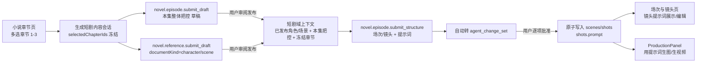

# 短剧分集生成实施计划

版本：0.2  
日期：2026-08-25  
状态：S1 数据与契约、S2 Worker 业务与上下文、S3 Desktop 交互已完成（2026-08-25 全仓质量门禁通过）；S4 文档同步与最终验收进行中  
适用范围：Desktop、Worker、Contracts、Domain、Persistence、Context、LLM Provider

> 本文档定义“用户上传小说后，在会话中按章节分组（一集）自动生成：本集整体把控项目文档、本集场次与镜头（含镜头提示词）、按需生成整部小说的角色与场景提示词”的业务逻辑与实施顺序。本文档建立在 `docs/NOVEL-AGENT-TOOL-IMPLEMENTATION-PLAN.md` 与 `docs/AGENT-PROJECT-DOCUMENT-WORKFLOW-IMPLEMENTATION-PLAN.md` 已实现能力之上，不重复建设已有文档草稿、审核、发布、CAS、change set、任务事件和不可变审计能力。

> **2026-08-28 输入边界更新：** 用户所选小说章节直接读取其当前已保存草稿的本地 RAG 切片，并冻结章节 ID 与当前版本；源小说无需先发布。生成出的本集整体把控、角色/场景提示词等派生文档仍按本计划的审阅与发布参考链执行。

## 1. 背景与目标

用户上传小说原文后，系统已完成自动拆分章节并显示在“小说章节”页面。目标是把小说内容在会话中转化为短剧生产结构：

- **分集**：不新增“一集”实体，分集 = 章节分组。例如“第一卷 第1–3章 = 第 1 集”。
- **本集项目文档**：生成“本集整体把控”（方向、节奏、核心冲突、场次清单），显示在“项目文档”页。
- **本集场次与镜头**：生成本集的场次、镜头，且每个镜头带“提示词”，显示在“场次与镜头”页。
- **角色与场景**：整部小说的角色/场景提示词，**按需生成**（例如用户说“把前三章的人物和场景做成提示词”，就只基于前三章生成），显示在“角色与场景”页。

## 2. 已确认需求

以下决策已与用户确认，实施期间不得在未获用户明确同意的情况下变更：

- **D1 不新增“一集”实体**：分集是章节分组概念（如“第一卷 第1–3章 = 第1集”），分集范围记录在本集整体把控文档正文，不建表。
- **D2 用户选定章节范围作为任务作用域**：在小说章节树多选章节（如第一卷 第1–3章），所选章节 ID 冻结进 Agent 任务，作为本集生成的内容来源。
- **D3 每集生成两样正式产物**：
  1. 本集整体把控项目文档（草稿 → 用户审阅 → 发布，显示在“项目文档”页）；
  2. 本集场次/镜头结构 + 每个镜头的提示词（change set 提案 → 用户逐项批准 → 原子写入 `scenes`/`shots`，显示在“场次与镜头”页）。
- **D4 角色与场景按需生成**：角色/场景提示词是整部小说的资料文档（`documents.kind ∈ {character, scene}`），不要求一次性全部生成；用户按需指定章节范围或范围描述后生成。
- **D5 一致性通过“来源冻结 + 参考链”保证**：源小说读取用户所选章节的当前已保存 RAG 切片并冻结版本；派生文档只读已发布内容，上一步已发布产物作为下一步输入，同时执行结构化引用校验和人工审阅门禁（详见 §10）。
- **D6 镜头提示词存 `shots.prompt`**：新增列直接保存本集场次对应镜头的提示词，页面可展示/编辑，生产面板可读取。
- **D7 信任边界**：Agent 只生成草稿/提案，不直接写正式记录；文档发布、change set 批准均由用户执行。

## 3. 范围与非目标

### 3.1 首期范围

- 小说章节多选与“生成短剧内容”会话入口；
- `novel.episode.submit_draft`：本集整体把控文档工具；
- `novel.episode.submit_structure`：场次/镜头 + 提示词工具（自动转 change set）；
- `novel.reference.submit_draft` 支持 `documentKind`（character/scene），并按 kind 落库；
- 短剧域上下文编译（注入已发布角色/场景、本集把控、约束与冻结章节）；
- 引用校验（`[角色:X]` / `[场景:Y]` 必须存在于已发布资料）；
- Desktop：章节多选入口、场次与镜头页 prompt 展示/编辑、文档编辑器 kind 选择器。

### 3.2 明确非目标

- 不建 `episodes` 表，不做分集实体；
- 不做完全一键生成（仍需要用户提示词与审阅）；
- 不自动改写已生成产物（章节变更后靠血缘标记 + 提示重新生成）；
- 不做批量/多集并发流水线；
- 不改变现有通用文档工作流、发布与 CAS 语义。

## 4. 当前基线（已实现，作为起点）

| 能力 | 实现位置 | 状态 |
|---|---|---|
| 小说文件读取（md/txt/epub、编码识别） | `apps/desktop/src-tauri/src/novel_import.rs` | ✅ |
| 章节切分（`第*章` 优先 + 宽泛标记兜底） | `apps/desktop/src/novel-import.ts` | ✅ |
| 章节导入落库（profile/volume/chapter/document/version） | `apps/worker/src/novel-service.ts` | ✅ |
| 小说章节工作区（导入预览、树、编辑器、导出） | `apps/desktop/src/NovelWorkspace.tsx` | ✅ |
| 通用文档 Agent 工作流（create/update draft、审阅、发布、binding） | `apps/worker/src/document-workflow-service.ts`、`agent-provider-loop-service.ts` | ✅ |
| 场次/镜头 CRUD 与分镜文档 | `apps/worker/src/content-service.ts`、`apps/desktop/src/App.tsx` | ✅ |
| 场次/镜头 change set（提案/审阅/原子应用/CAS） | `apps/worker/src/change-set-service.ts`、`apps/desktop/src/ChangeSetReviewPanel.tsx` | ✅ |
| 短剧改编提案（血缘表，只生成提案） | `novel.adaptation.submit_proposal`、`novel_adaptation_proposals` | ⚠️ 部分（无桌面入口） |
| 小说上下文编译、章节摘要、一致性报告 | `apps/worker/src/novel-context-service.ts`、`novel_chapter_summaries` | ✅ |

## 5. 关键设计决策

### 5.1 分集 = 章节分组（D1）

- 不新增实体；分集范围（卷、章节区间、集号）写入本集整体把控文档正文与标题（如 `第 1 集 · 第一卷 第1–3章`）。
- 任务作用域通过 `AgentGenerationPrepareParams.selectedChapterIds` 传入并冻结（D2）。

### 5.2 场次/镜头提示词存 `shots.prompt`（D6）

- `shots` 新增 `prompt TEXT` 列（迁移新增，默认 NULL/空）。
- change set 的 `shot` 类 item 新增 `prompt` 字段；批准应用时写入 `shots.prompt`。
- 场次与镜头页：镜头条目展示/编辑 prompt；`ProductionPanel` 后续可用 `shots.prompt` 作为生成参数默认值（可选增强）。

### 5.3 Agent 工具（新增/扩展）

| 工具 | 作用 | 落库 |
|---|---|---|
| `novel.episode.submit_draft` | 提交本集整体把控文档草稿 | `documents.kind='plan'` + binding `role='screenplay'`、`domain_scope='short-drama'`（草稿，用户发布） |
| `novel.episode.submit_structure` | 提交本集场次/镜头 + 镜头提示词 | Worker 自动转换为 `agent_change_set`（scene/shot create 带 prompt），用户批准后原子写入 |
| `novel.reference.submit_draft`（扩展） | 提交角色/场景资料草稿 | 新增 `documentKind` 参数（`character`/`scene`），落库 `documents.kind` 对应值，显示在“角色与场景”页 |

### 5.4 短剧域上下文编译（新增）

- 扩展 `apps/worker/src/novel-context-service.ts`（或新增 `compileShortDrama`）：
  - 注入 binding 域 `shared` + `short-drama` 且角色为 `character-bible`、`world-bible`、`screenplay`、`style-guide`、`timeline` 的已发布文档；
  - 注入生产约束（`constraints`）与项目记忆（`memories`）；
  - 注入冻结章节（`selectedChapterIds`）的已发布正文 + 确定性摘要；
  - 注入最近相关会话。
- 当前 `compile` 只注入 `domain_scope IN ('shared','novel')`，本计划需补齐短剧域（这是角色/场景、场次/镜头生成上下文一致性的关键缺口）。

### 5.5 引用与校验（D5）

- 角色/场景提示词采用结构化条目（每人物/场景一个条目 + 名称）。
- 场次/镜头提示词使用引用占位符，例如 `[角色:林澈] 站在 [场景:旧码头]`。
- Worker 在保存/应用前校验引用集合：占位符必须存在于已发布角色/场景提示词中，否则工具调用失败并要求模型修正（硬保证）。
- 系统指令要求：人物名、称谓、时间线、地点必须与上下文资料一致；发现冲突必须报告，不得静默改写。

### 5.6 触发与入口（D2）

- 小说章节树多选章节 → “生成短剧内容”按钮 → 打开会话并把 `selectedChapterIds` 传入 `agent.generation.prepare`。
- 会话内由用户发提示词（可预填默认指令：如“把所选章节做成一集，生成整体把控、场次和镜头提示词”）。

## 6. 目标架构



## 7. 端到端业务流程

### 7.1 场景 A：生成一集

1. 用户在小说章节页勾选“第一卷 第1–3章”，点“生成短剧内容”；
2. Desktop 创建/复用会话，调 `agent.generation.prepare` 并传入 `selectedChapterIds`；
3. Worker 冻结所选章节 ID（任务快照），编译短剧域上下文（约束、已发布角色/场景、所选章节正文+摘要）；
4. 用户发提示词（如“把这三章做成一集，生成本集整体把控”）；
5. 模型调用 `novel.episode.submit_draft` → Worker 落“本集整体把控”草稿（kind=plan，binding screenplay）→ 显示在“项目文档”页 → 用户审阅发布；
6. 用户继续发提示词（如“生成这一集的场次和镜头提示词”）；
7. 模型调用 `novel.episode.submit_structure` → Worker 校验引用 → 自动生成 change set；
8. 用户在场次与镜头页的 Agent proposals 面板逐项批准 → 原子写入 `scenes`/`shots`（含 `prompt`）；
9. 用户选中镜头可查看/编辑提示词，并进入 ProductionPanel 生产。

### 7.2 场景 B：按需生成角色/场景

1. 用户在会话中发提示词（如“把前三章的人物和场景做成提示词”，可同时选定章节）；
2. Worker 编译上下文（仅所选章节 + 已发布资料）；
3. 模型调用 `novel.reference.submit_draft`（`documentKind='character'|'scene'`）→ 落草稿；
4. 草稿自动出现在“角色与场景”页 → 用户审阅发布；
5. 发布后进入短剧域上下文，供后续集生成引用（参考链）。

## 8. 数据模型变更

> 遵循“增量 Schema”原则，新增迁移版本（v29 起，2026-08-25 实施），不修改既有表语义。

- `shots` 新增 `prompt TEXT`（允许 NULL/空）；
- `agent_change_set_items` 新增 `shot_prompt TEXT`（shot 类 item 的提示词；复用现有 `parent_item_id`/`parent_item_ordinal` 表达父子）；
- `agent_change_sets` 新增可选来源血缘字段：`source_chapter_ids_json TEXT`、`source_content_hash TEXT`（记录本集来源章节与内容哈希，模式对齐 `novel_adaptation_proposals`；若迁移成本高可先用 change set title 记录，血缘作为 S4 强化项）；
- `AgentGenerationPrepareParams` 新增 `selectedChapterIds?: string[]`（上限 50）；
- `novel.reference.submit_draft` 工具参数新增 `documentKind?: 'character' | 'scene'`；
- `DocumentWorkflowService.writeTrustedAgentDraftInTransaction` 增加 `kind` 参数（不再写死 `'note'`）；
- `document_bindings` 复用现有 `role='screenplay'`（short-drama 域、project 级），不新增 role，避免重建 role CHECK 约束；如后续需要更精确的“本集把控”角色，再在独立迁移中新增 `episode-overview`。

## 9. Agent 工具设计（草案 Schema）

### 9.1 `novel.episode.submit_draft`

```json
{
  "title": "第 1 集 · 第一卷 第1–3章 整体把控",
  "contentMarkdown": "# 第 1 集整体把控\n\n- 集范围：第一卷 第1–3章\n- 本集目标：……\n- 节奏：……\n- 核心冲突：……\n- 场次清单：……"
}
```

- `additionalProperties: false`；title ≤ 200；contentMarkdown ≤ 200,000 字符 / 1 MiB；
- 不接受项目、任务、章节 ID 等字段（来源由任务快照注入）。

### 9.2 `novel.episode.submit_structure`

```json
{
  "episodeTitle": "第 1 集 · 来信",
  "scenes": [
    {
      "title": "旧码头 · 台风前夜",
      "shots": [
        { "title": "海雾中的码头", "prompt": "[场景:旧码头] 全景，台风前夜，海雾低垂，[角色:林澈] 站在码头上。" }
      ]
    }
  ]
}
```

- 限制：`scenes` 1–20；每场 `shots` 1–30；`prompt` ≤ 2,000 字符；全部字段 `additionalProperties: false`；
- Worker 转换规则：每个 scene → `entityType='scene', action='create'`；每个 shot → `entityType='shot', action='create'`（`parentItemOrdinal` 指向所属 scene item，`prompt` 写入 `shot_prompt`）；
- 引用校验：`[角色:X]`/`[场景:Y]` 必须命中已发布 character/scene 资料，否则工具失败。

### 9.3 角色/场景按需生成（实施说明）

实施采用 `document.create_draft` 的 `documentKind` 参数（`character`/`scene`/`plan`/`outline`/`storyboard`/`note`），而不是扩展 `novel.reference.submit_draft`：后者是“更新类”工具（必须授权目标文档），新建角色/场景提示词文档需要创建类入口。模型调用：

```json
{
  "title": "前三章人物提示词",
  "contentMarkdown": "# 林澈\n24 岁，灯塔守望员，……\n\n# 周叔\n……",
  "documentKind": "character"
}
```

- 落库 `documents.kind = character/scene` 后自动显示在“角色与场景”页；
- `novel.reference.submit_draft` 保持更新类语义不变。

## 10. 上下文与一致性设计（D5）

一致性不是靠提示词，而是靠“输入唯一 + 输出可引用 + 变更可失效 + 人工门禁”：

1. **输入唯一**：只读 `published_version_id`；草稿/未发布内容不进上下文（现有机制）。
2. **作用域冻结**：`selectedChapterIds` + 来源版本/内容哈希冻结（对齐 `novel_adaptation_proposals`）。
3. **参考链**：生成顺序固定：角色/场景 → 本集把控 → 场次/镜头；后一步上下文显式包含前一步已发布产物。
4. **短剧域上下文**：新增 `compileShortDrama`，注入 `shared`+`short-drama` 已发布 binding 文档、约束、冻结章节正文/摘要、相关会话。
5. **结构化引用**：`[角色:X]`/`[场景:Y]` 占位符 + Worker 引用集合校验（硬保证）。
6. **一致性体检**：复用 `novel.context.consistencyReport`；新增引用校验错误码与 change set 血缘记录。
7. **人工门禁**：文档发布、change set 逐项批准（现有 CAS）。
8. **失效与重生成**：章节变更 → 摘要 stale → 相关 change set 标记“基于旧版本”，提示用户决定是否重新生成，不自动覆盖。

## 11. Desktop 交互设计

- **小说章节页（`NovelWorkspace.tsx`）**：章节树多选（checkbox）；选中后显示“生成短剧内容”按钮；点击打开会话并携带 `selectedChapterIds`。
- **场次与镜头页（`App.tsx` shots 视图）**：镜头条目显示 `prompt`（可编辑，保存走 `shot.save` 或新增 `shot.prompt.save`）；底部沿用 `ChangeSetReviewPanel` 审阅提案（条目展示 prompt 预览）。
- **角色与场景页（`App.tsx` characters 视图）**：文档编辑器增加 kind 选择器（character/scene/outline/plan/storyboard/note），解决 Agent 文档固定 note 无法归类的问题。
- **项目文档页**：本集整体把控草稿（kind=plan）与既有项目文档一致展示，支持审阅/发布。

## 12. 分阶段实施计划

> 阶段按顺序执行；每阶段代码、测试和验证记录完成后才勾选检查清单。

### S1：数据与契约

目标：为短剧分集生成提供数据与类型基础。

主要文件：

- `packages/persistence/src/schema.ts`、`database.ts`（新增迁移 v28）
- `packages/contracts/src/index.ts`
- `packages/domain/src/index.ts`
- `apps/worker/src/request-validation.ts`
- `apps/worker/src/content-service.ts`（scene/shot 保存支持 prompt）
- `apps/worker/src/change-set-service.ts`（shot item 支持 prompt）

工作项：

- [x] `shots.prompt` 列 + 迁移（MIGRATION_V29）；
- [x] `agent_change_set_items.shot_prompt` 列 + 迁移（MIGRATION_V29，含 shot-only 触发器）；
- [x] change set item draft 增加 `prompt`，validate/apply 支持写入 `shots.prompt`；
- [x] `AgentGenerationPrepareParams.selectedChapterIds`（校验：上限 50、短剧模式必填）；
- [x] `document.create_draft` 工具参数 `documentKind`（校验枚举；按需生成角色/场景入口）；
- [x] `DocumentWorkflowService` 草稿保存支持 `kind` 参数。

退出门禁：迁移从既有 schema 升级通过；change set 应用后 `shots.prompt` 正确落库；request-validation 拒绝未知/越界字段；Persistence/Worker 单测通过。

### S2：Worker 业务与上下文

目标：接通生成工具、短剧上下文与引用校验。

主要文件：

- `apps/worker/src/novel-context-service.ts`（selectedChapterIds + compileShortDrama）
- `apps/worker/src/agent-provider-loop-service.ts`（新工具、reference kind、引用校验）
- `apps/worker/src/agent-orchestration-service.ts`（任务快照冻结 selectedChapterIds）
- `apps/worker/src/handler.ts`（命令分发）
- `apps/worker/src/request-validation.ts`

工作项：

- [x] `NovelContextService.compile` 支持 `selectedChapterIds`（显式包含所选章节，正文+摘要）；
- [x] 新增 `compileShortDrama`（短剧域 binding 注入 + 冻结章节 + 约束 + 记忆 + 会话，`agentMode='short-drama'` 时自动使用）；
- [x] 实现 `novel.episode.submit_draft` 工具与落库（kind=plan + binding role `screenplay`、domain `short-drama`）；
- [x] 实现 `novel.episode.submit_structure` 工具：结构校验 → `[角色:X]`/`[场景:Y]` 引用校验 → 自动生成 change set（scene/shot create 带 prompt）；
- [x] `document.create_draft` 按 `documentKind` 落库（character/scene/plan 等）；
- [x] 系统指令更新（短剧分集生成指令：只使用上下文、保持人物/场景一致、冲突必须报告）；
- [x] `selectedChapterIds` 冻结进任务快照（request_snapshot_json）。

退出门禁：端到端 Worker 集成测试通过（冻结章节进入上下文；工具成功生成草稿/change set；引用不存在的 `[角色:X]` 被拒绝）；typecheck/lint/test 通过。

### S3：Desktop 交互

目标：用户可完成“选章节 → 发提示词 → 审阅发布 → 查看/编辑结果”。

主要文件：

- `apps/desktop/src/NovelWorkspace.tsx`（多选 + 入口）
- `apps/desktop/src/App.tsx`（selectedChapterIds 传递、镜头 prompt 展示/编辑、kind 选择器）
- `apps/desktop/src/ChangeSetReviewPanel.tsx`（prompt 预览）
- `apps/desktop/src/use-document-workspace.ts`（kind 选择器状态）
- `apps/desktop/src/ChatPanel.tsx`（预填指令）

工作项：

- [x] 章节多选 + “生成短剧内容”入口（NovelWorkspace，含选择计数）；
- [x] 会话携带 `selectedChapterIds`，ChatPanel 新增“短剧创作”模式与意图推断（`inferShortDramaIntent`）；
- [x] 场次与镜头页 prompt 展示/编辑（保存走 `shot.save`，≤2000 字符）；
- [x] ChangeSetReviewPanel 展示 shot prompt 预览；
- [x] 文档编辑器 kind 选择器（角色与场景页可建 character/scene 文档）。

退出门禁：Desktop 组件测试通过；手工路径“选章节 → 生成 → 审阅 → 查看”可走通。

### S4：测试、文档与同步

目标：达到可合入质量门槛，并同步文档。

工作项：

- [x] 全仓 `pnpm.cmd test`、`typecheck`、`lint`、`format:check`、`build`、`git diff --check` 通过（2026-08-25）；
- [x] 更新 `docs/NOVEL-AGENT-TOOL-IMPLEMENTATION-PLAN.md` P8 短剧改编部分（子计划登记）；
- [ ] 本计划 Markdown 与 DOCX 同步（DOCX 待生成/待更新）；
- [x] 验证记录写入 §17。

## 13. 测试矩阵

| 层 | 用例 |
|---|---|
| Persistence | v27→v28 迁移、`shots.prompt` 默认/更新、change set item shot_prompt 应用/冲突 |
| Worker | selectedChapterIds 校验与冻结、短剧域上下文注入、`novel.episode.submit_draft` 落库、`novel.episode.submit_structure` 转换与引用校验、reference kind 落库、跨项目隔离 |
| Desktop | 章节多选、入口携带 selectedChapterIds、prompt 展示/编辑、kind 选择器、ChangeSetReviewPanel prompt 预览 |
| 安全 | 未知字段拒绝、越界/空数组拒绝、引用占位符注入校验、项目边界 |

## 14. 风险与缓解

| 风险 | 缓解 |
|---|---|
| 生成内容跨集不一致 | 短剧域上下文注入已发布角色/场景；引用校验；人工门禁 |
| 章节变更后产物过期 | 来源版本/哈希冻结 + 摘要 stale + 血缘标记，提示重新生成 |
| 镜头提示词与角色/场景资料漂移 | `[角色:X]`/`[场景:Y]` 占位符 + 引用集合硬校验 |
| change set 规模过大 | scenes ≤ 20、每场 shots ≤ 30、prompt ≤ 2,000 字符硬上限 |
| 工具结果与正式表冲突 | 继续使用 change set CAS/事务回滚，不直接写正式表 |

## 15. 完成定义

- S1–S4 全部勾选，验证记录写入 §17；
- 全仓质量门禁通过；
- 用户可完成“多选章节 → 会话生成 → 审阅发布 → 查看/编辑镜头提示词”的完整路径；
- 角色/场景提示词按需生成并显示在“角色与场景”页；
- 短剧域上下文与引用校验生效，一致性机制有测试覆盖。

## 16. 实施检查清单

- [x] S1 数据与契约
- [x] S2 Worker 业务与上下文
- [x] S3 Desktop 交互
- [ ] S4 测试、文档与同步
- [x] 全仓质量门禁（2026-08-25）
- [ ] 人工验收（真实 Provider、Windows 多窗口）

## 17. 实施与验证记录

| 日期 | 阶段 | 状态 | 验证命令/证据 | 未验证边界 |
|---|---|---|---|---|
| 2026-08-25 | S1 数据与契约 | 完成 | Schema v29 迁移（`shots.prompt`、`agent_change_set_items.shot_prompt` + shot-only 触发器）；change set 应用后 `shots.prompt` 落库；`selectedChapterIds`/`short-drama`/`documentKind` 校验；Persistence 22 项、Worker 222 项、Desktop 全量测试通过 | 真实 Provider 端到端 |
| 2026-08-25 | S2 Worker 业务与上下文 | 完成 | `compileShortDrama` + selectedChapterIds 上下文；`novel.episode.submit_draft`（plan + screenplay binding）；`novel.episode.submit_structure`（引用校验 + 自动 change set）；`document.create_draft` documentKind；任务快照冻结；Worker 227 项测试通过 | 真实 Provider、引用校验的人工提示词边界 |
| 2026-08-25 | S3 Desktop 交互 | 完成 | 章节多选 + “生成短剧内容”；ChatPanel “短剧创作”模式与意图推断；镜头提示词展示/编辑；文档类型选择器；change set prompt 预览；Desktop 145 项测试通过 | Windows 多窗口人工验收 |
| 2026-08-25 | S4 测试、文档与同步 | 部分完成 | 全仓 `pnpm.cmd test/typecheck/lint/format:check/build`、`git diff --check` 通过；NOVEL 计划 P8 子计划登记；验证记录已写入 | DOCX 同步、真实 Provider、Windows 人工验收 |
